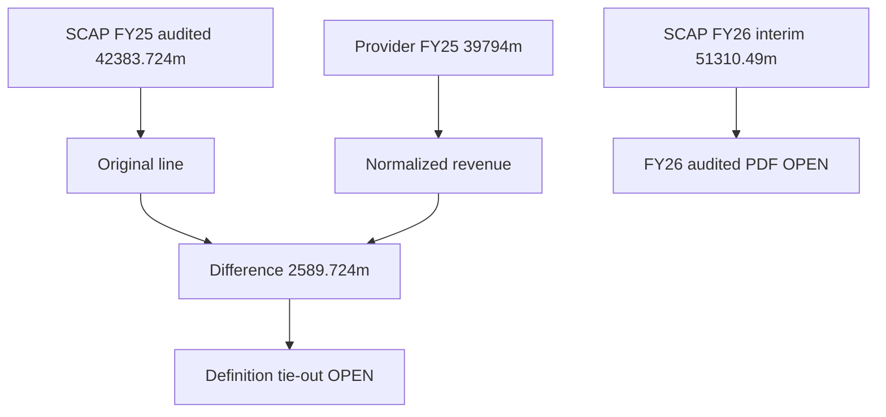

# 12 · ගිණුම් පරීක්ෂාව: FY2025 ආදායම් වෙනස

[← Fundamental analysis](../README.md) · [English](../../../01-Fundamental-Analysis/12-Forensic-Accounting/README.md) · [தமிழ்](../../../ta/01-Fundamental-Analysis/12-Forensic-Accounting/README.md) · [සිංහල](README.md)

> **SCAP.N0000 · මුල් සාක්ෂි පර්යේෂණ · 2026-09-30 · වෙනත් ඒකකයක් නොකී විට LKR මිලියන.** **OPEN: SCAP FY2025/26 අවසන් audited සහ 2026 ජූනි මුල් ගොනු තවමත් ගළපා නැත. FY2025 අගයන් වත්මන් තහවුරු තත්ත්වය ලෙස සලකන්න එපා.**

## 🎯 පර්යේෂණ ප්‍රශ්නය

SCAP මුල් විගණිත income line එක සහ third-party revenue එක නොගැළපෙන්නේ ඇයි?

SCAP FY2025 මුල් audited **Group total operating income LKR 42,383.724m** (PDF පි.63), FY2024 සංසන්දනය **36,729.682m**. මෙය standalone SCAP FY2025 income **4,093.984m** නොවේ. StockAnalysis secondary provider විසින් FY2025 **39,794m**, FY2024 **35,927m** revenue දක්වයි. මුල් line-definition bridge නොමැතිව provider අගය audited issuer ලෙස නොසලකන්න. [SCAP-AR-2025](../../../sources/records/SCAP-AR-2025.md) · [SCAP-STOCKANALYSIS](../../../sources/records/SCAP-STOCKANALYSIS.md).

## 🔎 දින සහිත සාක්ෂි

| මූලාශ්‍ර තීරුව | FY2024 LKR mn | FY2025 LKR mn | තත්ත්වය |
|---|---|---|---|
| SCAP original Group operating income | 36,729.682 | 42,383.724 | Audited පි.63 |
| Provider normalized revenue | 35,927 | 39,794 | Secondary StockAnalysis |
| Issuer − provider වෙනස | 802.682 | 2,589.724 | ගණනය; හේතුව OPEN |
| SCAP standalone Company income | 1,933.064 | 4,093.984 | Audited පි.63; group නොවේ |
| FY2026 Group interim | — | 51,310.49 (FY26) | 2026 මැයි; විගණනයට යටත් |

### මුල් විගණිත ආදායම

SCAP FY2025 PDF පි.63 හි **Total operating income LKR 42,383,724,027**, FY2024 **36,729,682,098**. FY2025 net earned insurance premium **30,842.349m** සමඟ interest/fees/gains ද ඇතුළත්ය. Insurer **GWP = SCAP total operating income** නොවේ. Parent income සහ consolidated income වෙනස්ය. [SCAP-AR-2025](../../../sources/records/SCAP-AR-2025.md).

### Provider අගයේ වෙනස

StockAnalysis [වගුව](https://stockanalysis.com/quote/cose/SCAP.N0000/financials/) FY2025 **39,794m**, FY2024 **35,927m** පෙන්වයි. Issuer minus provider **2,589.724m** සහ **802.682m**. Provider අර්ථකථනයේ එකතු/අඩුකිරීම් ලැයිස්තුව මෙතෙක් නොමැති නිසා **සැකසුම් පේළියක් කල්පිතව නිර්මාණය නොකරන්න**. Repo financial-pulse සහ භාෂා තුනේ ග්‍රාෆ් දැන් FY25 original **42,383.72m** භාවිත කරයි; 39,794 නිවැරදි කිරීමේ සටහනේ පමණි. [SCAP-STOCKANALYSIS](../../../sources/records/SCAP-STOCKANALYSIS.md).

### FY2026 audited සහ ජූනි කාර්තුව

Third-party catalogue SCAP **31-03-2026 annual** සහ **30-06-2026 interim** ලැයිස්තුගත කරයි. එහෙත් මුල් signed SCAP audited PDF සහ June මුල් ගොනුව මෙහි **OPEN**. පෙර **27 මැයි 2026 interim group income 51,310.49m** තවම **subject to audit** වේ. [SCAP-AR-2026-CATALOGUE](../../../sources/records/SCAP-AR-2026-CATALOGUE.md) · [SCAP-JUN2026-CATALOGUE](../../../sources/records/SCAP-JUN2026-CATALOGUE.md).

## සාක්ෂි සිතියම

## ⚠️ ඉතිරි සත්‍යාපනය

- [ ] FY2025/26 SCAP signed audited PDF, restatements හා original issuer notes ලබාගන්න.
- [ ] SCAP 2026 ජූනි original report group/parent figures සසඳන්න.
- [ ] Provider revenue definition bridge FY24 හා FY25 දෙකට සොයන්න.
- [ ] වෙනස් වූ වාර්තා තුන් භාෂා charts තුළ එකම විදිහට යාවත්කාලීන කරන්න.

**මූලාශ්‍ර හැඳුනුම්:** [SCAP-AR-2025](../../../sources/records/SCAP-AR-2025.md) · [SCAP-STOCKANALYSIS](../../../sources/records/SCAP-STOCKANALYSIS.md) · [SCAP-FY2026-YE-INTERIM](../../../sources/records/SCAP-FY2026-YE-INTERIM.md) · [SCAP-AR-2026-CATALOGUE](../../../sources/records/SCAP-AR-2026-CATALOGUE.md) · [SCAP-JUN2026-CATALOGUE](../../../sources/records/SCAP-JUN2026-CATALOGUE.md).

[SCAP FY2025 original p.63](https://cdn.cse.lk/cmt/upload_report_file/1100_1764673838964.03.2025%20-%20Annual%20Report.pdf) · [StockAnalysis normalized revenue](https://stockanalysis.com/quote/cose/SCAP.N0000/financials/) · [SCAP FY2026 interim](https://cdn.cse.lk/cmt/upload_report_file/1100_1779968696398.pdf).

[මුල් මූලාශ්‍ර](../../../sources/SOURCE-REGISTER.md) · [පර්යේෂණ ප්‍රගතිය](../../../si/RESEARCH-QUEUE.md)

මෙය මූල්‍ය සාක්ෂි පර්යේෂණයක් වන අතර කොටස් මිලදී/විකිණීමේ නිර්දේශයක් නොවේ.