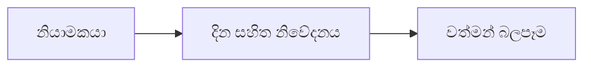

# 13 · නියාමන විශ්ලේෂණය

[← මූලික විශ්ලේෂණය](../README.md) · [English](../../../01-Fundamental-Analysis/13-Regulatory/README.md) · [தமிழ்](../../../ta/01-Fundamental-Analysis/13-Regulatory/README.md) · [සිංහල](README.md)

> **SCAP.N0000 · Softlogic Capital PLC** · **තත්ත්වය:** පර්යේෂණ ක්‍රමවේදයකි; SCAP පිළිබඳ නවතම නිගමනයක් නොවේ. **Reference date: 2026-09-30**.

## 🎯 පර්යේෂණ ප්‍රශ්නය

SCAP ව්‍යාපාරවලට බලපාන වත්මන් බලපත්‍ර, solvency, ප්‍රාග්ධන, හෙළිදරව් හා හැසිරීම් නියම මොනවාද?

## 🔎 තහවුරු කළ යුතු දේ

- [ ] මූල්‍යයට CBSL, රක්ෂණයට IRCSL, කොටස් සේවාවට SEC/CSE ආයතනවල දින සහිත ප්‍රකාශන කියවන්න.
- [ ] එක් එක් නීතිමය ආයතනයට අදාළ සීමා හා ඒවායේ ආරම්භ/අවසන් දින වෙන වෙනම තහවුරු කරන්න.
- [ ] නියාමන ප්‍රාග්ධන සහ ලාභාංශ සීමා මව් සමාගමේ මුදල් හා valuation උපකල්පනවලට ඇතුළත් කරන්න.

## 🧭 පර්යේෂණ රූප සටහන

## ⚠️ නොකළ යුතු උපකල්පනය

2025 දී සීමාවක් ඉවත් කළ බවට පුවතක් 2026 වත්මන් නියාමන තත්ත්වය සනාථ නොකරයි.

## 🛠️ SCAP සඳහා පරීක්ෂණය

එක් එක් ආයතනයට දින සහිත නියාමන සිදුවීම් වගුවක් සාදා මුල් නිවේදන හා නවතම SCAP වාර්තා සසඳන්න.

## 📝 සාක්ෂි වගුව

| මිනුම / සිදුවීම | කාලය / විෂය පථය | මුල් මූලාශ්‍රය | සොයාගත් ප්‍රතිඵලය |
|---|---|---|---|
| ______ | ______ | ______ | ______ |
| ______ | ______ | ______ | ______ |

[පෙර SCAP සටහන](../../../si/05-risks-and-questions.md) · [මූලාශ්‍ර](../../../si/SOURCES.md) · [CSE](https://www.cse.lk/)

**ක්‍රමය:** ප්‍රකාශන දිනය, ගිණුම් විෂය පථය, ඒකකය සහ මුල් පිටුව ලියන්න. මෙය වෙළෙඳපොළ මිලක් හෝ ආයෝජන නිර්දේශයක් නොවේ.
