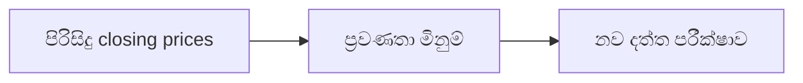

# 02 · ප්‍රවණතා සහ වේග විශ්ලේෂණය

[← තාක්ෂණික විශ්ලේෂණය](../README.md) · [English](../../../02-Technical-Analysis/02-Trend-Momentum/README.md) · [தமிழ்](../../../ta/02-Technical-Analysis/02-Trend-Momentum/README.md) · [සිංහල](README.md)

> **SCAP.N0000 — Softlogic Capital PLC.** **තත්ත්වය: ක්‍රමවේදයක් පමණි; වත්මන් trading signal එකක් නොවේ.** මුලින් දත්ත හා CSE ගනුදෙනු දින තහවුරු කරන්න. **Reference: 2026-09-30.**

## 🎯 පර්යේෂණ ප්‍රශ්නය

නිශ්චිත පෙර කාලයක SCAP මිල මැනිය හැකි ප්‍රවණතාවක් හෝ momentum රටාවක් පෙන්වනවාද?

## 🔍 දත්ත සහ ක්‍රම තහවුරු කිරීම

- [ ] පැහැදිලිව සඳහන් කළ 50/200-session moving averages සහ RSI(14) වැනි momentum මිනුම ගණනය කරන්න.
- [ ] ගනුදෙනු නොවූ දින, පරණ closing price, සීමිත ඉතිහාසය සහ corporate actions ගණනයට කරන බලපෑම සොයන්න.
- [ ] අතීතයට පමණක් හොඳින් ගැළපෙන parameters නොතෝරා දෛනික හා සතිපතා දත්ත සසඳන්න.

## 🧭 ක්‍රමවේද සටහන

## ⚠️ පොදු වැරදි අර්ථකථනය

RSI සීමාවක්, crossover එකක් හෝ uptrend එකක් පමණක් අනාගත ප්‍රතිලාභ තහවුරු නොකරයි.

## 🛠️ SCAP සඳහා භාවිතය

දත්ත මූලාශ්‍ර, කාලය හා parameters සටහන් කර පිරිසිදු දත්ත ලැබුණු පසු baseline සමඟ backtest කරන්න.

## 📝 නැවත නිෂ්පාදනය කළ හැකි දත්ත වගුව

| මිනුම / සිදුවීම | කාලය / interval | මූලාශ්‍ර / adjustment | නිරීක්ෂණ අගය |
|---|---|---|---|
| ______ | ______ | ______ | ______ |
| ______ | ______ | ______ | ______ |

[පෙර පර්යේෂණය](../../../si/07-reading-checklist.md) · [මූලාශ්‍ර](../../../si/SOURCES.md) · [CSE](https://www.cse.lk/).

**ක්‍රම සටහන:** chart patterns, indicators සහ sentiment පුරෝකථන හැකියාව ස්වාධීනව පරීක්ෂා කළ යුතුය. අතීත ප්‍රතිලාභ හෝ backtests අනාගතය සහතික නොකරයි.
