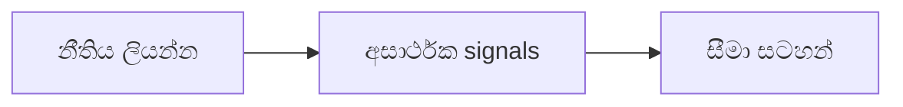

# 04 · ප්‍රස්තාර රටා සහ දර්ශක විශ්ලේෂණය

[← තාක්ෂණික විශ්ලේෂණය](../README.md) · [English](../../../02-Technical-Analysis/04-Patterns-Indicators/README.md) · [தமிழ்](../../../ta/02-Technical-Analysis/04-Patterns-Indicators/README.md) · [සිංහල](README.md)

> **SCAP.N0000 — Softlogic Capital PLC.** **තත්ත්වය: ක්‍රමවේදයක් පමණි; වත්මන් trading signal එකක් නොවේ.** මුලින් දත්ත හා CSE ගනුදෙනු දින තහවුරු කරන්න. **Reference: 2026-09-30.**

## 🎯 පර්යේෂණ ප්‍රශ්නය

අතීත ප්‍රතිඵල දැක රටා ඇඳීම වෙනුවට, නැවත ගණනය කර පරීක්ෂා කළ හැකි නීති අනුව රටා හඳුනාගත හැකිද?

## 🔍 දත්ත සහ ක්‍රම තහවුරු කිරීම

- [ ] pattern, breakout threshold සහ confirmation කාලය ප්‍රතිඵල බැලීමට පෙර පැහැදිලිව අර්ථ දක්වන්න.
- [ ] moving averages, RSI, MACD, ATR වැනි දර්ශක adjusted prices හා එකම trading-day අර්ථකථනයෙන් ගණනය කරන්න.
- [ ] false breakouts, ගනුදෙනු පිරිවැය, look-ahead bias හා අකාර්යක්ෂම කාලයන් ඇතුළත් කරන්න.

## 🧭 ක්‍රමවේද සටහන

## ⚠️ පොදු වැරදි අර්ථකථනය

එක් chart එකක පෙනෙන රටාවක් SCAP ප්‍රතිලාභ පුරෝකථනය කරන බවට සංඛ්‍යානමය සාක්ෂියක් නොවේ.

## 🛠️ SCAP සඳහා භාවිතය

දත්ත, සැකසුම්, අසාර්ථක signals හා out-of-sample පරීක්ෂණ සටහන් කරන්න.

## 📝 නැවත නිෂ්පාදනය කළ හැකි දත්ත වගුව

| මිනුම / සිදුවීම | කාලය / interval | මූලාශ්‍ර / adjustment | නිරීක්ෂණ අගය |
|---|---|---|---|
| ______ | ______ | ______ | ______ |
| ______ | ______ | ______ | ______ |

[පෙර පර්යේෂණය](../../../si/07-reading-checklist.md) · [මූලාශ්‍ර](../../../si/SOURCES.md) · [CSE](https://www.cse.lk/).

**ක්‍රම සටහන:** chart patterns, indicators සහ sentiment පුරෝකථන හැකියාව ස්වාධීනව පරීක්ෂා කළ යුතුය. අතීත ප්‍රතිලාභ හෝ backtests අනාගතය සහතික නොකරයි.
