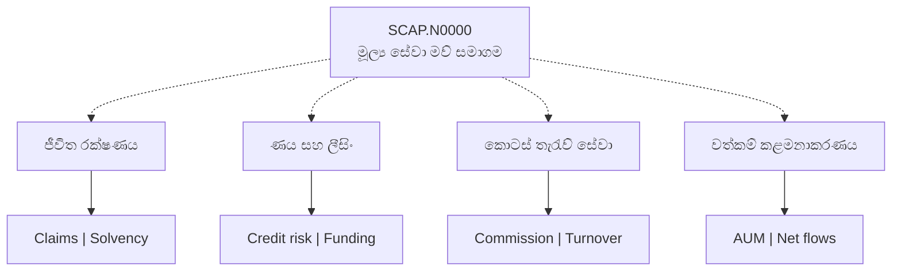
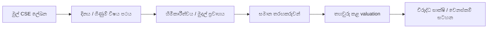

# 📊 SCAP.N0000 — සිංහල දෘශ්‍ය ආයෝජන පර්යේෂණය

[← ප්‍රධාන ගබඩාව](../../README.md) · [සිංහල](README.md) · [தமிழ்](../../ta/reports/README.md) · [English](../../reports/README.md)

> **Softlogic Capital PLC · CSE: SCAP.N0000**
>
> **සාක්ෂි තත්ත්වය: මූලික.** නවතම ගිණුම්, මව් සමාගමේ හිමියන්ට අයත් ලාභය, වත්මන් අනුබද්ධ හිමිකාරීත්වය සහ කොටස් මිල මුල් CSE ගොනු සමඟ තවමත් සම්පූර්ණයෙන් සැසඳී නැත.

## 📌 ප්‍රධාන දෘශ්‍ය පර්යේෂණ වාර්තාව

| පර්යේෂණ අංශය | දැනට ඇති තොරතුරු | තව අවශ්‍ය දෙය |
|---|---|---|
| 🏢 ව්‍යාපාරය | සමාගම විස්තර කරන මූල්‍ය සේවා අංශ හතර | නවතම අනුබද්ධ හිමිකාරීත්වය |
| 💵 මූල්‍ය | FY25/FY26 තෙවන පාර්ශ්ව සංඛ්‍යා | නිල CSE වාර්තා සමඟ ගැළපීම |
| ⚖️ වටිනාකම | තවමත් ගණනය කර නැත | හිමියන්ට අයත් ලාභය, share count, දින සහිත මිල |
| 🛡️ අවදානම් | ගුණාත්මක හේතු සිතියම | නවතම මුල් මූල්‍ය/නියාමන සාක්ෂි |

## 🧩 ව්‍යාපාර ආකෘතිය

**රේඛාවල අර්ථය:** තිත් රේඛාවෙන් සමාගම විස්තර කරන ව්‍යාපාරික සම්බන්ධය පමණක් දක්වයි; අද දින නිශ්චිත හිමිකාරීත්ව ප්‍රතිශතයක් නොවේ. කොටුවක ප්‍රමාණය හෝ වර්ණය ආදායම්, වෙළෙඳපොළ කොටස හෝ අවදානම නොපෙන්වයි.

## 📑 දෘශ්‍ය වාර්තා

| දෘශ්‍ය වාර්තාව | අන්තර්ගතය |
|---|---|
| [🏢 ව්‍යාපාර සිතියම](business-model.md) | අනුබද්ධ ක්‍රියාකාරකම් සහ ලාභ/මුදල් ගමන් මග |
| [📈 මූල්‍ය ප්‍රස්තාර](financial-pulse.md) | FY25/FY26 තාවකාලික සංඛ්‍යාවල වෙන වෙනම ප්‍රස්තාර |
| [🛡️ අවදානම් සිතියම](risk-map.md) | අවදානම් මාර්ග සහ අවශ්‍ය සාක්ෂි |
| [🔬 පර්යේෂණ සැලැස්ම](research-roadmap.md) | මුල් වාර්තා සිට valuation දක්වා ක්‍රියාවලිය |

## 🔎 Evidence gate / ஆதாரச் சோதனை / සාක්ෂි පරීක්ෂාව

**[CSE](https://www.cse.lk/)** · [සිංහල sources](../SOURCES.md) · [සිංහල log](../RESEARCH-LOG.md)

**පර්යේෂණ තත්ත්වය: මූලික · යොමු දිනය: 2026-09-30.** මෙය කොටස් මිලදී ගැනීමට හෝ විකිණීමට නිර්දේශයක් නොවේ. පැරණි හෝ තෙවන පාර්ශ්ව දත්ත අද දින තහවුරු කළ අගයන් ලෙස නොසලකන්න.
