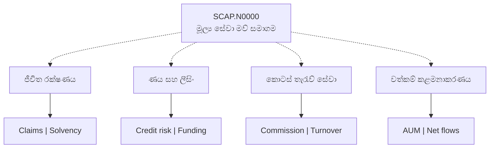
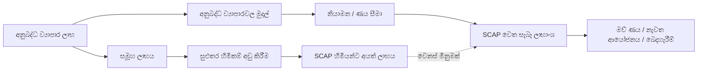

# 🏢 SCAP.N0000 — ව්‍යාපාර ආකෘති සිතියම

[← ප්‍රධාන ගබඩාව](../../README.md) · [සිංහල](README.md) · [தமிழ்](../../ta/reports/README.md) · [English](../../reports/README.md) · [ප්‍රධාන දෘශ්‍ය පර්යේෂණ වාර්තාව](README.md)

> **මෙය නවතම සම්පූර්ණ කොටස් හිමිකාරීත්ව සටහනක් නොවේ.** සමාගම විස්තර කරන මෙහෙයුම් සම්බන්ධතා මෙහි පෙන්වයි; නවතම ප්‍රතිශත වෙනම තහවුරු කළ යුතුය.

## 🗺️ Group and exposures

## 💸 Revenue engines

| අංශය | ආදායම් උත්පාදන ක්‍රමය | පර්යේෂණ කරුණු |
|---|---|---|
| ☂️ ජීවිත රක්ෂණය | රක්ෂණ ගිවිසුම් සහ ආයෝජන ප්‍රතිඵල | Claims, persistency, SLFRS 17, solvency |
| 🏦 මූල්‍ය සේවා | ණය පොලී සහ සේවා ගාස්තු | NPL, funding cost, capital |
| 📊 තැරැව් සේවා | කොමිස් සහ අනෙකුත් ප්‍රකාශිත ගාස්තු | CSE turnover, ගනුදෙනුකරු රඳවාගැනීම |
| 🌱 වත්කම් කළමනාකරණය | AUM-සම්බන්ධිත කළමනාකරණ ගාස්තු | AUM, net flows, fee rates |

## 🔁 Profits and cash are not identical

**වෙනස් මිනුම් තුනක්:** සමූහ ලාභය, SCAP සාමාන්‍ය කොටස් හිමියන්ට අයත් ලාභය සහ SCAP මව් සමාගමට සැබැවින් ලැබුණු මුදල් සමාන නොවේ.

**දින සහිත හිමිකාරීත්ව සාක්ෂිය:** [Softlogic Life 2025 වාර්තාව](https://softlogiclife.lk/wp-content/uploads/sites/3/2026/03/Softlogic-Life-Integrated-Annual-Report-2025.pdf) අනුව **2025-12-31** දින SCAP සතු කොටස **50.16%** යි. මෙය වත්මන් ප්‍රතිශතයක් බවට තහවුරුවක් නොවේ.

[සිංහල හිමිකාරීත්ව විශ්ලේෂණය](../01-business-and-ownership.md) · [ආදායම් ආකෘතිය](../02-how-it-makes-money.md) · [තරඟකරුවන්](../03-competition.md)

**[SCAP issuer overview](https://softlogiccapital.lk/about-us-overview/)** · **[Subsidiary directory](https://softlogiccapital.lk/subsidiaries/)**

**පර්යේෂණ තත්ත්වය: මූලික · යොමු දිනය: 2026-09-30.** මෙය කොටස් මිලදී ගැනීමට හෝ විකිණීමට නිර්දේශයක් නොවේ. පැරණි හෝ තෙවන පාර්ශ්ව දත්ත අද දින තහවුරු කළ අගයන් ලෙස නොසලකන්න.
