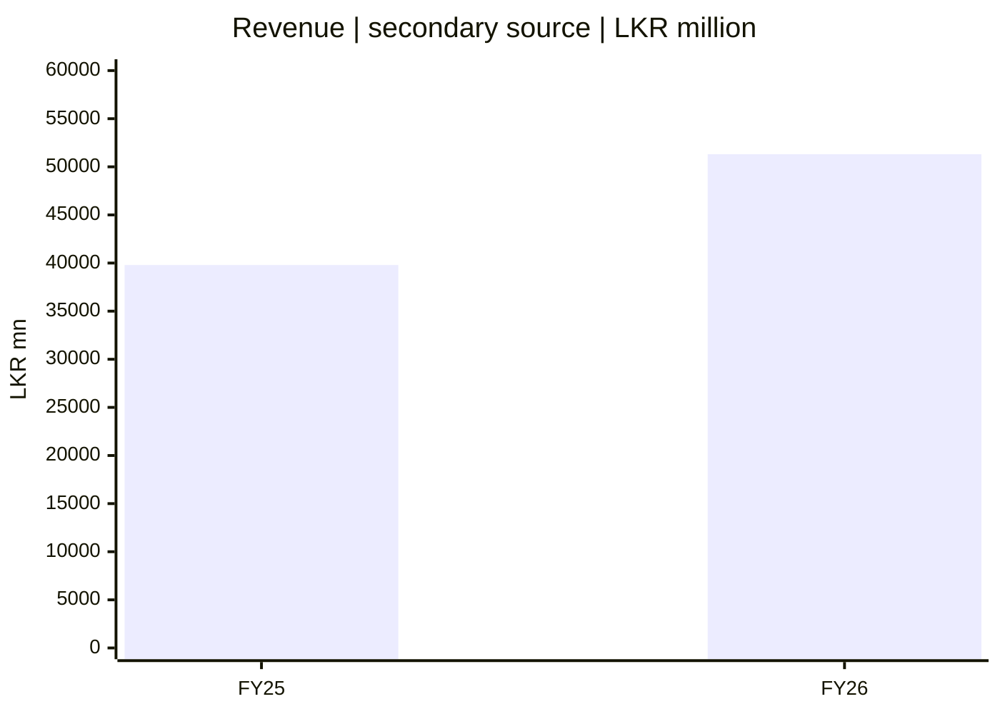
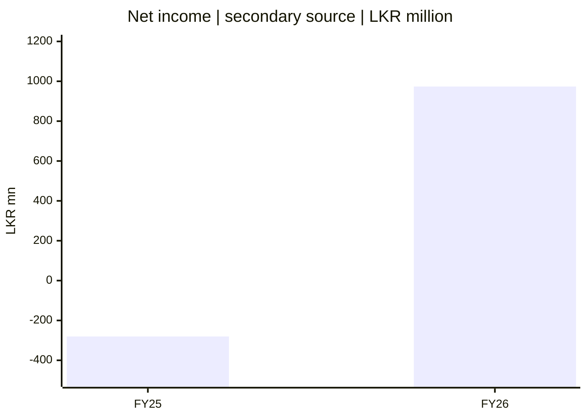
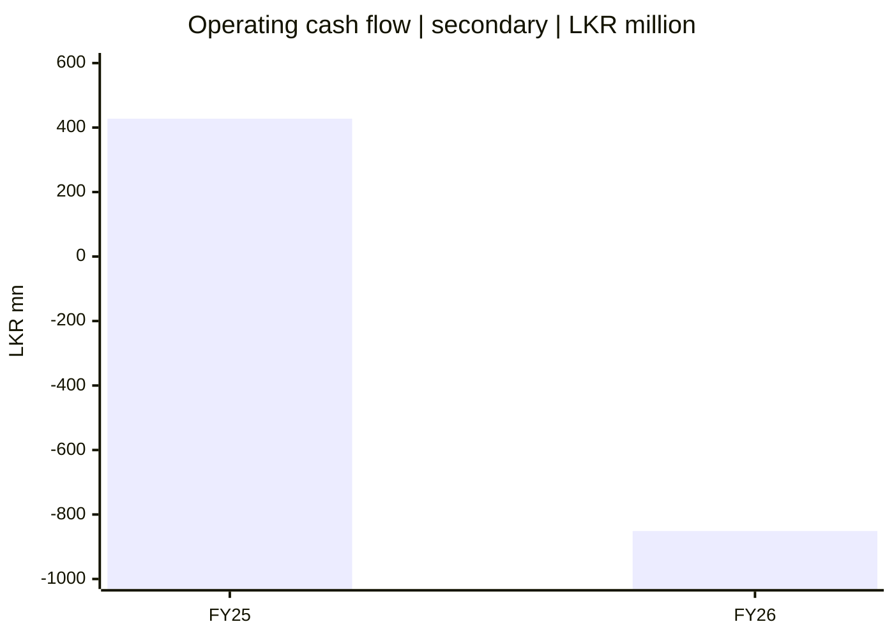
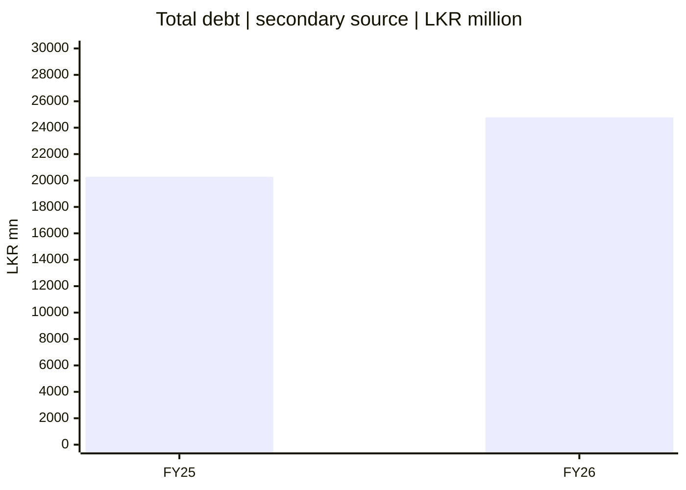

# 📈 SCAP.N0000 — මූලික මූල්‍ය ප්‍රස්තාර

[← ප්‍රධාන ගබඩාව](../../README.md) · [සිංහල](README.md) · [தமிழ்](../../ta/reports/README.md) · [English](../../reports/README.md) · [ප්‍රධාන දෘශ්‍ය පර්යේෂණ වාර්තාව](README.md)

⚠️ **පහත අගයන් පෙර සටහන් කළ තෙවන පාර්ශ්ව දත්ත වේ; නිල SCAP/CSE විගණිත වාර්තා සමඟ තවමත් තහවුරු කර නැත.** [සිංහල මූලික මූල්‍ය සටහන](../06-financial-snapshot.md) සහ [StockAnalysis](https://stockanalysis.com/quote/cose/SCAP.N0000/financials/) බලන්න. තහවුරු නොකළ අගයන් ආයෝජන valuation සඳහා භාවිත නොකරන්න.

**ඒකකය: LKR මිලියන. සෑම ප්‍රස්තාරයකම පරිමාණය වෙනස් වේ.** එක් ප්‍රස්තාරයක තීරුවක උස තවත් ප්‍රස්තාරයකට සෘජුව සැසඳිය නොහැක. මෙහි වත්මන් කොටස් මිල, intrinsic value හෝ ගනුදෙනු සංඥාවක් නැත.

## 01 / ආදායම — Revenue

*ගිණුම් වර්ෂ 2025-03-31 සහ 2026-03-31 අවසන් වේ.*

## 02 / ශුද්ධ ලාභය — Net income

*Net income යනු SCAP සාමාන්‍ය කොටස් හිමියන්ට අයත් අගයදැයි තවදුරටත් බලන්න.*

## 03 / මෙහෙයුම් මුදල් ප්‍රවාහය — Operating cash flow

*රක්ෂණ/මූල්‍ය ව්‍යාපාරවල මුදල් ප්‍රවාහය විශේෂයෙන් අර්ථ දැක්විය යුතුය.*

## 04 / මුළු ණය — Total debt

*ඒකාබද්ධ ණය හා SCAP තනි මව් සමාගමේ ණය වෙනස් වේ.*

## 📋 Data table / தரவு அட்டவணை / දත්ත වගුව

| අගය | FY25 | FY26 | තත්ත්වය |
|---|---:|---:|---|
| Revenue | 39,794 | 51,310 | ද්විතීයික |
| Net income | -280.42 | 973.77 | හිමිකරුවන්ට අදාළදැයි නොතහවුරුයි |
| Operating cash flow | 427.54 | -851.24 | අංශ-විශේෂ අර්ථකථනය අවශ්‍යයි |
| Total debt | 20,286 | 24,781 | group vs parent විවෘතයි |

**[CSE](https://www.cse.lk/)** · [Original financial note](../06-financial-snapshot.md) · [Source register](../SOURCES.md)

**පර්යේෂණ තත්ත්වය: මූලික · යොමු දිනය: 2026-09-30.** මෙය කොටස් මිලදී ගැනීමට හෝ විකිණීමට නිර්දේශයක් නොවේ. පැරණි හෝ තෙවන පාර්ශ්ව දත්ත අද දින තහවුරු කළ අගයන් ලෙස නොසලකන්න.
