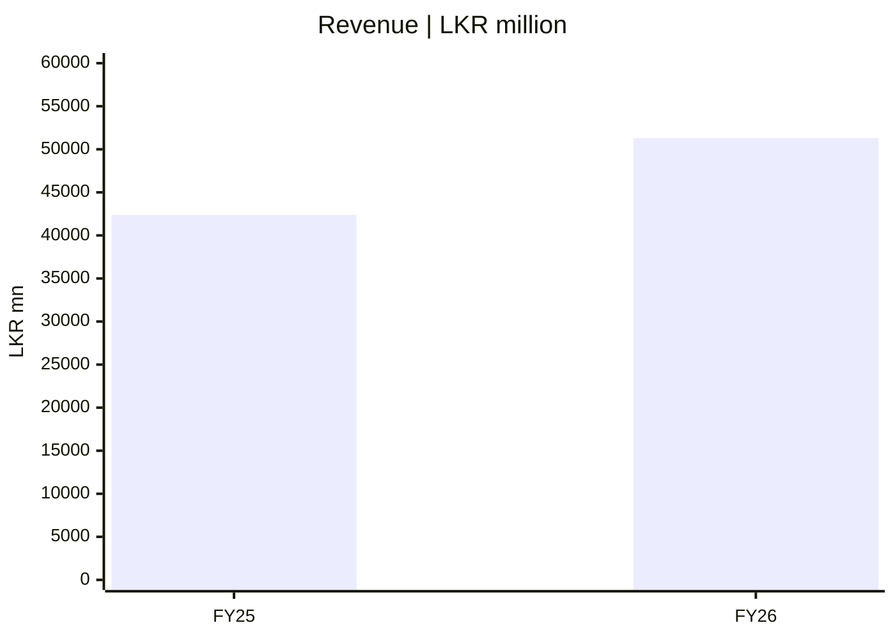
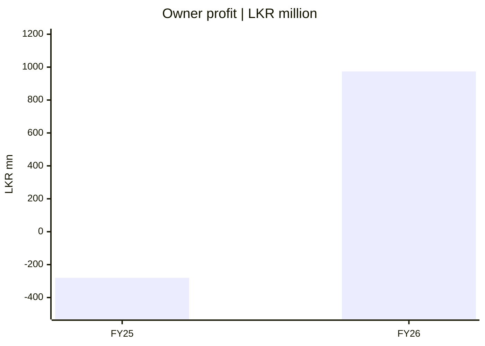
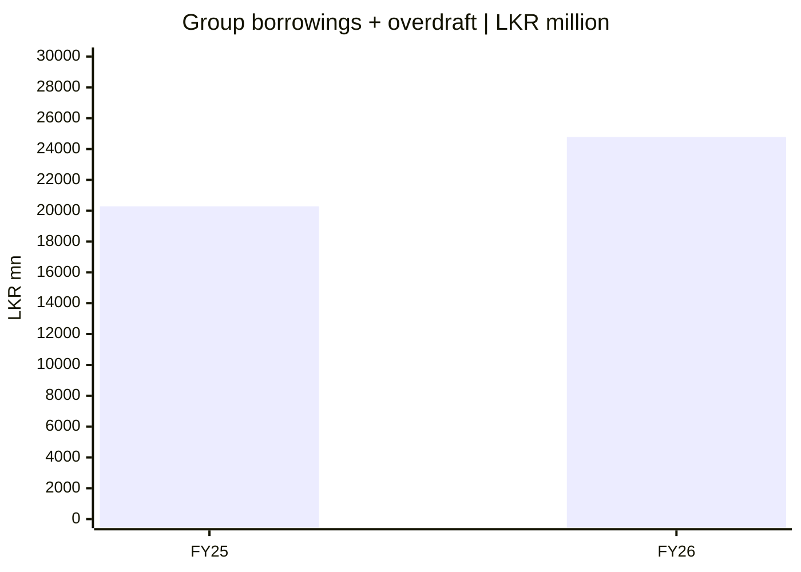

# 📈 මූල්‍ය දෘශ්‍ය සටහන — මුල් CSE මූලාශ්‍රය

[← ප්‍රධාන ගබඩාව](../README.md) · [සිංහල ප්‍රධාන වාර්තාව](README.md) · [English](../../reports/financial-pulse.md) · [தமிழ்](../../ta/reports/financial-pulse.md)

> **මූලාශ්‍රය:** [SCAP 2026 මැයි 27 CSE අතුරු ගොනුව](https://cdn.cse.lk/cmt/upload_report_file/1100_1779968696398.pdf). සියලු අගයන් **LKR මිලියන**. FY2025 **Audited** සංසන්දන; FY2026 **විගණනයට යටත්**. පැරණි FY2025 revenue **39,794** වෙනුවට මුල් CSE **42,383.72** භාවිත කර ඇත; පසුකාලීන සංශෝධන හා වත්මන් මිල මෙහි නොමැත.

FY2025 audited සංසන්දන / FY2026 අතුරු. **Four independently scaled charts: bar heights between charts cannot be compared.**

## 1 · සමූහ මුළු ආදායම

*සමූහ ආදායම් ප්‍රකාශනය PDF පි. 2.*

## 2 · SCAP මව් හිමියන්ට අයත් ලාභය/පාඩුව

*SCAP හිමියන්ට අයත් සමූහ ලාභය PDF පි. 2; **මුළු සමූහ PAT නොවේ**.*

## 3 · සමූහ මෙහෙයුම් මුදල් ප්‍රවාහය

*සමූහ මෙහෙයුම් මුදල් ප්‍රවාහය PDF පි. 9; **මව් සමාගමට ලැබෙන cash නොවේ**.*

## 4 · සමූහ පොලී සහිත ණය + overdraft

*සමූහ පොලී සහිත ණය + overdraft PDF පි. 6; **මව් තනි ණය නොවේ**.*

## මුල් දත්ත සාරාංශය

| මිනුම | FY2025 Audited සංසන්දන | FY2026 අතුරු | මූලාශ්‍රය |
|---|---:|---:|---|
| සමූහ මුළු ආදායම | 42,383.72 | 51,310.49 | සමූහ ආදායම් ප්‍රකාශනය, PDF පි. 2 |
| SCAP මව් හිමියන්ට අයත් ලාභය/පාඩුව | −280.42 | 973.77 | සමූහ PAT හි මව් හිමියන්ට අයත් කොටස, පි. 2 |
| සමූහ මෙහෙයුම් මුදල් ප්‍රවාහය | 427.54 | −851.24 | සමූහ මුදල් ප්‍රවාහ ප්‍රකාශනය, පි. 9 |
| සමූහ පොලී සහිත ණය + overdraft | 20,285.82 | 24,781.48 | සමූහ මූල්‍ය තත්ත්වය, පි. 6; තැන්පතු/රක්ෂණ වගකීම් ඇතුළත් නොවේ |

## සමූහය ≠ හිමිකරුවන් ≠ මව් තනි සමාගම

FY2026 සමූහ PAT **LKR 3,371.26mn**; SCAP හිමියන්ට අයත් කොටස **973.77mn**, සුළුතර හිමියන්ට අයත් **2,397.49mn**. SCAP මව් තනි සමාගම FY2026 **722.49mn පාඩුවක්** වාර්තා කරයි. 2026 මාර්තු 31 එහි cash **32.07mn** සහ පොලී සහිත ණය **17,324.26mn**. [ව්‍යාපාර විශ්ලේෂණය](../../si/01-Fundamental-Analysis/01-Business-Analysis/README.md) සහ [මුල් CSE ලේඛනය](https://cdn.cse.lk/cmt/upload_report_file/1100_1779968696398.pdf) බලන්න.

**පැරණි දත්ත නිවැරදි කිරීම:** තෙවන පාර්ශ්ව chart එකේ FY2025 revenue **LKR 39,794mn** යි. SCAP මුල් CSE ගොනුවේ **FY2025 Audited සංසන්දන LKR 42,383.72mn** යි. provider හි අර්ථකථන වෙනස තවමත් විසඳා නැත. මෙම අගයන් දැන් මුල් CSE අගය භාවිත කරයි. FY2026 අවසන් විගණිත හා 2026 ජූනි මුල් ගොනු තවදුරටත් සැසඳිය යුතුය.

[මූල්‍ය සංක්ෂිප්තය](../06-financial-snapshot.md) · [මූලාශ්‍ර](../SOURCES.md) · [CSE](https://www.cse.lk/)

රක්ෂණ/මූල්‍ය ආයතන මුදල් ප්‍රවාහය සාමාන්‍ය නිෂ්පාදන සමාගමකට සමානව අර්ථ දැක්විය නොහැක. කොටස් මිල ඉලක්කයක් හෝ නිර්දේශයක් මෙහි නැත.
