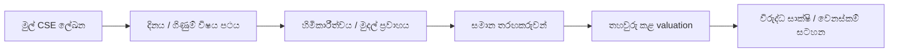
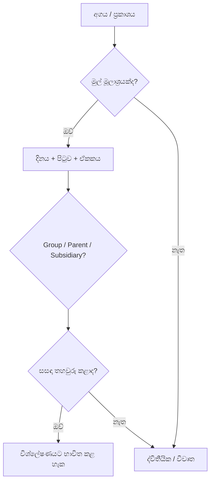

# 🔬 SCAP.N0000 — සාක්ෂි-පාදක පර්යේෂණ මාර්ග සිතියම

[← ප්‍රධාන ගබඩාව](../../README.md) · [සිංහල](README.md) · [தமிழ்](../../ta/reports/README.md) · [English](../../reports/README.md) · [ප්‍රධාන දෘශ්‍ය පර්යේෂණ වාර්තාව](README.md)

**මෙය කාර්ය ප්‍රවාහ සටහනකි; සියලු පරීක්ෂණ අවසන් වී ඇති බවට ප්‍රකාශයක් නොවේ.**

## 🧭 පර්යේෂණ මාර්ග සිතියම

## 🗂️ Research status — not a share rating

| තත්ත්වය | දැනට ඇති දේ | තව අවශ්‍ය දේ |
|---|---|---|
| 🟡 ව්‍යාපාරය | සමාගමේ ක්‍රියාකාරී අංශ | වත්මන් අයිතිය හා segment earnings |
| 🟡 තරඟකරුවන් | සැසඳුම් ක්‍රමවේදය | සමාන කාලයේ සමාන මිනුම් |
| 🔴 මූල්‍ය | FY25/FY26 තෙවන පාර්ශ්ව සටහන | මුල් විගණිත හා අතුරු ප්‍රකාශන සැසඳීම |
| 🔴 Valuation | ප්‍රශ්න/ආකෘති | නිවැරදි EPS, share count, දින සහිත මිල |
| 🟡 අවදානම් | ගුණාත්මක සිතියම | නවතම මුල් සාක්ෂි |
| 🔴 තාක්ෂණික chart | ඉදිරි පර්යේෂණ අංශය | කාල මුද්‍රාව සහිත price/volume දත්ත |

🟡 = ஆய்வு வடிவம் உள்ளது / පර්යේෂණ රාමුව ඇත · 🔴 = அசல் சான்று தேவை / මුල් සාක්ෂි අවශ්‍යයි. **இவை நிறுவனத்திற்கு வழங்கிய மதிப்பெண்கள் அல்ல / මේවා සමාගම් ලකුණු නොවේ.**

## ✅ Checklist

- [ ] SCAP FY2025/26 මුල් විගණිත වාර්තාව ලබාගන්න.
- [ ] 2026 ජූනි අතුරු වාර්තාව සහ පසුකාලීන නිවේදන සොයන්න.
- [ ] Group vs parent vs subsidiary අගයන් වෙන වෙනම සටහන් කරන්න.
- [ ] සුළුතර හිමිකම්, මව් ණය සහ සැබෑ මුදල් ලැබීම් තහවුරු කරන්න.
- [ ] අදාළ තරඟකරුවන් හා valuation අවස්ථා සසඳන්න.
- [ ] නව සාක්ෂි ලැබෙන විට පර්යේෂණ සටහන් වෙනස් කරන්න.

## 📖 Claim validation

[Research log](../RESEARCH-LOG.md) · [Original checklist](../07-reading-checklist.md)

මෙම යාවත්කාලීනයට GitHub Actions හෝ ස්වයංක්‍රීය workflows එකතු කර නැත.

**පර්යේෂණ තත්ත්වය: මූලික · යොමු දිනය: 2026-09-30.** මෙය කොටස් මිලදී ගැනීමට හෝ විකිණීමට නිර්දේශයක් නොවේ. පැරණි හෝ තෙවන පාර්ශ්ව දත්ත අද දින තහවුරු කළ අගයන් ලෙස නොසලකන්න.
