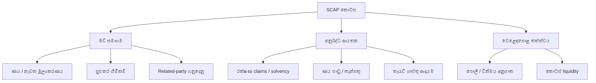

# 🛡️ SCAP.N0000 — අවදානම් සහ සාක්ෂි සිතියම

[← ප්‍රධාන ගබඩාව](../../README.md) · [සිංහල](README.md) · [தமிழ்](../../ta/reports/README.md) · [English](../../reports/README.md) · [ප්‍රධාන දෘශ්‍ය පර්යේෂණ වාර්තාව](README.md)

> **ගුණාත්මක අවදානම් පර්යේෂණයක් පමණි:** ඊතලවලින් හැකි අවදානම් මාර්ග පෙන්වයි; තහවුරු කළ සිද්ධි, සම්භාවිතා හෝ අගය කිරීම් නොවේ.

## 🌿 අවදානම් සිතියම

## 🔎 Evidence needed

| අවදානම් සාධකය | බලපෑම | මුල් සාක්ෂිය |
|---|---|---|
| මව් සමාගමේ ණය | බෙදාහැරිය හැකි මුදල් | SCAP තනි ගිණුම් සහ debt notes |
| සුළුතර හිමිකම් | හිමිකරුවන්ට අයත් ලාභය | Ownership / NCI notes |
| රක්ෂණය | Claims හා solvency | Insurer වාර්තාව |
| ණය/තැන්පතු | Credit loss, liquidity | Finance subsidiary + regulator |
| Related parties | ඇප/මුදල් මාරු | Related-party disclosures |
| කොටස් ද්‍රවශීලතාව | විකිණීමේ වියදම/පහසුව | දින සහිත CSE trading data |

**ඓතිහාසික තොරතුරක්:** [2025 සැප්තැම්බර් ලිපිය](https://economynext.com/sri-lankas-softlogic-finance-to-resume-business-after-central-bank-lifts-restrictions-241534/) අනුව Softlogic Finance සීමා 2025-09-19 සිට ඉවත් වූ බව වාර්තා විය. එමගින් අද නියාමන තත්ත්වය තහවුරු නොවේ.

[Detailed risk chapter](../05-risks-and-questions.md) · [Source register](../SOURCES.md) · [CSE](https://www.cse.lk/)

**පර්යේෂණ තත්ත්වය: මූලික · යොමු දිනය: 2026-09-30.** මෙය කොටස් මිලදී ගැනීමට හෝ විකිණීමට නිර්දේශයක් නොවේ. පැරණි හෝ තෙවන පාර්ශ්ව දත්ත අද දින තහවුරු කළ අගයන් ලෙස නොසලකන්න.
