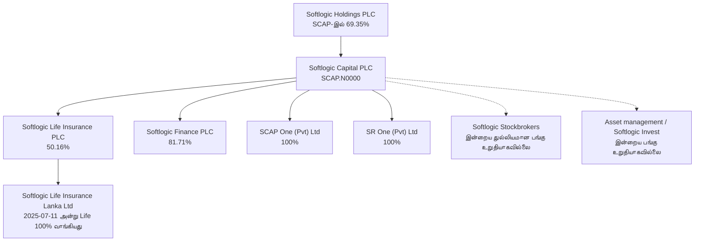
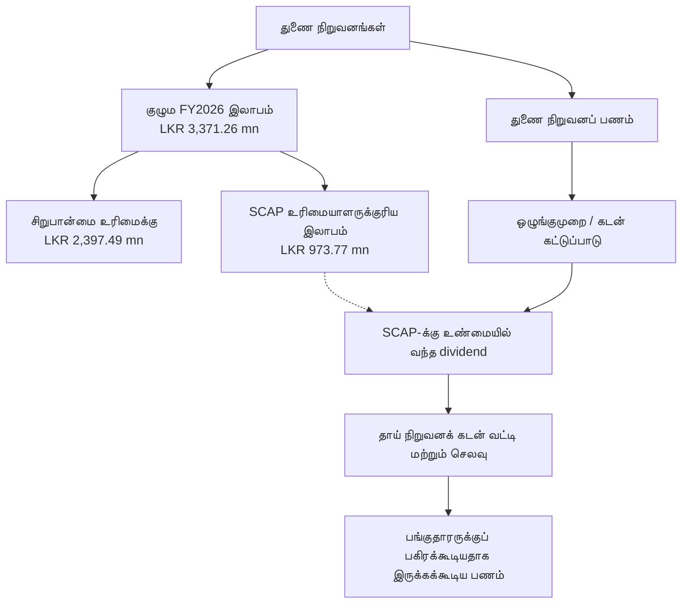

# 01 · வணிகப் பகுப்பாய்வு — Softlogic Capital PLC

[← அடிப்படைப் பகுப்பாய்வு](../README.md) · [English](../../../01-Fundamental-Analysis/01-Business-Analysis/README.md) · **தமிழ்** · [සිංහල](../../../si/01-Fundamental-Analysis/01-Business-Analysis/README.md)

> **பங்கு: SCAP.N0000 (CSE)** · **ஆய்வுத் தேதி: 30 செப்டம்பர் 2026**  
> **ஆதாரம்: நிறுவனம் CSE-யில் தாக்கல் செய்த 27 மே 2026 இடைக்கால நிதி அறிக்கை [S1] மற்றும் நிறுவன இணையதளம்.**
>
> **நிலை: பகுதியளவு சரிபார்க்கப்பட்டது.** இங்கே உள்ள பங்குரிமைச் சதவீதங்கள் **31 மார்ச் 2026** தேதிக்கானவை; இன்றைய பங்குரிமையாகக் கருதக்கூடாது. FY2025/26 இறுதி தணிக்கை அறிக்கையும் 2026 ஜூன் இடைக்கால அசல் அறிக்கையும் இன்னும் முழுமையாக ஒப்புச்சரிபார்க்கப்படவில்லை. இது பங்கை வாங்க/விற்க பரிந்துரை அல்ல.

## 🔎 நிறுவனம் உண்மையில் என்ன செய்கிறது?

**Softlogic Capital PLC தனியாக ஆயுள் காப்பீடு மட்டும் செய்யும் நிறுவனம் அல்ல; Softlogic குழுமத்தின் நிதிச் சேவைகளுக்கான பங்குச் சந்தையில் பட்டியலிடப்பட்ட தாய் நிறுவனமாகும்.** ஏப்ரல் 2005-இல் Capital Reach Holdings Limited என்ற பெயரில் தொடங்கப்பட்டு, ஆகஸ்ட் 2010-இல் Softlogic Holdings வாங்கியதாக நிறுவனம் கூறுகிறது. காப்பீடு, நிதி/கடன், பங்குத் தரகு, முதலீட்டு நிர்வகிப்பு ஆகிய தொழில்களுடன் தொடர்புடையது; SCAP-க்கு முதலீட்டு மேலாண்மைத் தரப்பிலும் SEC உரிமம் இருப்பதாக அதன் இணையதளம் குறிப்பிடுகிறது. **[S2, S3]**

**SCAP-ன் பிரதான பங்குதாரர்:** 31 மார்ச் 2026 அன்று **Softlogic Holdings PLC — 677,652,893 பங்குகள் (69.35%)**. அன்றைய SCAP மொத்த சாதாரணப் பங்குகள் **977,187,200**; பொதுப் பங்குரிமை **30.36%**. **[S1, PDF பக்கங்கள் 15–16]**

## 🗺️ தேதியுள்ள உரிமை அமைப்பு

**குறிப்பு:** நேர்கோடுகளில் உள்ள சதவீதங்கள் **2026-03-31** CSE அறிக்கைப் பங்குகள். புள்ளிக் கோடுகள் நிறுவனம் விவரிக்கும் தொழில்தொடர்பைக் காட்டுகின்றன; அந்த இரண்டு நிறுவனங்களின் இன்றைய சரியான பங்குரிமை இன்னும் திறந்த கேள்வி.

| நிறுவனம் | 31 மார்ச் 2026 அன்று SCAP-ன் பங்கு | ஆதாரம் / இன்னும் உறுதி செய்ய வேண்டியது |
|---|---:|---|
| Softlogic Life Insurance PLC | **50.16%** | **[S1, PDF ப. 19]**; பின்னைய மாற்றங்கள் தேவை |
| Softlogic Finance PLC | **81.71%** | **[S1, ப. 19]**; நிதி நிறுவனத்தின் பங்குதாரர் அட்டவணை **[S4]** இதை ஆதரிக்கிறது |
| SCAP One (Pvt) Ltd | **100%** | **[S1, ப. 19]**; அதன் சொத்து/பொறுப்புகள் பற்றி ஆய்வு தேவை |
| SR One (Pvt) Ltd | **100%** | **[S1, ப. 19]**; சொத்து மாற்றம், கடன் மீட்பு, funding ஆய்வு தேவை |
| Softlogic Stockbrokers (Pvt) Ltd | **சரியான சதவீதம் இன்னும் திறந்தது** | வணிகம் இருப்பதாக நிறுவனம் குறிப்பிடுகிறது **[S2, S3]** |
| Softlogic Asset Management / Softlogic Invest | **தற்போதைய பங்கு உறுதி செய்யப்படவில்லை** | இணையதளம் Softlogic Invest-ஐ 100% துணை நிறுவனம் எனக் கூறுகிறது; விளக்கத்திற்கு தெளிவான தேதி இல்லை **[S3]** |

**மறைமுக உரிமை:** Softlogic Life, **11 ஜூலை 2025** அன்று Allianz குழுமத்திலிருந்து **Softlogic Life Insurance Lanka Limited-ஐ 100%**, **LKR 1,426 மில்லியன்** ரொக்கமாக வாங்கியதாக SCAP ஆவணம் கூறுகிறது. அது **Softlogic Life-ன் நேரடித் துணை நிறுவனம்**; SCAP நேரடியாக இன்னொரு 100%-பங்கு வைத்திருப்பதாக எண்ணக்கூடாது. **[S1, PDF ப. 11]**

## 💼 யார் பணம் செலுத்துகிறார்கள்? இலாபம் எப்படிச் சாத்தியம்?

| வணிகப் பிரிவு | பணம் செலுத்துபவர்கள் | வருமானம் கிடைக்கும் வழி | முக்கிய பாதிப்பு |
|---|---|---|---|
| **ஆயுள் காப்பீடு** | தனிநபர், குடும்பம், நிறுவனங்கள் | காப்பீட்டு ஒப்பந்தங்கள், புதுப்பிப்பு, முதலீட்டு பலன்; claims மற்றும் செலவுகளுக்குப் பிறகு கிடைக்கும் விளைவு | Claims, விற்பனைக் கமிஷன், insurance liabilities, solvency |
| **வங்கி அல்லாத நிதிச் சேவை** | கடன்/லீசிங் வாடிக்கையாளர்கள்; வைப்பு தருபவர்கள் நிதி ஆதாரம் | கடன் வட்டி + கட்டணம் − நிதி திரட்டும் செலவு − கடன் இழப்பு − செலவுகள் | NPL, வைப்புத் தொகை வெளியேற்றம், மூலதன விதிகள் |
| **பங்குத் தரகு** | Retail, பெரிய/நிறுவன முதலீட்டாளர்கள் | பரிவர்த்தனைக் கமிஷன் மற்றும் அறிக்கையில் உறுதியாகக் காட்டப்படும் மற்ற கட்டணங்கள் | CSE turnover, வாடிக்கையாளர் நிலைத்தன்மை |
| **சொத்து மேலாண்மை** | Unit trust முதலீட்டாளர்கள் / வாடிக்கையாளர்கள் | AUM-ஐ அடிப்படையாகக் கொண்ட அனுமதிக்கப்பட்ட நிர்வாகக் கட்டணங்கள் | முதலீட்டாளர்கள் பணம் திரும்பப் பெறுதல், குறைந்த fees, செலவு |
| **தாய் நிறுவனம் SCAP** | துணை நிறுவனங்கள் மற்றும் பிற குழுமத் தரப்புகள் | பெற்ற dividend, வட்டி, consultancy / management fees | தாய் நிறுவனக் கடன் வட்டி, related-party, கட்டுப்பட்ட dividend |

இது **வணிகத்தின் பணம் உருவாகும் முறை**; எல்லாப் பிரிவுகளும் இலாபம் ஈட்டின என்று பொருள் அல்ல. காப்பீட்டு **gross written premium** = SCAP குழும இலாபம் அல்ல. வாடிக்கையாளருக்காக நிர்வகிக்கும் **AUM** = பங்குதாரருக்குச் சொந்தமான பணம் அல்ல. **[S1, பக்கங்கள் 2–3, 10; S2, S3]**

## 📊 31 மார்ச் 2026 முடிந்த நிதியாண்டின் பிரிவு முடிவுகள்

**[S1, PDF பக்கம் 10]. தொகைகள் LKR மில்லியன். இவை 27 மே 2026 இடைக்கால அறிக்கையில் வந்த FY2026 எண்கள்; இறுதி தணிக்கை முடிவாகக் கருதக்கூடாது.**

| பிரிவு | குழுமச் சரிசெய்தலுக்கு முன்பான வருமானம் | வரிக்குப் பின் பிரிவு இலாபம்/(இழப்பு) |
|---|---:|---:|
| காப்பீடு | **48,425.96** | **+4,870.86** |
| Non-banking finance | **1,384.78** | **−136.24** |
| இதரப் பிரிவுகள் | **4,019.94** | **−515.40** |
| குழுமச் சரிசெய்தல் / eliminations | **−1,260.09** | **−847.95** |
| **மொத்தக் குழுமம்** | **51,310.49** | **+3,371.26** |

**பிரிவு ஆய்வு:** அந்த அறிக்கையின் *revenue* அடிப்படையில் காப்பீடு முக்கியமான தொழில். ஆனால் காப்பீட்டுத் துணை நிறுவனத்தின் முழு இலாபமும் SCAP சாதாரண பங்குதாரருடையது அல்ல; சிறுபான்மை உரிமை, கடன் மற்றும் பணப்பங்கீட்டுக் கட்டுப்பாடுகள் முக்கியம்.

**2025 திருத்தக் குறிப்பு:** இதே CSE அறிக்கையின் **FY2025 audited ஒப்பீட்டு வருமானம் LKR 42,383.72 மில்லியன்**. இந்த repo-வின் பழைய மூன்றாம் தரப்பு snapshot-இல் **LKR 39,794 மில்லியன்** என இருந்தது. இது **ஆதார வேறுபாடு**; அசல் அறிக்கையுடன் முழுமையாக ஒப்பிடும்வரை பழைய எண்ணைப் பங்குமதிப்பீட்டிற்கு பயன்படுத்த வேண்டாம். **[S1, PDF ப. 2]**

## 💸 குழும இலாபம் ≠ SCAP பங்குதாரர் இலாபம் ≠ SCAP-க்கு வரும் பணம்

**SCAP குழுமத்தின் FY2026 இடைக்கால நிகர இலாபம் LKR 3,371.26 மில்லியன். அதில் SCAP உரிமையாளர்களுக்குரியது LKR 973.77 மில்லியன்; மற்ற பங்குதாரர் உரிமை LKR 2,397.49 மில்லியன்.** SCAP-க்குரிய கணக்கியல் இலாபம் = SCAP-க்கு வந்த dividend அல்ல. **[S1, PDF ப. 2]**

### தாய் நிறுவனத்தின் தனிக் கணக்கு — மிக முக்கியம்

| அளவுகோல் | 31 மார்ச் 2026 முடிந்த FY / அந்தத் தேதி | பொருள் |
|---|---:|---|
| SCAP தனி நிறுவன வருமானம் | **LKR 1,485.72 mn** | குழுமத்தின் LKR 51,310.49 mn அல்ல **[S1, ப. 3]** |
| பெற்ற/பதிவான dividend வருமானம் | **LKR 635.18 mn** | FY2025 audited ஒப்பீடு **LKR 3,273.55 mn**; SCAP பங்குதாரருக்கு செலுத்திய dividend என்று பொருள் அல்ல **[S1, ப. 3]** |
| தாய் நிறுவன வட்டிச் செலவு | **LKR 1,810.84 mn** | கணிசமான கடன் சேவைச் செலவு **[S1, ப. 3]** |
| SCAP தனி நிறுவன இழப்பு | **−LKR 722.49 mn** | குழும இலாபத்துடன் முரணல்ல **[S1, ப. 3]** |
| SCAP தனிக் காசு / வங்கி | **LKR 32.07 mn** | குழுமத்திலுள்ள அனைத்து பணமும் அல்ல **[S1, ப. 6]** |
| SCAP தனி bank overdraft | **LKR 323.13 mn** | கூடுதல் நிதிப் பொறுப்பு **[S1, ப. 6]** |
| SCAP தனி வட்டியுள்ள கடன் | **LKR 17,324.26 mn** | கடன் காலவரை, அடமானம், மறுநிதியளிப்பு ஆய்வு தேவை **[S1, ப. 6]** |
| SCAP தனி நிறுவன equity | **LKR 4,848.03 mn** | குழும உரிமையாளருக்குரிய equity-யிலிருந்து வேறுபடும் **[S1, ப. 6]** |
| குழுமத்தில் SCAP உரிமையாளருக்குரிய equity | **−LKR 1,035.49 mn** | குழும மொத்த equity **+6,269.84 mn**, சிறுபான்மை equity **+7,305.34 mn**; வெவ்வேறு அளவுகள் **[S1, ப. 6]** |

**ஆய்வு விளக்கம்:** ஒரு புறம் குழும இலாபம் அதிகமாக இருந்தாலும், **SCAP தனி நிறுவன இழப்பு, கடன் செலவு, குழும உரிமையாளருக்குரிய எதிர்மறை equity** ஆகியவற்றைத் தனியாக விளக்க வேண்டும். இது நிறுவனம் தோல்வியடையும் என்ற கணிப்பு அல்ல. இந்த இடைக்கால அறிக்கையில் 31 மார்ச் 2026 துணை நிறுவன முதலீடுகளின் fair value மதிப்பீடு இன்னும் முடிவடையவில்லை என்றும் குறிப்பிடப்பட்டுள்ளது. **[S1, PDF பக்கங்கள் 6, 11]**

### Related-party வருமானம் — குழும வருமானத்துடன் இருமுறை சேர்க்காதீர்கள்

FY2026 **SCAP தனி நிறுவனக் கணக்கில்**, Softlogic Holdings-இலிருந்து **வட்டி LKR 427.04 mn**, SR One-இலிருந்து **வட்டி LKR 160.39 mn**; Softlogic Life-இலிருந்து **consultancy fees LKR 120 mn**, Stockbrokers-இலிருந்து **LKR 64.11 mn**, Asset Management-இலிருந்து **LKR 76 mn** எனப் பதிவு உள்ளது. இவை **குழுமத்திற்குள் உள்ள வர்த்தகங்கள்**; group external revenue-க்கு மீண்டும் கூட்டக்கூடாது. **[S1, PDF ப. 17]**

### காப்பீட்டு இலாபத்தில் எல்லாவற்றையும் dividend-ஆக வழங்க முடியுமா?

**தானாக முடியாது.** அறிக்கையில் காப்பீட்டின் குறிப்பிட்ட *restricted one-off surplus* மீதான dividend வெளியீட்டிற்கு **IRCSL விதிகள்/ஒப்புதல்** பொருந்தும் என்று குறிப்பிடப்பட்டுள்ளது. 31 மார்ச் 2026 அன்று **restricted regulatory reserve LKR 1,515.80 mn** எனக் காட்டப்பட்டுள்ளது. இது **SCAP-க்கு உடனே கிடைக்கும் ரொக்கம் அல்ல**. **[S1, பக்கங்கள் 6, 13]**

## 🧩 போட்டி முன்னிலை — இன்னும் நிரூபிக்கப்படாத கருதுகோள்கள்

| சாத்தியமான காரணம் | தற்போது உள்ள சான்று | நிரூபிக்க வேண்டியது |
|---|---|---|
| பல தொழில்களை ஒன்றிணைத்த சேவை | காப்பீடு, கடன், தரகு, நிர்வகிப்பு வணிகங்களை நிறுவனம் குறிப்பிடுகிறது **[S2, S3]** | லாபகர cross-selling, வாடிக்கையாளர் acquisition செலவு |
| காப்பீட்டு அளவு | FY2026 பிரிவு வருமானத்தில் காப்பீடு பெரிய பங்கு **[S1, ப. 10]** | சக காப்பீட்டாளர்களுக்கு எதிரான persistency, claims, returns, solvency |
| பங்குத் தரகு வாடிக்கையாளர் வலையமைப்பு | நிறுவன இணையதளத்தில் institutional, high-net-worth, retail வாடிக்கையாளர்கள் குறிப்பிடப்படுகின்றனர் **[S3]** | உண்மையான fees, market share, நிகர இலாபம் |
| நிதி நிறுவன மறுசீரமைப்பு | SR One 100% துணை நிறுவனம் என CSE பதிவு **[S1, ப. 19]** | மாற்றப்பட்ட சொத்துகள், recoveries, ஒழுங்குமுறை மூலதன விளைவு |

**இந்தக் காரணங்கள் மட்டும் நிரந்தர போட்டி முன்னிலை என்று நிரூபிக்காது.**

## 📝 நிரப்பப்பட்ட ஆதார அட்டவணை

| அளவுகோல் / கூற்று | காலம் / scope | அசல் மூலம் + பக்கம் | அறிக்கையில் உள்ள தகவல் / நிலை |
|---|---|---|---|
| SCAP பிரதான பங்குதாரர் | 31-03-2026 | **[S1, ப. 15–16]** | Softlogic Holdings **69.35%** |
| SCAP shares / public holding | 31-03-2026 | **[S1, ப. 15–16]** | **977,187,200 பங்குகள்; 30.36% public** |
| Softlogic Life-ல் SCAP பங்கு | 31-03-2026 | **[S1, ப. 19]** | **50.16%** |
| Softlogic Finance-ல் SCAP பங்கு | 31-03-2026 | **[S1, ப. 19; S4]** | **81.71%** |
| SCAP One / SR One | 31-03-2026 | **[S1, ப. 19]** | **தலா 100%** |
| Stockbrokers / asset-manager இன்றைய பங்கு | குறிப்பிட்ட தேதி இல்லை | **[S2, S3]** | வணிகம் குறிப்பிடப்பட்டுள்ளது; **சரியான பங்கு திறந்தது** |
| Life-ன் Allianz Life கையகப்படுத்தல் | 11-07-2025 | **[S1, ப. 11]** | **100%; LKR 1,426 mn** |
| குழும வருமானம் / மொத்த இலாபம் | FY2026 இடைக்காலம் | **[S1, ப. 2, 10]** | **LKR 51,310.49 / 3,371.26 mn** |
| SCAP உரிமையாளருக்குரிய / minority இலாபம் | FY2026 இடைக்காலம் | **[S1, ப. 2]** | **LKR 973.77 / 2,397.49 mn** |
| SCAP பெற்ற dividend வருமானம் | FY2026 தனி நிறுவனம் | **[S1, ப. 3]** | **LKR 635.18 mn** |
| SCAP வட்டிச் செலவு / இழப்பு | FY2026 தனி நிறுவனம் | **[S1, ப. 3]** | **LKR 1,810.84 mn / −722.49 mn** |
| SCAP தனி கடன் / காசு | 31-03-2026 | **[S1, ப. 6]** | **LKR 17,324.26 / 32.07 mn** |
| குழும உரிமையாளருக்குரிய equity | 31-03-2026 | **[S1, ப. 6]** | **−LKR 1,035.49 mn** |
| Restricted reserve | 31-03-2026 | **[S1, ப. 6, 13]** | **LKR 1,515.80 mn; IRCSL விதிகள் பொருந்தும்** |
| FY2025 group revenue ஒப்பீடு | Audited comparator | **[S1, ப. 2]** | **LKR 42,383.72 mn**; பழைய aggregator வேறுபடுகிறது |
| இறுதி FY2026 audited / June 2026 | அடுத்த அறிக்கைகள் | **[S6]** செய்திச் சுருக்கம் | **அசல் SCAP அறிக்கையை முழுமையாக ஒப்பிட வேண்டியது மீதம்** |

## ⏭️ அடுத்த ஆய்வுப் பணிகள்

- [x] SCAP தாய் நிறுவனம், பிரதான பங்குதாரர் மற்றும் தேதியுள்ள முக்கிய உரிமைப் பங்குகளை கண்டறிதல்.
- [x] காப்பீடு, நிதி, தரகு, asset-management, SPV தொழில் மாதிரிகளை விவரித்தல்.
- [x] அசல் SCAP FY2026 இடைக்காலக் குழும/தனி நிறுவன/segment அறிக்கைகளை வாசித்தல்.
- [x] FY2026 குழும இலாபத்தை SCAP உரிமையாளருக்குரிய இலாபத்துடன் ஒப்பிடுதல்.
- [ ] **முன்னுரிமை:** FY2025/26 இறுதி தணிக்கை அறிக்கை மற்றும் 2026 ஜூன் CSE அசல் அறிக்கையைப் பெற்று புதிய மாற்றங்களைக் கண்டறிதல்.
- [ ] பங்குத் தரகு/asset-management இன்றைய உரிமை, அடமானம், கட்டுப்பாடு கண்டறிதல்.
- [ ] SCAP தனிக் கடனின் காலவரை, dividend பணப்பாதை, காப்பீட்டு ஒழுங்குமுறை கட்டுப்பாடு உறுதி செய்தல்.
- [ ] காப்பீட்டு persistency / solvency, நிதி நிறுவன NPL / funding ஆகியவற்றைச் சக நிறுவனங்களுடன் ஒப்பிடுதல்.
- [ ] 2025 பழைய மூன்றாம் தரப்பு revenue chart-ஐ அசல் CSE comparator-உடன் ஒப்புச்சரிபார்த்தல்.

**இது வணிகப் பகுப்பாய்வு; தற்போதைய பங்குவிலை இலக்கு அல்லது வாங்க/விற்க பரிந்துரை அல்ல.**

## 📚 ஆதாரங்கள் மற்றும் நம்பகத்தன்மை

- **[S1] SCAP-ன் சொந்த CSE இடைக்கால நிதி அறிக்கை**, 31 மார்ச் 2026 முடிந்த நிதியாண்டு, 27 மே 2026 வாரியம் அனுமதி: [20-பக்க அசல் PDF](https://cdn.cse.lk/cmt/upload_report_file/1100_1779968696398.pdf). FY2026 எண்கள் **தணிக்கைக்கு உட்பட்டவை** என்று அறிக்கை தெளிவாகக் கூறுகிறது. FY2025 ஒப்பீட்டு நெடுவரிசைகள் **Audited** எனக் குறிக்கப்படுகின்றன. PDF viewer பக்க எண்ணை பயன்படுத்தவும்.
- **[S2] நிறுவனம் பற்றி:** https://softlogiccapital.lk/about-us-overview/ — நிறுவனம் தானே கூறுவது.
- **[S3] துணை நிறுவனங்கள்:** https://softlogiccapital.lk/subsidiaries/ — தொழில் விளக்கங்கள்; சில உரிமைத் தகவல்கள் தேதி இல்லாதவை.
- **[S4] Softlogic Finance-ன் CSE 31 மார்ச் 2026 பங்குதாரர் அட்டவணை:** https://cdn.cse.lk/cmt/upload_report_file/863_1779879284133.pdf — **81.71%** பங்கு கொண்ட பெயர்ப் பதிவு; custody/pledge விவரம் தேவை.
- **[S5] Softlogic Life 2025 அறிக்கை:** https://annualreport.softlogiclife.lk/ — காப்பீட்டு ஆண்டு டிசம்பரில் முடிகிறது; SCAP நிதியாண்டு மார்ச்சில் முடிகிறது.
- **[S6] 2026 ஜூன் காலாண்டு குறித்த இரண்டாம் தரப்பு செய்தி:** https://www.marketscreener.com/news/softlogic-capital-plc-reports-earnings-results-for-the-first-quarter-ended-june-30-2026-ce7859dfd88af521 — அசல் CSE ஆவணத்திற்குப் பதிலல்ல.

**கடைசியாகப் பார்த்த ஆதாரம் 30-09-2026.** பின்னைய audited அறிக்கையால் எண்கள்/உரிமைப் பங்குகள் மாறியிருந்தால் இந்தப் பதிவைப் புதுப்பிக்க வேண்டும்.
