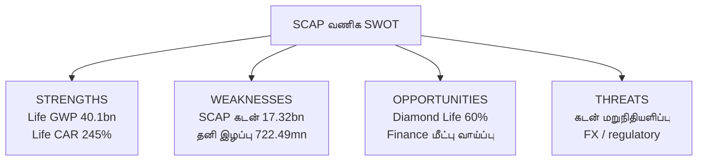

# 🧭 SCAP.N0000 — வணிக SWOT பகுப்பாய்வு

**ஆதாரக் களஞ்சியம்**: [Stable source register](../../../sources/SOURCE-REGISTER.md) · [SCAP-FY2026-YE-INTERIM](../../../sources/records/SCAP-FY2026-YE-INTERIM.md) · [SLIFE-FY2025-RESULTS](../../../sources/records/SLIFE-FY2025-RESULTS.md) · [SFIN-UPDATE-2026](../../../sources/records/SFIN-UPDATE-2026.md) · [DIAMOND-LIFE-ACQUISITION-2026](../../../sources/records/DIAMOND-LIFE-ACQUISITION-2026.md). அசல் PDF இணைப்புகள் பதிவு செய்யப்பட்டுள்ளன; முழு PDF கோப்புகள் GitHub-இல் mirror செய்யப்படவில்லை.

[← வணிகப் பகுப்பாய்வு](README.md) · [16 காட்சி அறிக்கைகள்](VISUAL-REPORT.md) · [English](../../../01-Fundamental-Analysis/01-Business-Analysis/SWOT-ANALYSIS.md) · **தமிழ்** · [සිංහල](../../../si/01-Fundamental-Analysis/01-Business-Analysis/SWOT-ANALYSIS.md)

> **ஆய்வு நிலை: 30 செப்டம்பர் 2026.** நிறுவனம்: **Softlogic Capital PLC (SCAP.N0000)**. இது **வணிகத்தின்** SWOT; பங்குவிலை மதிப்பீடு அல்லது வாங்க/விற்க பரிந்துரை அல்ல. கீழே உள்ள SCAP மார்ச் 2026 எண்கள் **27 மே 2026 இடைக்கால அறிக்கை**; அந்த ஆண்டு எண்கள் **தணிக்கைக்கு உட்பட்டவை**. காப்பீட்டு நிறுவனத்தின் ஆண்டு **டிசம்பர் 2025** முடியும்; வங்காளதேசக் கையகப்படுத்தல் 2026 மார்ச்சுக்குப் பிந்தையது.

## SWOT காட்சி வரைபடம்

> **முக்கிய எல்லை:** Life GWP/CAR மற்றும் Finance capital ஆகியவை துணை நிறுவன எண்கள். அவை SCAP குழும வருமானம் அல்லது SCAP தாய் நிறுவனக் கையிருப்பு அல்ல.

## 2×2 சான்று அட்டவணை

| **பலங்கள்** | **பலவீனங்கள்** |
|---|---|
| **Softlogic Life: 2025 GWP LKR 40.1bn (+27%), ஆயுள் காப்பீட்டு GWP சந்தைப் பங்கு 18.4%, CAR 245% என நிறுவனம் தெரிவித்துள்ளது.**  **Life 2025 ஆண்டு அறிக்கைத் தளம் 159 செயல்பாட்டு இடங்களைச் சொல்கிறது; நிறுவன அறிவிப்பு 1.3m மக்களுக்கு காப்புறுதி எனக் கூறுகிறது; SCAP பல தொழில்களை விவரிக்கிறது.**  **Softlogic Finance-ன் ஜூலை 2026 வெளியீடு சுமார் 61% capital adequacy மற்றும் தொடரும் மறுசீரமைப்பைக் குறிப்பிடுகிறது.** | **SCAP தனி நிறுவனம்: 31-03-2026 வட்டியுள்ள கடன் LKR 17,324.26mn; overdraft 323.13mn; cash/bank 32.07mn.**  **SCAP FY2026 தனி நிறுவன வட்டிச் செலவு LKR 1,810.84mn; இழப்பு LKR 722.49mn.**  **FY2026 குழும PAT LKR 3,371.26mn; SCAP உரிமையாளருக்குரியது 973.77mn; குழும owner-attributable equity −1,035.49mn.** |

| **வாய்ப்புகள்** | **அபாயங்கள்** |
|---|---|
| **Diamond Life நிறுவன இணையதளமும் 16-09-2026 வங்காளதேச முதலீட்டு ஆணைய செய்தியும் Softlogic Life ஜூலை 2026-இல் 60% பங்கை சுமார் USD 1.9m-க்கு வாங்கியதாகக் கூறுகின்றன.**  **Finance ஜூலை 2026 நிறுவன வெளியீடு மூலதன மறுசீரமைப்பும் வணிக விரிவாக்கத் திட்டமும் தொடர்வதாகக் கூறுகிறது.**  **Life 2025 நிறுவனச் செய்தி AI அடிப்படையிலான underwriting / claims மற்றும் protection distribution-ஐக் குறிப்பிடுகிறது.** | **SCAP மார்ச் 2026 கடனும் வட்டிச் செலவும் பின்னைய மறுநிதியளிப்பு மற்றும் வட்டி நிலையைச் சார்ந்திருக்கின்றன.**  **Softlogic Finance CBSL மேற்பார்வையிலும், Softlogic Life IRCSL insurance capital மற்றும் reserve விதிகளின் கீழும் உள்ளன.**  **Life-ன் வங்காளதேசக் கையகப்படுத்தல் வேறு நாணயம்/விதிமுறையை உள்ளடக்குகிறது; தரகு வருமானம் சந்தை வர்த்தகச் சுழற்சியைச் சாரலாம்.** |

> **SWOT வகை:** Strength/Weakness என்பது நிறுவனத்திற்குள் உள்ள நிலை; Opportunity/Threat என்பது வெளியிலிருந்து வரக்கூடிய சூழல். இங்கு இடப்பட்ட பெயர்கள் **ஆய்வு விளக்கங்கள்**; தணிக்கை முடிவோ நிகழ்தகவு மதிப்பெண்ணோ அல்ல.

## ஆதாரம் சார்ந்த ஆய்வும் சோதனைகளும்

| SWOT பகுதி | தேதியுள்ள சான்று | வணிகப் பொருள் | அடுத்த சரிபார்ப்பு | ஆதாரம் |
|---|---|---|---|---|
| **பலங்கள்** | Softlogic Life: 2025 GWP LKR 40.1bn (+27%), ஆயுள் காப்பீட்டு GWP சந்தைப் பங்கு 18.4%, CAR 245% என நிறுவனம் தெரிவித்துள்ளது. | காப்பீட்டில் அளவும் வாடிக்கையாளர் அடிப்படையும் உள்ளது; ஆனால் Life-ன் GWP என்பது SCAP பங்குதாரருக்குரிய இலாபம் அல்ல. | Life-ன் persistency, claims, solvency, புதிய வாடிக்கையாளர் செலவு மற்றும் உண்மையான dividend பணப்பாதையை ஒப்பிடவும். | [Life 2025 அறிவிப்பு](https://softlogiclife.lk/news/softlogic-life-surpasses-rs-40-bn-gwp-in-fy25-doubles-key-financial-metrics-over-four-years/) |
| **பலங்கள்** | Life 2025 ஆண்டு அறிக்கைத் தளம் 159 செயல்பாட்டு இடங்களைச் சொல்கிறது; நிறுவன அறிவிப்பு 1.3m மக்களுக்கு காப்புறுதி எனக் கூறுகிறது; SCAP பல தொழில்களை விவரிக்கிறது. | வாடிக்கையாளர்களை அடையும் வாயில்கள் உள்ளன; இலாபகர cross-selling இன்னும் நிரூபிக்கப்படவில்லை. | ஒவ்வொரு சேனலின் செலவு, வாடிக்கையாளர் தக்கவைப்பு மற்றும் உண்மையான cross-sell எண்களைப் பெறவும். | [Life 2025 / SCAP](https://annualreport.softlogiclife.lk/) |
| **பலங்கள்** | Softlogic Finance-ன் ஜூலை 2026 வெளியீடு சுமார் 61% capital adequacy மற்றும் தொடரும் மறுசீரமைப்பைக் குறிப்பிடுகிறது. | மூலதன மீட்பு வளர்ச்சிக்கான செயல்பாட்டு இடம் உருவாக்கலாம்; இது துணை நிறுவன அளவுகோல் மட்டும். | புதிய audited capital, loan quality மற்றும் தற்போதைய CBSL நிலையை உறுதி செய்யவும். | [Finance ஜூலை 2026](https://softlogicfinance.lk/news/building-a-stronger-more-resilient-softlogic-finance/) |
| **பலவீனங்கள்** | SCAP தனி நிறுவனம்: 31-03-2026 வட்டியுள்ள கடன் LKR 17,324.26mn; overdraft 323.13mn; cash/bank 32.07mn. | தாய் நிறுவனக் கடனையும் மறுநிதியளிப்பையும் சமாளிப்பது பங்குதாரருக்கு பகிரக்கூடிய பணத்தை பாதிக்கலாம். | Debt maturity, அடமானம், covenant, cash மற்றும் பெற்ற dividend அட்டவணை தயாரிக்கவும். | [SCAP இடைக்காலம் ப. 6](https://cdn.cse.lk/cmt/upload_report_file/1100_1779968696398.pdf) |
| **பலவீனங்கள்** | SCAP FY2026 தனி நிறுவன வட்டிச் செலவு LKR 1,810.84mn; இழப்பு LKR 722.49mn. | குழும வணிக இலாபம் இருந்தாலும் தாய் நிறுவனத்தின் நிதிச் செலவு தனியாக ஆய்வு செய்யப்பட வேண்டும். | உண்மையான பணவரவு, வட்டி செலுத்தல், மீண்டும் மீண்டும் வரும் செலவுகளை ஒப்பிடவும். | [SCAP இடைக்காலம் ப. 3](https://cdn.cse.lk/cmt/upload_report_file/1100_1779968696398.pdf) |
| **பலவீனங்கள்** | FY2026 குழும PAT LKR 3,371.26mn; SCAP உரிமையாளருக்குரியது 973.77mn; குழும owner-attributable equity −1,035.49mn. | சிறுபான்மை உரிமை இருப்பதால் குழும மொத்தம் SCAP சாதாரணப் பங்குதாரரின் பொருளாதார உரிமைக்கு சமமல்ல. | Minority interests, parent NAV, segment dividends மற்றும் பின்னைய திருத்தங்களைப் பிரிக்கவும். | [SCAP இடைக்காலம் ப. 2, 6](https://cdn.cse.lk/cmt/upload_report_file/1100_1779968696398.pdf) |
| **வாய்ப்புகள்** | Diamond Life நிறுவன இணையதளமும் 16-09-2026 வங்காளதேச முதலீட்டு ஆணைய செய்தியும் Softlogic Life ஜூலை 2026-இல் 60% பங்கை சுமார் USD 1.9m-க்கு வாங்கியதாகக் கூறுகின்றன. | புதிய நாட்டில் காப்பீட்டுச் சந்தை வாய்ப்பு இருக்கலாம்; SCAP-க்கு வரும் கூடுதல் இலாபம் இன்னும் கணக்கிடப்படவில்லை. | கையகப்படுத்தலுக்குப் பிந்தைய இலாபம், செலவு, forex, மூலதனம் மற்றும் மறைமுக உரிமையைப் பெறவும். | [Diamond Life / Bangladesh](https://diamondlifebd.com/overview/) |
| **வாய்ப்புகள்** | Finance ஜூலை 2026 நிறுவன வெளியீடு மூலதன மறுசீரமைப்பும் வணிக விரிவாக்கத் திட்டமும் தொடர்வதாகக் கூறுகிறது. | அனுமதிக்கப்படும் secured lending வளரலாம்; கடன் அளவு உயர்வதே இலாபம் உறுதி அல்ல. | புதிய கடன் yield, NPL, deposit cost, impairment, CAR ஆகியவற்றை ஒரே காலத்தில் கண்காணிக்கவும். | [Finance ஜூலை 2026](https://softlogicfinance.lk/news/building-a-stronger-more-resilient-softlogic-finance/) |
| **வாய்ப்புகள்** | Life 2025 நிறுவனச் செய்தி AI அடிப்படையிலான underwriting / claims மற்றும் protection distribution-ஐக் குறிப்பிடுகிறது. | டிஜிட்டல் வசதி செலவைக் குறைக்கவோ சேவையை மேம்படுத்தவோ வாய்ப்பு உள்ளது; பொருளாதார பலன் இன்னும் உறுதி இல்லை. | Claims கையாளும் செலவு, பாலிசி பெறும் செலவு, retention, புகார்கள், நிகர இலாபம் பார்க்கவும். | [Life 2025 அறிவிப்பு](https://softlogiclife.lk/news/softlogic-life-surpasses-rs-40-bn-gwp-in-fy25-doubles-key-financial-metrics-over-four-years/) |
| **அபாயங்கள்** | SCAP மார்ச் 2026 கடனும் வட்டிச் செலவும் பின்னைய மறுநிதியளிப்பு மற்றும் வட்டி நிலையைச் சார்ந்திருக்கின்றன. | வட்டி/நிதி அணுகல் மாறினால் பணத் தேவை அதிகரிக்கலாம்; கடன் தவறுதல் நடந்தது என்று கூறவில்லை. | கடன் காலவரை, collateral, புதிய finance நிபந்தனை, வட்டி, covenant நிலையை உறுதி செய்யவும். | [SCAP இடைக்காலம் ப. 3, 6](https://cdn.cse.lk/cmt/upload_report_file/1100_1779968696398.pdf) |
| **அபாயங்கள்** | Softlogic Finance CBSL மேற்பார்வையிலும், Softlogic Life IRCSL insurance capital மற்றும் reserve விதிகளின் கீழும் உள்ளன. | Credit loss, deposit போட்டி, claims, solvency விதிகள் துணை நிறுவனங்களின் dividend-ஐக் கட்டுப்படுத்தலாம். | சமீபத்திய CBSL/IRCSL அறிவிப்பு, கடன் தரம், solvency, dividend அனுமதி கண்டறியவும். | [SCAP இடைக்காலம் / துணை நிறுவனம்](https://cdn.cse.lk/cmt/upload_report_file/1100_1779968696398.pdf) |
| **அபாயங்கள்** | Life-ன் வங்காளதேசக் கையகப்படுத்தல் வேறு நாணயம்/விதிமுறையை உள்ளடக்குகிறது; தரகு வருமானம் சந்தை வர்த்தகச் சுழற்சியைச் சாரலாம். | FX, integration, வெளிநாட்டு விதிகள், சந்தை turnover மாற்றங்கள் **சாத்திய அபாயப் பாதைகள்**; முன்னறிவிப்பு அல்ல. | உண்மையான Bangladesh நிதி முடிவு, FX treatment, உள்ளூர் capital மற்றும் தரகு வருமானத்தைப் பெறவும். | [Diamond Life / SCAP](https://diamondlifebd.com/overview/) |

### இதன் மூலம் என்ன ஆய்வு செய்ய வேண்டும்?

**SCAP தாய் நிறுவனத்துக்குக் கிடைக்கக்கூடிய பணம் அதன் கடன்/வட்டிச் செலவைச் சமாளிக்குமா?** என்பது முக்கியக் கணக்கியல் கேள்வி. காப்பீடு மற்றும் நிதி நிறுவனங்களின் வளர்ச்சி minority rights, regulator capital ஆகியவற்றுக்குப் பிறகு SCAP உரிமையாளருக்கு எவ்வாறு பயன் தரும் என்பதைத் தனியாகக் கணக்கிட வேண்டும். இது எதிர்கால முடிவை முன்னறிவிப்பதல்ல.

## அடுத்த சரிபார்ப்புப் பட்டியல்

- [ ] SCAP FY2025/26 **இறுதி audited ஆண்டு அறிக்கை** மற்றும் 2026 ஜூன் அசல் இடைக்கால அறிக்கையைப் பெறவும்.
- [ ] SCAP → Life → Diamond Life உட்பட **இன்றைய நேரடி/மறைமுக பங்குரிமையை** உறுதி செய்யவும்.
- [ ] தாய் நிறுவனக் கடன்/வட்டியை உண்மையில் பெற்ற subsidiary dividend பணத்துடன் ஒப்பிடவும்.
- [ ] Finance-ன் தற்போதைய CBSL நிலை, கடன் தரம் மற்றும் புதிய capital எண்ணை அசல் அறிக்கையில் உறுதி செய்யவும்.
- [ ] Bangladesh புதிய நிறுவன இலாபம், integration, forex, solvency செலவுகளைத் தனியாக ஆய்வு செய்யவும்.
- [ ] இந்த SWOT மூலம் தற்போதைய பங்கு இலக்கு விலை கணக்கிட வேண்டாம்.

## ஆதாரங்களின் பதிவு

1. [SCAP CSE-filed 27 May 2026 year-end interim](https://cdn.cse.lk/cmt/upload_report_file/1100_1779968696398.pdf) — **FY2026 figures subject to audit**; previous research tied group and parent accounts to PDF pp. 2–3, 6 and subsidiary notes. Original PDF could not be reopened in the latest web check. Do **not** treat these figures as later audited data.
2. [SCAP business overview](https://softlogiccapital.lk/about-us-overview/) — issuer description of the holding company and businesses, website may not show a current legal ownership table.
3. [Softlogic Life issuer calendar-2025 release](https://softlogiclife.lk/news/softlogic-life-surpasses-rs-40-bn-gwp-in-fy25-doubles-key-financial-metrics-over-four-years/) — 40.1bn GWP, 18.4% market share, 245% insurer CAR, 1.3m lives and digital services.
4. [Softlogic Life 2025 reporting portal](https://annualreport.softlogiclife.lk/) — insurer-only year-end context.
5. [Softlogic Finance July 2026 issuer business update](https://softlogicfinance.lk/news/building-a-stronger-more-resilient-softlogic-finance/) — issuer-reported circa 61% capital ratio and ongoing transformation; compare to original regulatory returns.
6. [Diamond Life company overview](https://diamondlifebd.com/overview/) — 60% acquisition, approx USD1.9m; corroborate with [Bangladesh investment authority's dated September 2026 article](https://investbangladesh.gov.bd/publications-profile-items/from-colombo-to-dhaka-softlogic-lifebuys-into-bangladeshs-insurance-frontier).
7. [CSE company announcements](https://www.cse.lk/) — primary place to check more recent SCAP parent disclosures, shareholdings and audited annual report.

**நிலை:** ஆதாரத்துடன் கூடிய தரமான ஆய்வு; பங்கு இலக்கு விலை, வாய்ப்பு மதிப்பெண் அல்லது வாங்க/விற்கச் சைகை இல்லை.
