# 📊 SCAP.N0000 — வணிகப் பகுப்பாய்வு: தரவுடன் 15 காட்சி அறிக்கைகள்

[← வணிகப் பகுப்பாய்வு](README.md) · [English](../../../01-Fundamental-Analysis/01-Business-Analysis/VISUAL-REPORT.md) · [සිංහල](../../../si/01-Fundamental-Analysis/01-Business-Analysis/VISUAL-REPORT.md)

> **ஆய்வுத் தேதி: 30-09-2026.** SCAP-ன் **31 மார்ச் 2026 இடைக்கால CSE** அறிக்கை, Softlogic Life-ன் **2025 டிசம்பர் முடியும்** அறிக்கை, நிறுவனம் வெளியிட்ட தகவல்கள், தனியாகக் குறிக்கப்பட்ட இரண்டாம் நிலை ஆதாரங்கள் ஆகியவற்றை வைத்து உருவாக்கப்பட்ட Markdown/Mermaid வரைபடங்கள். **வெவ்வேறு நிறுவனத்தின்/காலத்தின் எண்களை ஒன்றாகக் கூட்டக்கூடாது.** இது live பங்குவிலையோ வாங்க/விற்க பரிந்துரையோ அல்ல.

## 🧭 காட்சிப் பட்டியல்

| # | காட்சியின் பெயர் | தரவு வகை |
|---|---|---|
| 01 | [பங்குரிமை மரம் — தேதியுடன்](#v01) | FY2026 ownership |
| 02 | [வணிக அமைப்பு வரைபடம்](#v02) | Issuer business map |
| 03 | [வணிக மாதிரி வரைபடம்](#v03) | Business mechanisms |
| 04 | [தொழில் பிரிவு வருமானம்](#v04) | FY2026 interim + reconciled estimate |
| 05 | [பிரிவு இலாபம் மற்றும் இழப்பு](#v05) | FY2026 interim |
| 06 | [குழும இலாபத்தில் யாருக்கு எவ்வளவு?](#v06) | FY2026 interim |
| 07 | [இலாபத்திலிருந்து பணம் வரும் பாதை](#v07) | FY2026 parent-only |
| 08 | [நிறுவன வரலாற்று நிகழ்வுகள்](#v08) | 2005–2026 events |
| 09 | [காப்பீட்டு வாடிக்கையாளர்கள் மற்றும் சேவை அளவு](#v09) | Insurer 2023–2025 |
| 10 | [சேவை வழங்கும் வழிகள்](#v10) | Insurer FY25 / undated finance |
| 11 | [துறையின் சந்தைப் பங்கு](#v11) | Insurer calendar 2025 |
| 12 | [போட்டி முன்னிலை: சான்று சோதனை](#v12) | Insurer 2025 / hypotheses |
| 13 | [குழும நிறுவனங்களுக்கிடையேயான பணப் பரிவர்த்தனைகள்](#v13) | FY2026 parent-only |
| 14 | [ஒழுங்குமுறை கட்டுப்பாட்டு வரைபடம்](#v14) | Insurer 2025 / sector regulation |
| 15 | [வாய்ப்புகளும் கட்டுப்பாடுகளும்](#v15) | Mixed historical periods |

> **ஆதார வகை:** *SCAP CSE interim* = 27-05-2026 வெளியீடு, FY2026 எண்கள் **தணிக்கைக்கு உட்பட்டவை**; *Insurer 2025* = Softlogic Life, நிதியாண்டு **டிசம்பர்** முடிவு; *தேதியற்ற நிறுவனம் இணையதளம்* = தொழில் விளக்கம் மட்டும்; *இரண்டாம் நிலை* = தனியாக உறுதி செய்ய வேண்டிய செய்தி/தரவுத்தளம். 'Other segment' எண் குழுமக் கூட்டுத்தொகையைப் பொருத்திக் **கணக்கிடப்பட்டது**; வரைபடம் 04 பார்க்கவும்.

## 01 · பங்குரிமை மரம் — தேதியுடன்

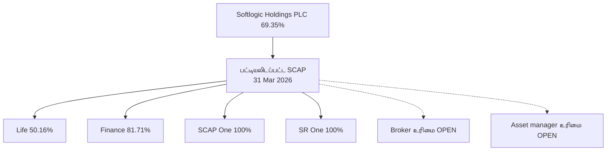

31-03-2026 அன்று Softlogic Holdings-க்கு SCAP-இல் **69.35%**; SCAP-க்கு Life **50.16%**, Finance **81.71%**, SCAP One மற்றும் SR One தலா **100%** என CSE அறிக்கை கூறுகிறது. **தரகு/asset management இன்றைய சரியான உரிமைப் பங்கு தெரியவில்லை**. Life வாங்கிய மற்ற காப்பீட்டு நிறுவனம் SCAP-ன் கூடுதல் நேரடி 100% சொத்து அல்ல.

**ஆதாரம் / காலம்:** [ஆதாரம் 1](https://cdn.cse.lk/cmt/upload_report_file/1100_1779968696398.pdf) · [ஆதாரம் 2](https://softlogiccapital.lk/about-us-overview/).

## 02 · வணிக அமைப்பு வரைபடம்

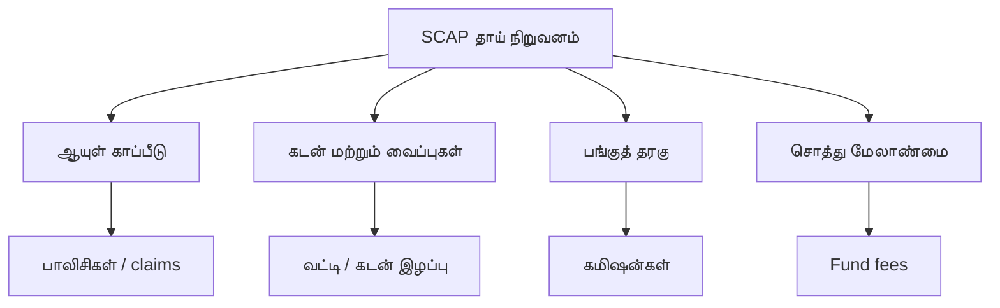

SCAP-ன் தொடர்புடைய தொழில்கள் காப்பீடு, கடன்/வைப்பு, தரகு, unit trust முதலீட்டு நிர்வகிப்பு. இந்த வரைபடம் **தொழில் வகைகள்**, வருமானச் சதவீதங்கள் அல்ல. Softlogic Life தனியாக **2025 GWP LKR 40.1bn** தெரிவித்தது; அது SCAP குழும வருமானம் அல்ல.

**ஆதாரம் / காலம்:** [ஆதாரம் 1](https://softlogiccapital.lk/about-us-overview/) · [ஆதாரம் 2](https://softlogiccapital.lk/subsidiaries/) · [ஆதாரம் 3](https://softlogiclife.lk/news/softlogic-life-surpasses-rs-40-bn-gwp-in-fy25-doubles-key-financial-metrics-over-four-years/).

## 03 · வணிக மாதிரி வரைபடம்

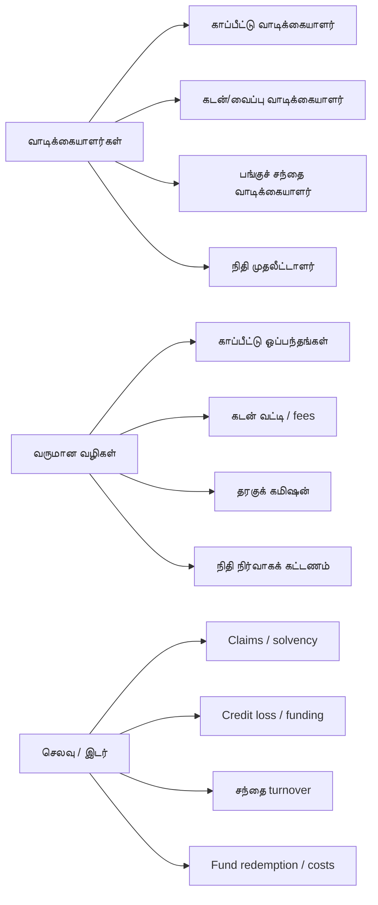

ஒவ்வொரு தொழிலின் வாடிக்கையாளர்கள், வருமான வழிகள், செலவுகள், சட்ட/மூலதனக் கட்டுப்பாடுகள் வேறு. **வாடிக்கையாளர் வைப்புகள் வருமானம் அல்ல; fund-இல் வாடிக்கையாளர் வைத்திருக்கும் சொத்து SCAP-ன் சொத்து அல்ல.**

**ஆதாரம் / காலம்:** [ஆதாரம் 1](https://softlogiccapital.lk/about-us-overview/) · [ஆதாரம் 2](https://softlogiccapital.lk/subsidiaries/).

## 04 · தொழில் பிரிவு வருமானம்

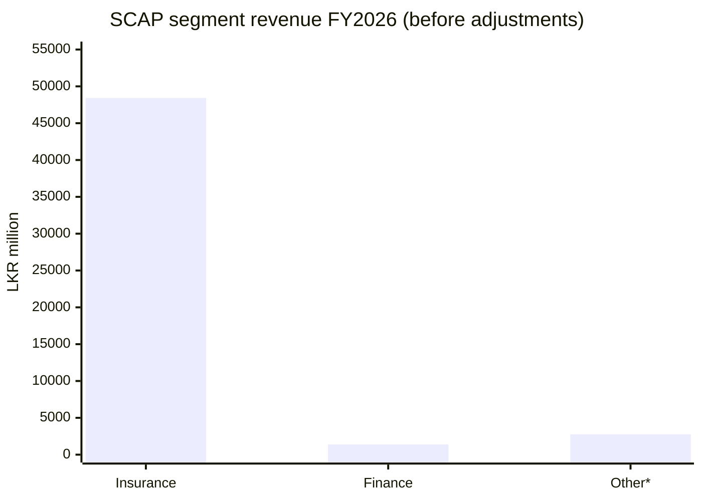

**31 மார்ச் 2026** முடிந்த SCAP குழும பிரிவு வருமானங்கள் (**LKR மில்லியன்**): காப்பீடு **48,425.96**, நிதி **1,384.78**, இதர **சுமார் 2,759.84**, group adjustments **−1,260.09**; இதன் மொத்தம் **51,310.49**. **இதரப் பிரிவு 2,759.84 என்பது சமன்பாட்டிலிருந்து கணக்கிட்ட எண்**; மூன்றாம் தரப்பு பட்டியலில் சுமார் 2,760 என வருகிறது. அசல் segment வரியை இந்த ஆய்வில் மீண்டும் தனியாக உறுதி செய்யவில்லை. இது காப்பீட்டு GWP அல்ல.

**ஆதாரம் / காலம்:** [ஆதாரம் 1](https://cdn.cse.lk/cmt/upload_report_file/1100_1779968696398.pdf) · [ஆதாரம் 2](https://stockanalysis.com/quote/cose/SCAP.N0000/financials/) · இதரப் பிரிவு **கணக்கிட்டு பெறப்பட்டது**; அசல் PDF வரியில் மீண்டும் சரிபார்க்கப்படவில்லை..

## 05 · பிரிவு இலாபம் மற்றும் இழப்பு

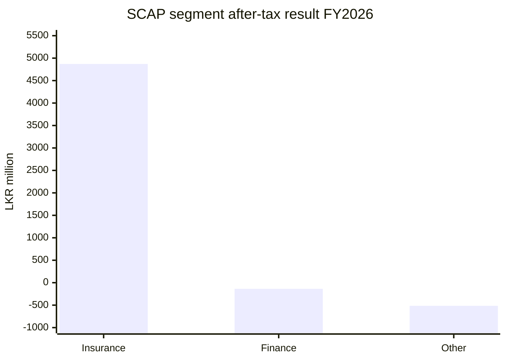

FY2026 இடைக்கால பிரிவு **வரிக்குப் பிந்தைய இலாபம்/இழப்பு**, LKR மில்லியன்: காப்பீடு **+4,870.86**, NBFI **−136.24**, இதர **−515.40**, குழுமச் சரிசெய்தல் **−847.95**, குழும PAT **+3,371.26** (rounding காரணமாக 0.01 வேறுபடலாம்). minority rights, parent debt இல்லாமல் segment இலாபத்தை பங்குமதிப்பாக எடுத்துக்கொள்ள வேண்டாம்.

**ஆதாரம் / காலம்:** [ஆதாரம் 1](https://cdn.cse.lk/cmt/upload_report_file/1100_1779968696398.pdf).

## 06 · குழும இலாபத்தில் யாருக்கு எவ்வளவு?

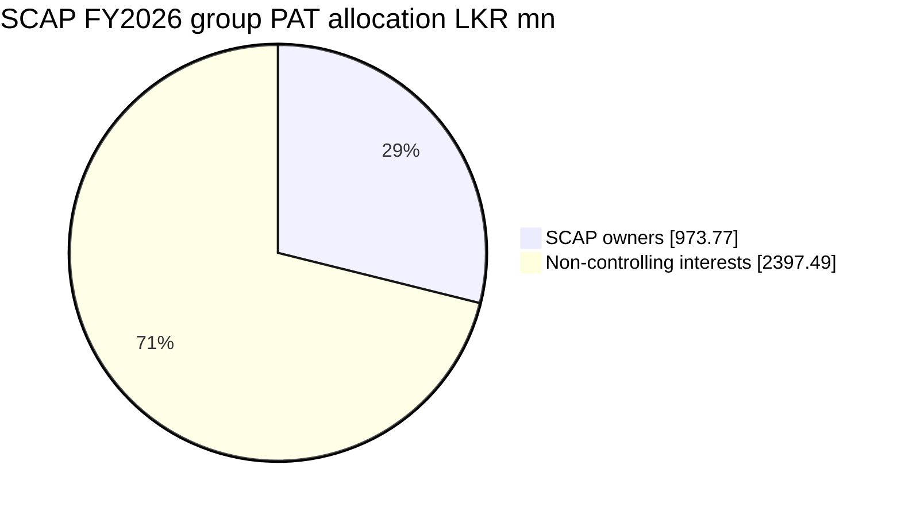

FY2026 இடைக்காலக் குழும PAT **LKR 3,371.26mn**. அதில் **SCAP உரிமையாளர்களுக்கு LKR 973.77mn (28.88%)**, சிறுபான்மை உரிமைக்கு **LKR 2,397.49mn (71.12%)**. இது கணக்கியல் இலாபப் பிரிப்பு; dividend/ரொக்கப் பகிர்வு அல்ல.

**ஆதாரம் / காலம்:** [ஆதாரம் 1](https://cdn.cse.lk/cmt/upload_report_file/1100_1779968696398.pdf).

## 07 · இலாபத்திலிருந்து பணம் வரும் பாதை

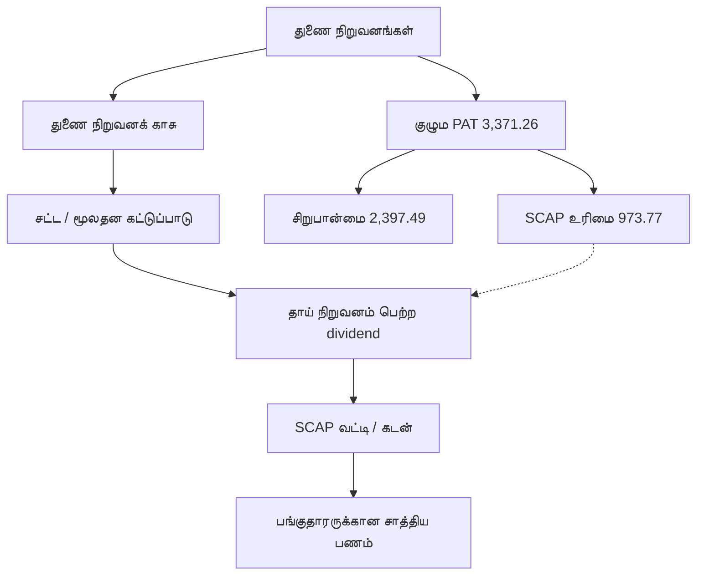

SCAP **தனி நிறுவனம்** FY2026-இல் **dividend income 635.18mn**, **வட்டிச் செலவு 1,810.84mn**, **இழப்பு 722.49mn** பதிவு செய்தது. 31-03-2026 அன்று தாய் நிறுவன வட்டியுள்ள கடன் **17,324.26mn**, overdraft **323.13mn**, cash **32.07mn**. இது விளக்கப் பணப்பாதை; குழும இலாபம், பெறப்பட்ட dividend, கிடைக்கும் ரொக்கம் ஒரே பொருள் அல்ல.

**ஆதாரம் / காலம்:** [ஆதாரம் 1](https://cdn.cse.lk/cmt/upload_report_file/1100_1779968696398.pdf).

## 08 · நிறுவன வரலாற்று நிகழ்வுகள்

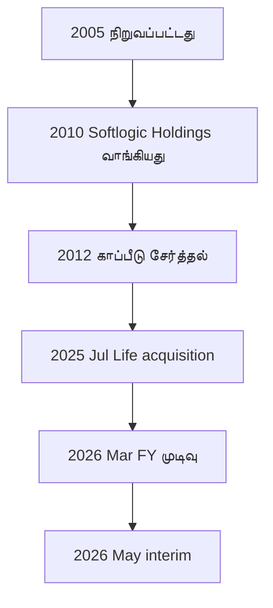

வரலாறு: **2005** நிறுவல்; **2010** Softlogic Holdings வாங்கியது; **2012** காப்பீட்டைப் குழுமத்தில் சேர்த்தது; **11-07-2025** Softlogic Life, இன்னொரு ஆயுள் காப்பீட்டு நிறுவனத்தை **LKR 1,426mn**-க்கு வாங்கியது; **31-03-2026** FY முடிவு; **27-05-2026** interim வெளியீடு. 2025 கையகப்படுத்தல் SCAP நேரடியாக வாங்கியது அல்ல.

**ஆதாரம் / காலம்:** [ஆதாரம் 1](https://softlogiccapital.lk/about-us-overview/) · [ஆதாரம் 2](https://cdn.cse.lk/cmt/upload_report_file/1100_1779968696398.pdf).

## 09 · காப்பீட்டு வாடிக்கையாளர்கள் மற்றும் சேவை அளவு

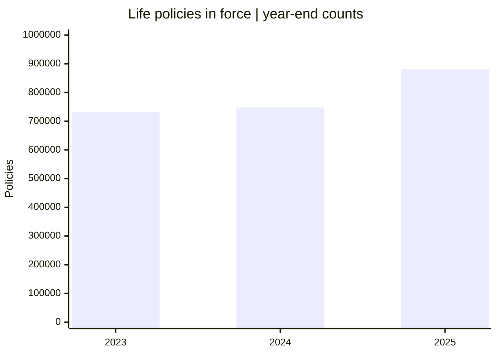

Softlogic Life **2025 ஆண்டு அறிக்கை:** நடைமுறையில் இருந்த பாலிசிகள் **880,706** (2024: **748,101**, 2023: **733,002**), customer retention **88.7%** (2024: **85.4%**). நிறுவனத்தின் 2025 செய்திப்படி **1.3 மில்லியன் மக்களுக்கு காப்புறுதி**, **LKR 19.4bn claims/benefits** வழங்கப்பட்டது. Chart-இல் **பாலிசிகள்** மட்டுமே; SCAP குழும வாடிக்கையாளர் எண்ணிக்கை அல்ல.

**ஆதாரம் / காலம்:** [ஆதாரம் 1](https://softlogiclife.lk/wp-content/uploads/sites/3/2026/04/Softlogic-Life-Integrated-Annual-Report-2025-3.pdf) · [ஆதாரம் 2](https://softlogiclife.lk/news/softlogic-life-surpasses-rs-40-bn-gwp-in-fy25-doubles-key-financial-metrics-over-four-years/).

## 10 · சேவை வழங்கும் வழிகள்

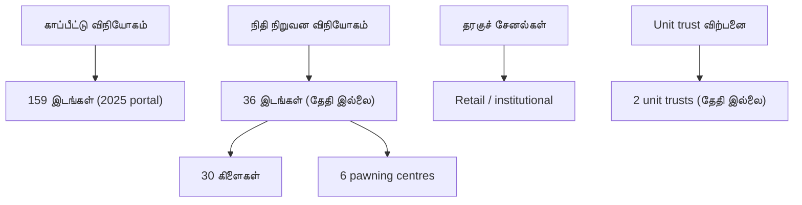

Softlogic Life-ன் **2025 ஆண்டு அறிக்கை portal** **159 செயல்பாட்டு இடங்கள்** எனக் காட்டுகிறது. SCAP-ன் **தேதியற்ற இணையதளம்** Finance-க்கு **36 இடங்கள் (30 கிளை + 6 pawning centres)** எனக் குறிப்பிடுகிறது. **இவை ஒரே தேதிக்கான ஒப்பீட்டு எண்கள் அல்ல.** Brokerage retail/institutional/high-net-worth வாடிக்கையாளர்களை விவரிக்கிறது; asset manager தளம் இரண்டு unit trusts-ஐக் குறிப்பிடுகிறது; இன்றைய எண்ணிக்கை இன்னும் உறுதியாகவில்லை.

**ஆதாரம் / காலம்:** [ஆதாரம் 1](https://annualreport.softlogiclife.lk/) · [ஆதாரம் 2](https://softlogiccapital.lk/subsidiaries/).

## 11 · துறையின் சந்தைப் பங்கு

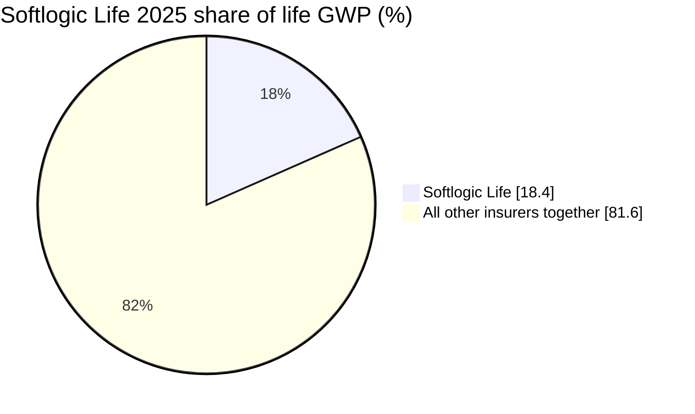

Softlogic Life நிறுவனம் 2025 calendar-year காப்பீட்டு **GWP சந்தைப் பங்கு 18.4%** எனக் கூறியது. மற்ற நிறுவங்கள் அனைத்துக்கும் சேர்த்து **81.6%** என்பது கணக்கியல் மீதி; **ஒரு போட்டியாளர் அல்ல**. செய்தித்தாள் 2026 Q2-க்கு **20.3%** எனக் கூறினாலும் அது **இரண்டாம் நிலை**, காலமும் வேறு; அசல் அறிக்கை/ஒழுங்குமுறை ஆதாரம் இன்னும் உறுதி செய்ய வேண்டும். SCAP குழுமத்துக்கே இதே பங்கு பொருந்தாது.

**ஆதாரம் / காலம்:** [ஆதாரம் 1](https://softlogiclife.lk/news/softlogic-life-surpasses-rs-40-bn-gwp-in-fy25-doubles-key-financial-metrics-over-four-years/) · [ஆதாரம் 2](https://www.dailymirror.lk/business-news/Softlogic-Life-delivers-Rs-7-2bn-GWP/273-348142).

## 12 · போட்டி முன்னிலை: சான்று சோதனை

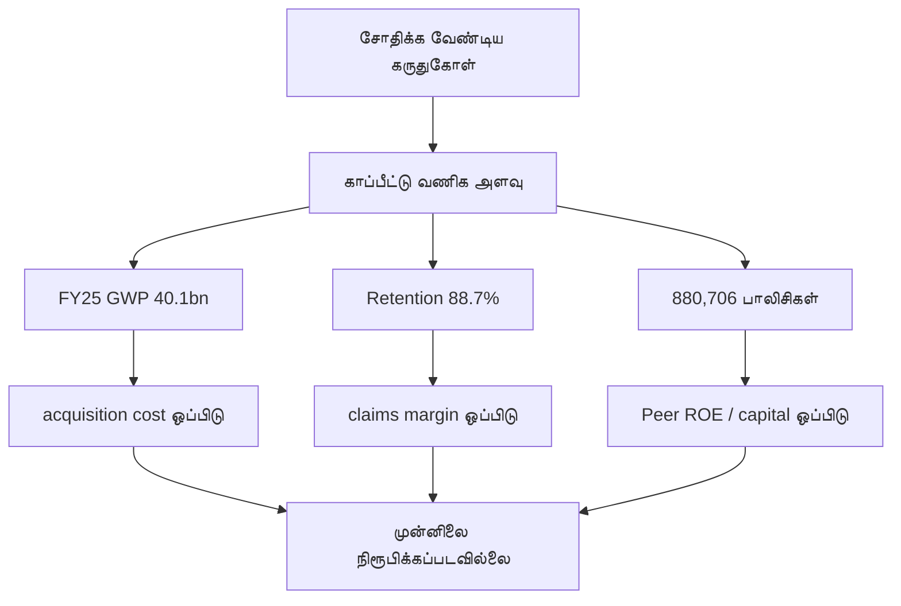

சோதிக்க வேண்டிய முன்னிலைக் கருதுகோள்கள்: Life FY2025 **GWP 40.1bn (+27%)**, **customer retention 88.7%**, **880,706 பாலிசிகள்**. இவை distribution/service பற்றிய கேள்விகளை எழுப்பும் தரவு; **நிரந்தரமான moat நிரூபிக்காது**. customer acquisition cost, claims margins, peer returns, solvency-ஐ ஒரே காலத்தில் ஒப்பிடவும்.

**ஆதாரம் / காலம்:** [ஆதாரம் 1](https://softlogiclife.lk/wp-content/uploads/sites/3/2026/04/Softlogic-Life-Integrated-Annual-Report-2025-3.pdf) · [ஆதாரம் 2](https://softlogiclife.lk/news/softlogic-life-surpasses-rs-40-bn-gwp-in-fy25-doubles-key-financial-metrics-over-four-years/).

## 13 · குழும நிறுவனங்களுக்கிடையேயான பணப் பரிவர்த்தனைகள்

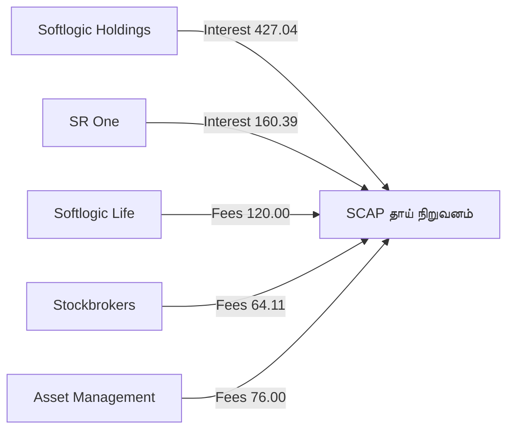

SCAP **தனிக் கணக்கின் related-party FY2026 குறிப்பில்**, **LKR மில்லியன்**: Softlogic Holdings-இலிருந்து வட்டி **427.04**, SR One-இலிருந்து வட்டி **160.39**, Life-இலிருந்து consultancy fees **120.00**, Stockbrokers **64.11**, Asset Management **76.00**. இவை **தாய் நிறுவனக் கணக்கில் பதிவு செய்த உள்ளகப் பரிவர்த்தனைகள்**; consolidated external revenue-க்கு மீண்டும் சேர்க்கக்கூடாது, அனைத்தும் ரொக்கமாக வந்தது என்று சொல்லக்கூடாது.

**ஆதாரம் / காலம்:** [ஆதாரம் 1](https://cdn.cse.lk/cmt/upload_report_file/1100_1779968696398.pdf).

## 14 · ஒழுங்குமுறை கட்டுப்பாட்டு வரைபடம்

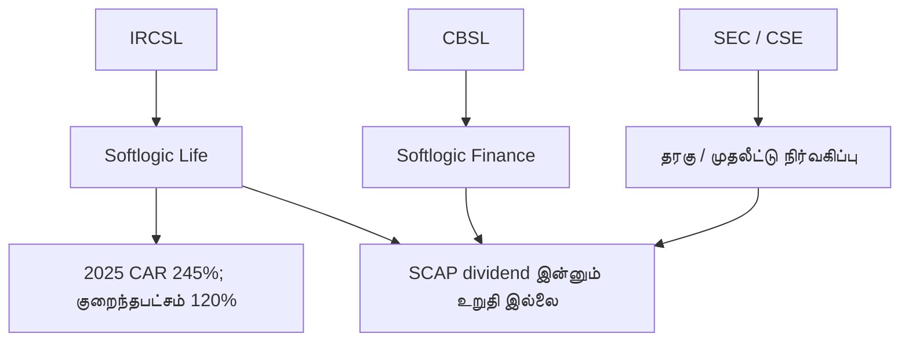

காப்பீடு **IRCSL**, நிதி நிறுவனம் **CBSL**, தரகு/முதலீட்டு நிர்வகிப்பு பொருத்தமாக **SEC/CSE** மேற்பார்வை. Life நிறுவனம் **2025 CAR 245%**, அதன் அறிக்கையில் கூறிய குறைந்தபட்சம் **120%** என வெளியிட்டுள்ளது. இது காப்பீட்டு நிறுவனத்துக்கே; SCAP dividend capacity அல்ல. 31-03-2026-இல் பதிவான **restricted insurance reserve LKR 1,515.80mn** மீதான வெளியீட்டுக் கட்டுப்பாடு ஆய்வுக்கு உரியது.

**ஆதாரம் / காலம்:** [ஆதாரம் 1](https://cdn.cse.lk/cmt/upload_report_file/1100_1779968696398.pdf) · [ஆதாரம் 2](https://softlogiclife.lk/news/softlogic-life-surpasses-rs-40-bn-gwp-in-fy25-doubles-key-financial-metrics-over-four-years/) · [ஆதாரம் 3](https://ircsl.gov.lk/) · [ஆதாரம் 4](https://www.cbsl.gov.lk/) · [ஆதாரம் 5](https://www.sec.gov.lk/).

## 15 · வாய்ப்புகளும் கட்டுப்பாடுகளும்

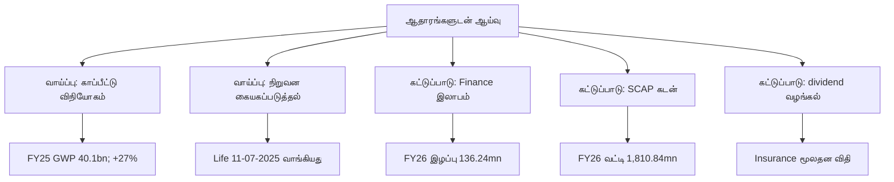

தரவுடன் பார்க்க வேண்டிய சாத்திய வாய்ப்புகள்: Life FY2025 **GWP 40.1bn (+27%)**, விநியோகம், Life கையகப்படுத்தல். கட்டுப்பாடுகள்: FY2026 finance பிரிவு இழப்பு **136.24mn**, SCAP தனி வட்டிச் செலவு **1,810.84mn**, கடன் **17,324.26mn**, insurer cash upstream விதிகள். **வெவ்வேறு காலத்தின் இத்தகவல்கள் முன்னறிவிப்பு அல்லது மதிப்பெண் அல்ல.**

**ஆதாரம் / காலம்:** [ஆதாரம் 1](https://cdn.cse.lk/cmt/upload_report_file/1100_1779968696398.pdf) · [ஆதாரம் 2](https://softlogiclife.lk/news/softlogic-life-surpasses-rs-40-bn-gwp-in-fy25-doubles-key-financial-metrics-over-four-years/).

## 📚 ஆதாரங்கள் மற்றும் வரம்புகள்

**SCAP original March 2026 CSE interim (FY2026 subject to audit):** [PDF](https://cdn.cse.lk/cmt/upload_report_file/1100_1779968696398.pdf) · company filing previously reviewed for pp. 2–3, 6, 10–11, 13, 15–17, 19.

**SCAP business pages:** [Overview](https://softlogiccapital.lk/about-us-overview/) · [Subsidiaries](https://softlogiccapital.lk/subsidiaries/); website figures may be undated.

**Softlogic Life 2025:** [Issuer news](https://softlogiclife.lk/news/softlogic-life-surpasses-rs-40-bn-gwp-in-fy25-doubles-key-financial-metrics-over-four-years/) · [Annual report](https://softlogiclife.lk/wp-content/uploads/sites/3/2026/04/Softlogic-Life-Integrated-Annual-Report-2025-3.pdf) · [Annual-report portal](https://annualreport.softlogiclife.lk/); reporting year ends December.

**Market-share update (secondary):** [Q2 2026 news](https://www.dailymirror.lk/business-news/Softlogic-Life-delivers-Rs-7-2bn-GWP/273-348142); not substituted for FY2025 share.

**Other segment cross-check:** [StockAnalysis](https://stockanalysis.com/quote/cose/SCAP.N0000/financials/); exact 2,759.84 remains derived/reconciliation pending original line verification.

**Supervisors:** [IRCSL](https://ircsl.gov.lk/), [CBSL](https://www.cbsl.gov.lk/), [SEC](https://www.sec.gov.lk/) and [CSE](https://www.cse.lk/).

இவை எல்லாம் வரலாற்றுத் தரவு. தற்போதைய audited ஆண்டு/காலாண்டு அறிக்கையுடன் ஒப்பிட்ட பிறகே முதலீட்டுத் தீர்மானத்தில் பயன்படுத்தவும்.
