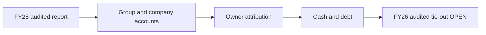

# 02 · நிதி அறிக்கைப் பகுப்பாய்வு

**ஆதாரக் களஞ்சியம்**: [Source register](../../../sources/SOURCE-REGISTER.md) · [SCAP-AR-2025](../../../sources/records/SCAP-AR-2025.md) · [SCAP-FY2026-YE-INTERIM](../../../sources/records/SCAP-FY2026-YE-INTERIM.md) · [SCAP-STOCKANALYSIS](../../../sources/records/SCAP-STOCKANALYSIS.md). அசல் PDF இணைப்புகள் உள்ளன; முழு PDF GitHub-இல் சேமிக்கப்படவில்லை.

**[📊 12 நிதிக் காட்சி வரைபடங்கள்](VISUAL-REPORT.md)**

[← அடிப்படைப் பகுப்பாய்வு](../README.md) · [English](../../../01-Fundamental-Analysis/02-Financial-Statements/README.md) · [தமிழ்](README.md) · [සිංහල](../../../si/01-Fundamental-Analysis/02-Financial-Statements/README.md)

> **Softlogic Capital PLC · CSE SCAP.N0000.** **ஆய்வு நிலை · 30 செப்டம்பர் 2026.** SCAP-ன் **FY2025 தணிக்கை செய்யப்பட்ட** நிதி அறிக்கைகளையும் **FY2026 ஆண்டு முடிவு இடைக்கால** அறிக்கையையும் தனித்தனியாக ஆய்வு செய்தல். FY2024 எண்கள் FY2025 தணிக்கை அறிக்கையின் பழைய ஒப்பீடு. **அலகு: LKR மில்லியன்.** Group = துணை நிறுவனங்களுடன் குழுமம்; Company = பட்டியலிடப்பட்ட SCAP தனி நிறுவனம்.
>
> **இறுதித் தணிக்கை வரம்பு:** SCAP FY2026 இறுதி ஆண்டு அறிக்கை வெளியிடப்பட்டதாக இணைய ஆவணப் பட்டியலில் உள்ளது. ஆனால் அதன் அசல் audited எண்களும் கையொப்பமிட்ட auditor கருத்தும் இங்கே முழுமையாக ஒப்பிடப்படவில்லை. **30 ஜூன் 2026 SCAP அசல் காலாண்டும் மீதம்.** 27 மே 2026-இன் FY2026 எண்கள் **தணிக்கைக்கு உட்பட்ட இடைக்கால எண்கள்** மட்டுமே; அவற்றை audited என்று கூறக்கூடாது. FY2025 auditor கருத்து 1 டிசம்பர் 2025 கையொப்பம்.

## 🎯 முக்கிய ஆய்வுக் கேள்வி

2025 தணிக்கை செய்யப்பட்ட நிதி நிலையும் 2026 இடைக்கால முடிவுகளும் SCAP-ன் வணிக நிலையை—குறிப்பாகச் சாதாரணப் பங்குதாரரின் பொருளாதார உரிமையை—எவ்வாறு விளக்குகின்றன?

## 🔍 ஆதாரமுள்ள முக்கிய கண்டுபிடிப்புகள்

- **FY2025 audited குழுமம்:** total operating income **42,383.72**, group PAT **+1,694.15**. ஆனால் **SCAP உரிமையாளருக்குரிய PAT −280.42**; minority உரிமைக்குரியது **+1,974.57**. **[A ப.63]**
- **FY2026 ஆண்டு முடிவு இடைக்காலம்:** குழும வருமானம் **51,310.49**, group PAT **+3,371.26**, SCAP உரிமையாளருக்குரியது **+973.77**, minority **+2,397.49**. **[I ப.2]**
- **FY2025 audited தனி நிறுவன பணப்புழக்கம்:** SCAP தனி operating CFO **−4,605.10**; குழும CFO **+427.54**. **[A ப.70]** முன்பு பதிவான FY2026 இடைக்காலக் குழும CFO **−851.24**; மூன்றாம் தரவு இதை ஆதரிக்கிறது; அதன் அசல் PDF ப.9-ஐ இம்முறை திறந்து பார்க்க முடியவில்லை. **[I; B]**
- **SCAP தனிக் கடன்:** 31-03-2025 audited **14,797.33**, 31-03-2026 இடைக்காலத்தில் **17,324.26**; cash/bank **27.89** மற்றும் **32.07**; overdraft தனிப் பொறுப்பு. **[A ப.65–66; I ப.6]**
- **குழுமத்தில் SCAP பங்குதாரருக்குரிய equity எதிர்மறை:** FY2025 **−2,440.85**, FY2026 இடைக்காலம் **−1,035.49**; minority equity சேர்வதால் முழுக் குழும equity **நேர்மறை**. **[A ப.65; I ப.6]**

## 🧭 FY2025 தணிக்கையாளர் கருத்து

Ernst & Young **1-12-2025** தணிக்கையாளர் அறிக்கை FY2025 SCAP group மற்றும் standalone கணக்குகளுக்கு **மாற்றமில்லாத true-and-fair-view கருத்து** அளித்துள்ளது. நான்கு முக்கிய audit பகுதிகள்: (1) காப்பீட்டு contract liabilities, (2) நிதி அறிக்கை தயாரிக்கும் **IT controls**, (3) expected credit losses, (4) interest-bearing borrowing. **Key audit matter என்பது qualified opinion அல்லது தவறு நடந்தது என்பதற்குச் சான்று அல்ல.** Going-concern கணக்கியல் கருதுகோள்கள் குறிப்புகளில் உள்ளன; FY2025 audit கருத்து FY2026 எண்களை உறுதி செய்யாது.

## 📊 இலாப-நட்டம்: குழுமம் vs உரிமையாளர் vs தனி நிறுவனம்

| நிதி அளவுகோல் | FY24 audited | FY25 audited | FY26 இடைக்காலம் | ஆதாரம் |
|---|---:|---:|---:|---|
| குழும total operating income | 36,729.68 | 42,383.72 | 51,310.49 | A63 / I2 |
| குழும PAT | −4,183.45 | +1,694.15 | +3,371.26 | A63 / I2 |
| SCAP உரிமையாளருக்குரிய PAT | −5,565.30 | −280.42 | +973.77 | A63 / I2 |
| Minority உரிமைக்குரிய PAT | +1,381.85 | +1,974.57 | +2,397.49 | A63 / I2 |
| SCAP தனி total operating income | 1,933.06 | 4,093.98 | 1,485.72 | A63 / I3 |
| SCAP தனி PAT | −4,738.28 | +1,339.80 | −722.49 | A63 / I3 |
| SCAP பெற்ற dividend income | 618.20 | 3,273.55 | 635.18 | A63 / I3 |
| SCAP தனி வட்டிச் செலவு | 2,472.51 | 1,833.56 | 1,810.84 | A63 / I3 |

Group-இல் கட்டுப்பாட்டில் உள்ள துணை நிறுவனத்தின் மொத்த revenue/asset ஆகியவை consolidation-இல் சேரலாம்; ஆனால் அது SCAP-ன் 100% உரிமை என்று பொருள் அல்ல. **Minority interest** இலாபம்/equity பிரிக்கப்பட்ட பின்னரே ordinary shareholder ஆய்வு செய்ய வேண்டும். காப்பீட்டு **GWP என்பது குழும total operating income அல்ல**; வைப்பு என்பது வருமானமல்ல, பொறுப்பு.

## 🏦 இருப்புநிலை: equity யாருக்குரியது?

| நிதி அளவுகோல் | FY24 audited | FY25 audited | FY26 இடைக்காலம் | ஆதாரம் |
|---|---:|---:|---:|---|
| குழும மொத்த சொத்துகள் | 65,782.36 | 68,619.73 | OPEN | A65; FY26 original final not checked |
| குழும மொத்த equity | +3,776.63 | +2,856.63 | +6,269.84 | A65 / I6 |
| குழும SCAP-owner equity | −2,644.47 | −2,440.85 | −1,035.49 | A65 / I6 |
| குழும minority equity | +6,421.10 | +5,297.48 | +7,305.34 | A65 / I6 |
| SCAP தனி equity | +5,577.91 | +5,373.24 | +4,848.03 | A65 / I6 |
| SCAP தனி வட்டியுள்ள கடன் | 13,828.16 | 14,797.33 | 17,324.26 | A66 / I6 |
| SCAP தனி cash/bank | 61.80 | 27.89 | 32.07 | A65 / I6 |
| SCAP தனி overdraft | 328.60 | 323.78 | 323.13 | A66 / I6 |
| குழும insurance liabilities | 27,759.13 | 33,671.06 | OPEN | A66; FY26 original final not checked |
| குழும public deposits | 7,481.72 | 4,273.39 | OPEN | A66; FY26 original final not checked |

31-03-2025 audited குழும **assets 68,619.73** = **liabilities 65,763.10** + **total equity 2,856.63** (rounding). Total equity-இல் **SCAP உரிமையாளருக்குரியது −2,440.85** + **minority +5,297.48** = **+2,856.63**. SCAP தனி நிறுவன equity **+5,373.24** என்பது **வேறு scope**; அதை consolidated NAV-க்கு மாற்றிப் பயன்படுத்த முடியாது. FY2026 இடைக்காலத்திலும் இந்த வேறுபாடு உள்ளது.

## 💸 பணப்புழக்கம்: இலாபம் = ரொக்கம் அல்ல

| நிதி அளவுகோல் | FY24 audited | FY25 audited | FY26 இடைக்காலம் | ஆதாரம் |
|---|---:|---:|---:|---|
| குழும operating cash flow | +4,006.00 | +427.54 | −851.24 | A70 / I9 and B |
| SCAP தனி operating cash flow | −1,533.19 | −4,605.10 | OPEN | A70; FY26 company CFO not verified |
| SCAP தனி பெற்ற dividend cash | 618.20 | 3,273.55 | OPEN | A70; FY26 receipts not checked |
| SCAP தனி உண்மையில் செலுத்திய வட்டி | −1,948.80 | −2,549.88 | OPEN | A70; FY26 interest paid not checked |

FY2025 audited SCAP தனி CFO **−4,605.10**; group CFO **+427.54**. SCAP தனிக் கணக்கில் investing activities-இல் **பெற்ற dividend cash +3,273.55**; உண்மையில் **செலுத்திய வட்டி −2,549.88**; ஆனால் income statement **interest expense 1,833.56**. Cash interest paid மற்றும் accrual interest expense இரண்டும் வேறு. Subsidiary dividend received என்பது SCAP சாதாரணப் பங்குதாரருக்கு வழங்கிய dividend அல்ல. **FY2026 தனி CFO இன்னும் OPEN.**

## ⚠️ கணக்கியல் மற்றும் தரவின் வரம்புகள்

- **FY2026 audited நிலை:** 27 மே 2026 இடைக்காலம் 'subject to audit'; இறுதி ஆண்டு அறிக்கை பதிவை அசல் signed opinion-உடன் ஒப்பிடவில்லை.
- **எண் வரையறை முரண்பாடு:** FY2025 அசல் total operating income **42,383.72**, மூன்றாம் தரப்பு normalized revenue **39,794**; காரணம் கண்டறியப்பட வேண்டும்.
- **விதிமுறை பொறுப்புகள்:** FY2025 insurance contract liabilities **33,671.06**, public deposits **4,273.39** ஆகியவை Group liabilities; தாய் நிறுவன வருமானமல்ல; equity-யிலிருந்து இருமுறை கழிக்கக்கூடாது.
- **Fair value / impairment:** FY2025 தனி investment in subsidiaries **17,850.10**; ECL மதிப்பீடுகள், மே 2026 fair-value குறிப்பு மற்றும் இறுதி audited தரவை ஒப்பிட வேண்டும்.

## 📝 நிரப்பப்பட்ட ஆதார அட்டவணை

| ஆய்வு செய்த கூற்று | Audit நிலை | அசல் ஆதாரம் + பக்கம் |
|---|---|---|
| FY2025 audit true-and-fair-view opinion | **AUDITED** | [SCAP original FY25 report pp.59–61](https://cdn.cse.lk/cmt/upload_report_file/1100_1764673838964.03.2025%20-%20Annual%20Report.pdf) |
| FY2025 group income and owner/minority PAT | **AUDITED** | [SCAP p.63](https://cdn.cse.lk/cmt/upload_report_file/1100_1764673838964.03.2025%20-%20Annual%20Report.pdf) |
| FY2025 Group / parent assets, liabilities, owner equity | **AUDITED** | [SCAP pp.65–66](https://cdn.cse.lk/cmt/upload_report_file/1100_1764673838964.03.2025%20-%20Annual%20Report.pdf) |
| FY2025 Group CFO and parent CFO | **AUDITED** | [SCAP pp.69–70](https://cdn.cse.lk/cmt/upload_report_file/1100_1764673838964.03.2025%20-%20Annual%20Report.pdf) |
| FY2026 PAT and owners' profit | **INTERIM, SUBJECT TO AUDIT** | [SCAP CSE FY26 interim p.2](https://cdn.cse.lk/cmt/upload_report_file/1100_1779968696398.pdf) |
| FY2026 parent interest-bearing debt and cash/bank | **INTERIM, SUBJECT TO AUDIT** | [SCAP CSE FY26 interim p.6](https://cdn.cse.lk/cmt/upload_report_file/1100_1779968696398.pdf) |
| FY2026 Group CFO −851.24 | **INTERIM + SECONDARY CROSS-CHECK** | [SCAP original p.9](https://cdn.cse.lk/cmt/upload_report_file/1100_1779968696398.pdf) · [secondary data](https://stockanalysis.com/quote/cose/SCAP.N0000/financials/cash-flow-statement/) |
| FY2026 final signed audit opinion and restatements | **OPEN** | [2026 report catalogue](https://nanayojana.com/company/SCAP.N0000?document_type=annual_report&year=2026); original audited content not independently tied out |
| 30 June 2026 SCAP original quarter | **OPEN** | [Secondary news](https://www.marketscreener.com/news/softlogic-capital-plc-reports-earnings-results-for-the-first-quarter-ended-june-30-2026-ce7859dfd88af521); original SCAP quarterly document not tied out |

## ✅ அடுத்த சரிபார்ப்புப் பணிகள்

- [ ] **SCAP FY2025/26 இறுதி audited ஆண்டு அறிக்கையை** அசல் PDF மற்றும் கையொப்பமிட்ட audit கருத்துடன் பெற்று FY2026 எண்களை மறுச்சரிபார்க்கவும்.
- [ ] **30 ஜூன் 2026 SCAP அசல் இடைக்கால அறிக்கையை** பெறவும்; பின்னைய மாற்றங்களை ஒப்பிடவும்.
- [ ] FY2026 SCAP தனி CFO, **உண்மையில் பெற்ற dividend**, **செலுத்திய வட்டி**, கடன் காலவரை, அடமானம் மற்றும் உத்தரவாதங்களைச் சரிபார்க்கவும்.
- [ ] Finance வாடிக்கையாளர் வைப்புகள், insurer liabilities, credit-loss நிலைகள், subsidiary solvency ஆகியவற்றை group-உடன் ஒப்பிடவும்.
- [ ] EPS, P/B, sum-of-parts செய்வதற்கு முன் audited SCAP owner-attributable equity மற்றும் share count உறுதி செய்யவும்.

## 📚 அசல் ஆதாரங்கள் மற்றும் வரம்புகள்

- **A — FY2025 primary audited:** [Original 186-page SCAP 2024/25 Annual Report](https://cdn.cse.lk/cmt/upload_report_file/1100_1764673838964.03.2025%20-%20Annual%20Report.pdf), auditor pp.59–61, income p.63, balance pp.65–66, CFO pp.69–70. Signed **1 December 2025**; PDF source text inspected; PDF-page-image screenshot service failed in this session.
- **I — FY2026 year-end interim:** [SCAP 27 May 2026 original CSE filing](https://cdn.cse.lk/cmt/upload_report_file/1100_1779968696398.pdf), **subject to audit**; values carried from the prior repository research pass, original PDF was **not** re-opened successfully this time.
- **B — secondary FY26 CFO cross-check:** [StockAnalysis cash flow](https://stockanalysis.com/quote/cose/SCAP.N0000/financials/cash-flow-statement/); a different normalized income definition appears on that provider.
- **N/Q — report existence, not reconciled numbers:** [SCAP FY2026 annual-report catalogue](https://nanayojana.com/company/SCAP.N0000?document_type=annual_report&year=2026) · [June 2026 results secondary news](https://www.marketscreener.com/news/softlogic-capital-plc-reports-earnings-results-for-the-first-quarter-ended-june-30-2026-ce7859dfd88af521).

[முந்தைய நிதிச் சுருக்கம்](../../../ta/06-financial-snapshot.md) · [ஆதாரப் பட்டியல்](../../../ta/SOURCES.md) · [12 நிதிக் காட்சி வரைபடங்கள்](VISUAL-REPORT.md) · [CSE](https://www.cse.lk/)

**முறை:** OPEN என உள்ள இடங்களை ஊக எண்களால் நிரப்பவில்லை. Unmodified audit கருத்து எதிர்கால வருமானத்தையோ liquidity-யையோ உறுதி செய்யாது. இது நிதி அறிக்கை ஆய்வு; தற்போதைய பங்கு வாங்க/விற்க பரிந்துரை அல்ல.
