# 📊 SCAP நிதி அறிக்கைகள் — 12 ஆதாரம் கொண்ட Mermaid காட்சிகள்

[← நிதி அறிக்கைப் பகுப்பாய்வு](README.md) · [English](../../../01-Fundamental-Analysis/02-Financial-Statements/VISUAL-REPORT.md) · [தமிழ்](VISUAL-REPORT.md) · [සිංහල](../../../si/01-Fundamental-Analysis/02-Financial-Statements/VISUAL-REPORT.md)

> **ஆய்வு: 30 செப்டம்பர் 2026.** FY2024/FY2025 எண்கள் SCAP-ன் **FY2025 audited** அசல் ஆண்டு அறிக்கையிலிருந்து; FY2026 எண்கள் **27 மே 2026 ஆண்டு முடிவு இடைக்கால அறிக்கையிலிருந்து**, அவை **தணிக்கைக்கு உட்பட்டவை**. இறுதி FY2026 audited ஆண்டு அறிக்கையும் 2026 ஜூன் SCAP இடைக்காலமும் முழுமையாக ஒப்பிடப்படவில்லை. **அலகு: LKR மில்லியன்.** நடப்பு பங்குவிலை மதிப்பீடு அல்ல.

## 01 · ஆதாரமும் audit நிலையும்

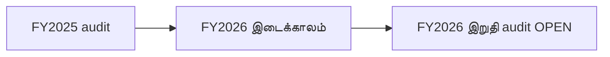

அசல் FY2025 ஆண்டு அறிக்கையில் EY **மாற்றமில்லாத auditor opinion** (PDF ப.59). FY2026 இடைக்காலத்தில் **subject to audit** என உள்ளது; இறுதி அறிக்கை கண்டுபிடிக்கப்பட்டாலும் signed audit கருத்து அசலுடன் ஒப்பிடாமல் audited எனக் கருத வேண்டாம்.

**Source / status:** [SCAP FY2025 audited report pp. 59–61](https://cdn.cse.lk/cmt/upload_report_file/1100_1764673838964.03.2025%20-%20Annual%20Report.pdf). **FY26* means FY2026 27 May 2026 interim, subject to audit.**

## 02 · குழும மொத்த வருமானம்

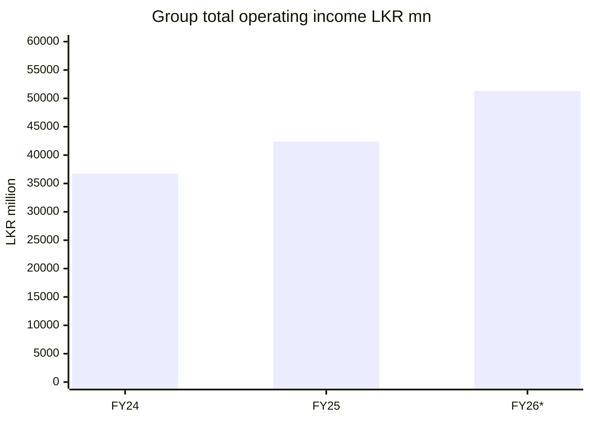

FY2024/FY2025 audited குழும **total operating income** **36,729.68m / 42,383.72m** (அறிக்கை ப.63); FY2026 இடைக்காலம் **51,310.49m**. 2025 third-party normalized revenue **39,794m** என்பது வேறு; இங்கு issuer total operating income பயன்படுத்தப்பட்டுள்ளது.

**Source / status:** [SCAP FY2025 audited report](https://cdn.cse.lk/cmt/upload_report_file/1100_1764673838964.03.2025%20-%20Annual%20Report.pdf) · [FY2026 year-end interim](https://cdn.cse.lk/cmt/upload_report_file/1100_1779968696398.pdf). **FY26* means FY2026 27 May 2026 interim, subject to audit.**

## 03 · குழும வரிக்குப் பிந்தைய இலாபம்

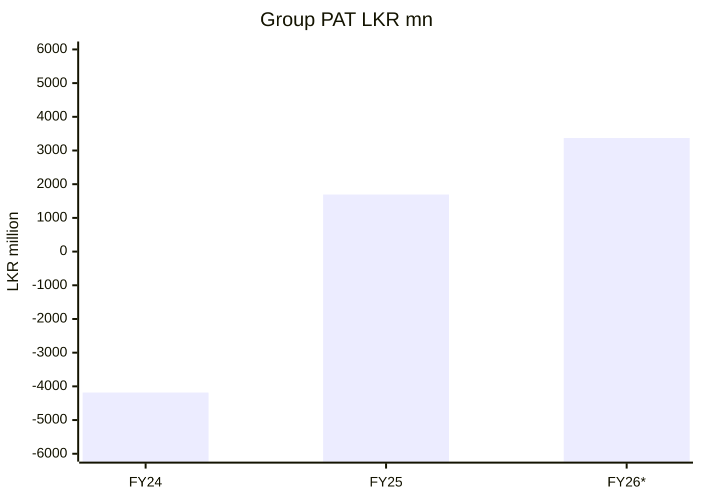

FY2024/25/26 குழும PAT: **−4,183.45m / +1,694.15m / +3,371.26m**. மூன்றாம் ஆண்டு இடைக்காலம். இது minority பங்கைப் பிரிப்பதற்கு முந்தைய குழும இலாபம்.

**Source / status:** [SCAP FY2025 audited report](https://cdn.cse.lk/cmt/upload_report_file/1100_1764673838964.03.2025%20-%20Annual%20Report.pdf) · [FY2026 year-end interim](https://cdn.cse.lk/cmt/upload_report_file/1100_1779968696398.pdf). **FY26* means FY2026 27 May 2026 interim, subject to audit.**

## 04 · SCAP பங்குதாரருக்குரிய இலாபம்

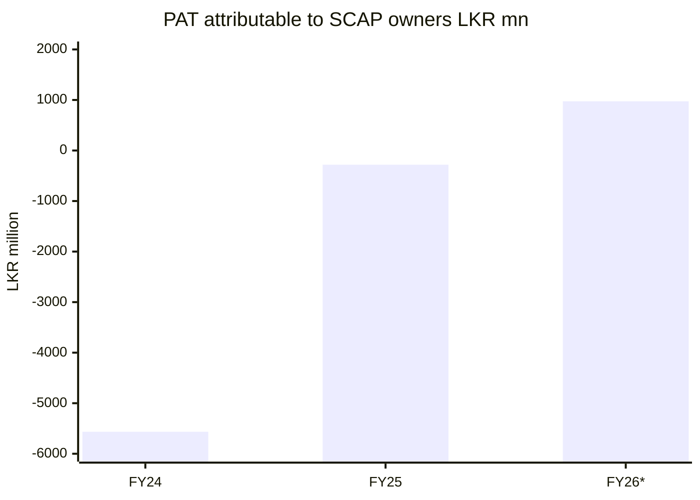

SCAP சாதாரணப் பங்குதாரருக்குரிய PAT: **−5,565.30m / −280.42m / +973.77m**; FY2024/FY2025 audited, FY2026 இடைக்காலம். முழுக் குழும PAT SCAP உரிமையாளருக்கு உரியது அல்ல.

**Source / status:** [SCAP FY2025 audited report](https://cdn.cse.lk/cmt/upload_report_file/1100_1764673838964.03.2025%20-%20Annual%20Report.pdf) · [FY2026 year-end interim](https://cdn.cse.lk/cmt/upload_report_file/1100_1779968696398.pdf). **FY26* means FY2026 27 May 2026 interim, subject to audit.**

## 05 · FY2026 குழும இலாபப் பிரிப்பு

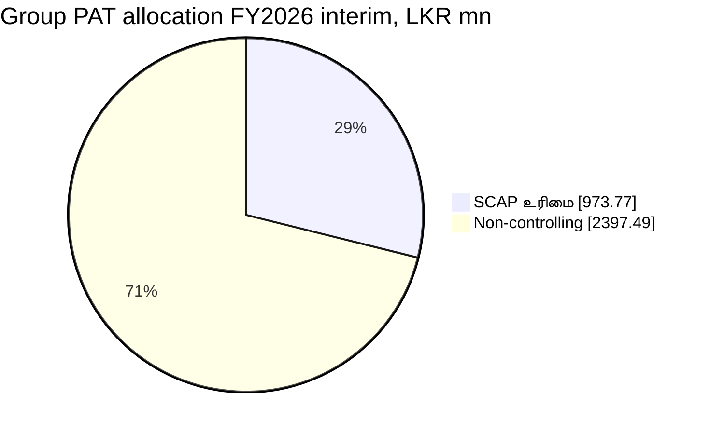

FY2026 இடைக்கால குழும PAT **3,371.26m** = SCAP உரிமையாளர்கள் **973.77m** + minority **2,397.49m**; சுமார் 28.9%/71.1% என்பது **கணக்கியல் பிரிப்பு; ரொக்க dividend அல்ல**.

**Source / status:** [SCAP FY2025 audited report](https://cdn.cse.lk/cmt/upload_report_file/1100_1764673838964.03.2025%20-%20Annual%20Report.pdf) · [SCAP FY2026 interim](https://cdn.cse.lk/cmt/upload_report_file/1100_1779968696398.pdf). **FY26* means FY2026 27 May 2026 interim, subject to audit.**

## 06 · FY2025 குழும equity ஒப்பீடு

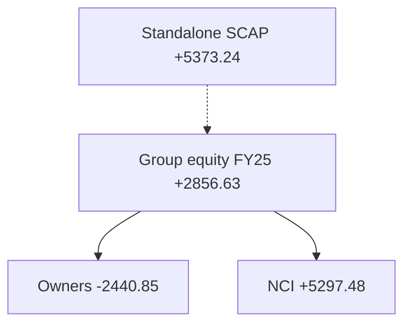

**31-03-2025** குழும total equity **+2,856.63m** = SCAP உரிமையாளருக்குரியது **−2,440.85m** + minority **+5,297.48m**. அதே தேதி SCAP தனி நிறுவன equity **+5,373.24m**; அது வேறு scope.

**Source / status:** [SCAP FY2025 audited report](https://cdn.cse.lk/cmt/upload_report_file/1100_1764673838964.03.2025%20-%20Annual%20Report.pdf) · [FY2026 year-end interim](https://cdn.cse.lk/cmt/upload_report_file/1100_1779968696398.pdf). **FY26* means FY2026 27 May 2026 interim, subject to audit.**

## 07 · FY2026 குழும equity ஒப்பீடு

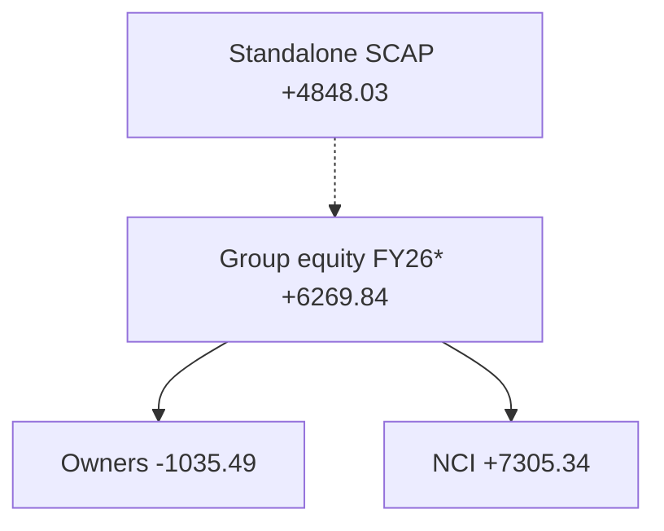

**31-03-2026 இடைக்காலம்:** குழும total equity **+6,269.84m** = SCAP உரிமையாளர் **−1,035.49m** + minority **+7,305.34m** (rounding 0.01m). SCAP தனி equity **+4,848.03m**.

**Source / status:** [SCAP FY2025 audited report](https://cdn.cse.lk/cmt/upload_report_file/1100_1764673838964.03.2025%20-%20Annual%20Report.pdf) · [SCAP FY2026 interim](https://cdn.cse.lk/cmt/upload_report_file/1100_1779968696398.pdf). **FY26* means FY2026 27 May 2026 interim, subject to audit.**

## 08 · SCAP தனி நிறுவன இலாபம்

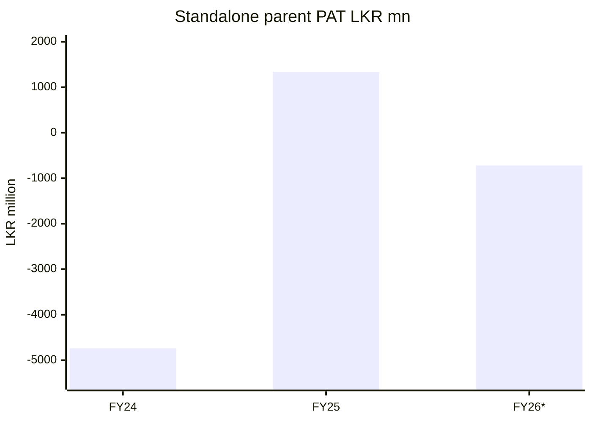

SCAP தனி நிறுவன PAT FY2024/25/26: **−4,738.28m / +1,339.80m / −722.49m**; FY2026 **இடைக்காலம்**. Dividend income, fair value ஆகியவை நிறுவன முடிவை பாதிக்கின்றன.

**Source / status:** [SCAP FY2025 audited report](https://cdn.cse.lk/cmt/upload_report_file/1100_1764673838964.03.2025%20-%20Annual%20Report.pdf) · [SCAP FY2026 interim](https://cdn.cse.lk/cmt/upload_report_file/1100_1779968696398.pdf). **FY26* means FY2026 27 May 2026 interim, subject to audit.**

## 09 · SCAP தனி வட்டியுள்ள கடன்

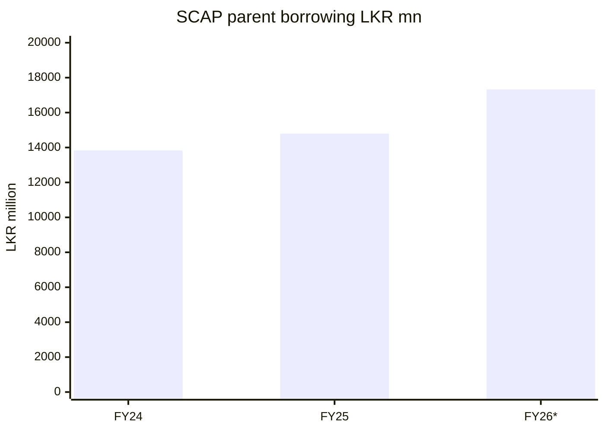

SCAP தனி வட்டியுள்ள கடன் **13,828.16m / 14,797.33m / 17,324.26m**, முறையே **31-03-2024/2025/2026**. Overdraft கூடுதலாக FY2025 **323.78m**, FY2026 **323.13m**. கடன் காலவரை/ரொக்கப் பெறுதலை ஆய்வு செய்ய வேண்டும்.

**Source / status:** [SCAP FY2025 audited report](https://cdn.cse.lk/cmt/upload_report_file/1100_1764673838964.03.2025%20-%20Annual%20Report.pdf) · [SCAP FY2026 interim](https://cdn.cse.lk/cmt/upload_report_file/1100_1779968696398.pdf). **FY26* means FY2026 27 May 2026 interim, subject to audit.**

## 10 · குழும இயக்கப் பணப்புழக்கம்

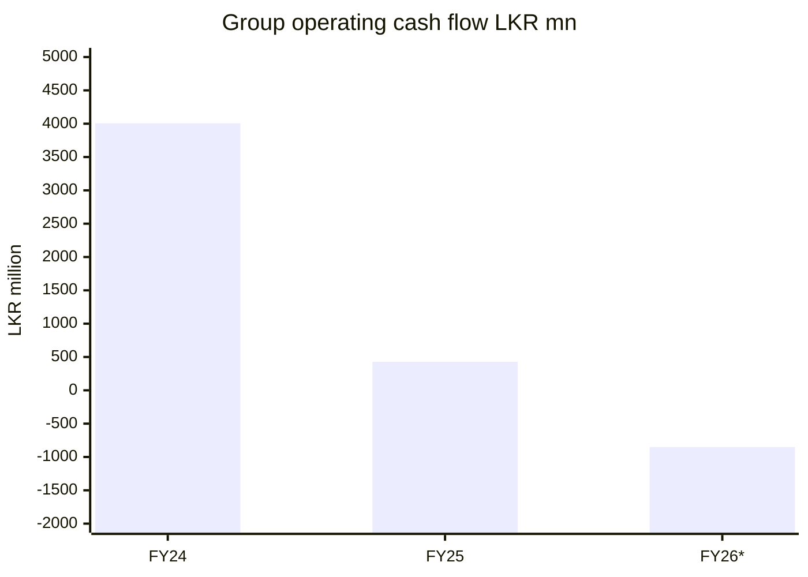

குழும operating cash flow FY2024/25/26 **+4,006.00m / +427.54m / −851.24m**; மூன்றாம் ஆண்டு இடைக்கால எண்ணுக்கு மூன்றாம் தரப்பு ஒப்பீடும் உள்ளது. கடன்/வைப்பு/காப்பீட்டு பொறுப்புகள் cash-flow கணக்கை பாதிக்கும்; SCAP-க்கு வரும் free cash அல்ல.

**Source / status:** [SCAP FY2025 audited report](https://cdn.cse.lk/cmt/upload_report_file/1100_1764673838964.03.2025%20-%20Annual%20Report.pdf) · [FY2026 year-end interim](https://cdn.cse.lk/cmt/upload_report_file/1100_1779968696398.pdf) · [secondary CFO cross-check](https://stockanalysis.com/quote/cose/SCAP.N0000/financials/cash-flow-statement/). **FY26* means FY2026 27 May 2026 interim, subject to audit.**

## 11 · தாய் நிறுவன இயக்கப் பணப்புழக்கம்

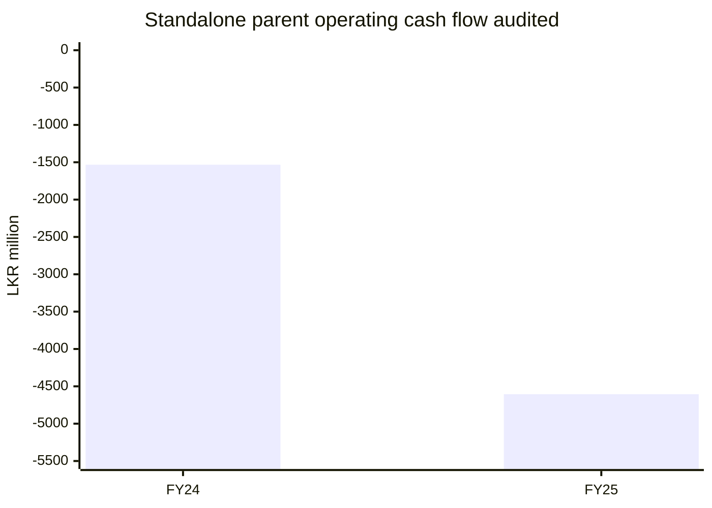

SCAP தனி இயக்க cash flow FY2024 **−1,533.19m**, FY2025 **−4,605.10m**, audited அறிக்கை ப.70. **FY2026 தாய் நிறுவன CFO இன்னும் உறுதி செய்யப்படவில்லை**; மூன்றாம் bar இல்லை. FY2025 உண்மையில் **செலுத்திய வட்டி −2,549.88m**, accrual interest **expense 1,833.56m**; இரண்டும் வேறு.

**Source / status:** [SCAP FY2025 audited report pp. 69–70](https://cdn.cse.lk/cmt/upload_report_file/1100_1764673838964.03.2025%20-%20Annual%20Report.pdf). **FY26* means FY2026 27 May 2026 interim, subject to audit.**

## 12 · FY2025 குழுமப் பொறுப்பு வகைகள்

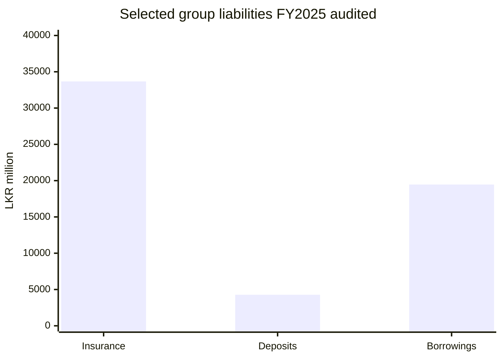

FY2025 audited குழுமத் தேர்ந்தெடுத்த பொறுப்புகள்: insurance contracts **33,671.06m**, public deposits **4,273.39m**, interest-bearing borrowing **19,467.97m**. **மற்ற liability-கள் சேர்க்கப்படவில்லை**; மொத்த liabilities pie அல்ல. Insurance, IT controls, ECL, borrowing முக்கிய audit பகுதிகள்.

**Source / status:** [SCAP FY2025 audited report pp. 65–66](https://cdn.cse.lk/cmt/upload_report_file/1100_1764673838964.03.2025%20-%20Annual%20Report.pdf). **FY26* means FY2026 27 May 2026 interim, subject to audit.**

## வரம்புகளும் சரிபார்ப்பும்

**முறை:** ஒவ்வொரு வரைபடத்திலும் காலம், scope, audit நிலை தனியாக உள்ளது. SCAP உரிமையாளர் equity எதிர்மறை என்பது முழுக் குழும equity எதிர்மறை என்று பொருள் அல்ல. கடன்/வைப்பு/insurance liabilities/risk எண்களைச் சேர்த்து தவறான கணக்கு உருவாக்க வேண்டாம்.

- **A — audited:** [SCAP original FY2024/25 annual report, pp. 59–70](https://cdn.cse.lk/cmt/upload_report_file/1100_1764673838964.03.2025%20-%20Annual%20Report.pdf); EY opinion signed 1 December 2025.
- **I — interim:** [SCAP CSE year-ended 31 March 2026 interim filing](https://cdn.cse.lk/cmt/upload_report_file/1100_1779968696398.pdf); original link, research previously transcribed; FY2026 figures **subject to audit**. The PDF could not be reopened in this pass.
- **B — secondary cross-check only:** [StockAnalysis FY2026 cash flow](https://stockanalysis.com/quote/cose/SCAP.N0000/financials/cash-flow-statement/); does not replace SCAP original statement.
- **OPEN:** original SCAP FY2025/26 final audited statements, 30 June 2026 report, standalone FY2026 cash flow and any restatements must still be verified. **Softlogic Holdings PLC and Softlogic Finance PLC are different issuers.**
