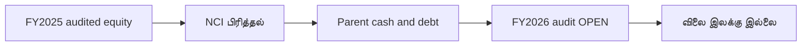

# SCAP மதிப்பீடு — சரிபார்க்கப்பட்ட தரவுகள்

**நிலை: PARTIAL · 30-09-2026.** இது பங்கு விலை இலக்கு அல்ல. FY2025 தணிக்கை செய்யப்பட்டது; FY2026 என்பது 27 மே 2026 அன்று வெளியிடப்பட்ட **தணிக்கைக்கு உட்பட்ட இடைக்கால அறிக்கை**. கீழுள்ள தொகைகள் **LKR மில்லியன்**.

| அளவுகோல் | FY2025 audited | FY2026 interim | கணக்கியல் வரம்பு / ஆதாரம் |
|---|---:|---:|---|
| SCAP பங்குதாரருக்குரிய குழும equity | −2,440.85 | −1,035.49 | Group owners; [FY25 ப.65](https://cdn.cse.lk/cmt/upload_report_file/1100_1764673838964.03.2025%20-%20Annual%20Report.pdf), [FY26 ப.6](https://cdn.cse.lk/cmt/upload_report_file/1100_1779968696398.pdf) |
| சிறுபான்மையினர் உட்பட குழும மொத்த equity | +2,856.63 | +6,269.84 | Group total; அதே பக்கங்கள் |
| சிறுபான்மையினர் equity (NCI) | +5,297.48 | +7,305.34 | NCI; அதே பக்கங்கள் |
| SCAP தனி நிறுவன equity | +5,373.24 | +4,848.03 | Parent-only; அதே பக்கங்கள் |
| SCAP தனி நிறுவன வட்டிக் கடன் | 14,797.33 | 17,324.26 | [FY25 ப.66](https://cdn.cse.lk/cmt/upload_report_file/1100_1764673838964.03.2025%20-%20Annual%20Report.pdf), [FY26 ப.6](https://cdn.cse.lk/cmt/upload_report_file/1100_1779968696398.pdf) |
| SCAP தனி நிறுவன cash/bank | 27.89 | 32.07 | [FY25 ப.65](https://cdn.cse.lk/cmt/upload_report_file/1100_1764673838964.03.2025%20-%20Annual%20Report.pdf), [FY26 ப.6](https://cdn.cse.lk/cmt/upload_report_file/1100_1779968696398.pdf) |
| SCAP தனி நிறுவன overdraft | 323.78 | 323.13 | [FY25 ப.66](https://cdn.cse.lk/cmt/upload_report_file/1100_1764673838964.03.2025%20-%20Annual%20Report.pdf), [FY26 ப.6](https://cdn.cse.lk/cmt/upload_report_file/1100_1779968696398.pdf) |
| SCAP உரிமையாளருக்குரிய குழும இலாபம் | −280.42 | +973.77 | [FY25 ப.63](https://cdn.cse.lk/cmt/upload_report_file/1100_1764673838964.03.2025%20-%20Annual%20Report.pdf), [FY26 ப.2](https://cdn.cse.lk/cmt/upload_report_file/1100_1779968696398.pdf) |
| NCI உட்பட குழும மொத்த இலாபம் | +1,694.15 | +3,371.26 | அதே வருமானப் பக்கங்கள் |
| SCAP தனி operating cash flow | −4,605.10 | **OPEN** | [FY25 ப.70](https://cdn.cse.lk/cmt/upload_report_file/1100_1764673838964.03.2025%20-%20Annual%20Report.pdf) |

**கணக்குச் சரிபார்ப்பு:** FY2025 −2,440.85 + 5,297.48 = 2,856.63. FY2026 இடைக்காலத்தில் −1,035.49 + 7,305.34 = 6,269.85; அறிக்கையின் 6,269.84 உடன் **0.01m rounding வேறுபாடு**.

**முக்கிய வரம்பு:** குழும மொத்த equity-யில் NCI இருப்பதால் அதை SCAP சாதாரணப் பங்குதாரரின் P/B denominator-ஆகப் பயன்படுத்தக் கூடாது. SCAP உரிமையாளருக்குரிய equity எதிர்மறை. தனி நிறுவன equity என்பது வேறு கணக்கியல் வரம்பு. துணை நிறுவன cash, insurance reserves மற்றும் deposits ஆகியவை தாய் நிறுவனத்திற்கு உடனே கிடைக்கும் பணமல்ல.

**OPEN:** FY2026 இறுதி கையொப்பமிட்ட audit, 30 ஜூன் 2026 அசல் அறிக்கை, தற்போதைய share count/market quote, அடமானப் பங்குகள், கடன் முதிர்வு, dividend பெறும் திறன். இவற்றின்றி P/E, P/B, SOTP அல்லது target price வெளியிடப்படவில்லை.

**ஆதாரக் களஞ்சியம்:** [FY2025](../../../sources/records/SCAP-AR-2025.md) · [FY2026 interim](../../../sources/records/SCAP-FY2026-YE-INTERIM.md) · [பதிவேடு](../../../sources/SOURCE-REGISTER.md). **அசல் PDF வெளிப்புற இணைப்பு மட்டுமே; GitHub-இல் சேமிக்கப்படவில்லை.**

