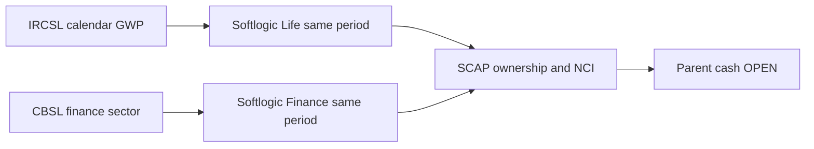

# Industry evidence — SCAP.N0000

## தொழிற்துறை: முதன்மை ஆதார ஆய்வு · 30 செப்டம்பர் 2026

**நிலை: PARTIAL.** இவை தொழிற்துறை அளவுகள்; SCAP நிறுவனத்தின் நேரடி வருமானம் அல்லது தற்போதைய சந்தைப் பங்கு அல்ல.

| தொழில் | சரிபார்க்கப்பட்ட தொழிற்துறை ஆதாரம் | SCAP-க்கு தேவையான தனி ஆய்வு |
|---|---|---|
| ஆயுள் காப்பீடு | IRCSL 2024 **தற்காலிக** ஆயுள் GWP **LKR 183,875m**, பொது காப்பீடு **138,162m**, மொத்தம் **322,037m**. 2025 Q1 ஆயுள் **51,056m**, பொது **41,172m**; இரண்டின் கூட்டுத்தொகைக்கும் அறிவிக்கப்பட்ட **92,229m** மொத்தத்துக்கும் **1m rounding** வேறுபாடு. [IRCSL Chart 1](https://ircsl.gov.lk/wp-content/uploads/2025/08/PRESS-RELEASE-_-Reviewing-Sri-Lankas-Insurance-Sector-Performance-2020-to-2024-and-Q1-2025.pdf). | Softlogic Life-ன் அதே **காலண்டர் கால** GWP, பாலிசிகள், claims, retention, solvency தனியே சரிபார்க்க வேண்டும். GWP என்பது SCAP குழும வருமானமோ தாய் நிறுவன cash-ஓ அல்ல. |
| நிதி நிறுவனங்கள் | CBSL-ன் **காலண்டர் 2025** மதிப்பீடு கடன் விரிவாக்கத்தையும் உயர்ந்த credit-to-GDP gap-ஐயும் விவரிக்கிறது. [CBSL Full Text](https://www.cbsl.gov.lk/en/node/20110). | இது Softlogic Finance-ன் தனி இலாபம்/மூலதன விகிதம் அல்ல; Stage 3, deposits, funding cost, capital ஆகியவற்றை அதன் அசல் அறிக்கையுடன் ஒப்பிட வேண்டும். |
| பங்குத் தரகு | SCAP FY2025 தணிக்கை அறிக்கையில் தரகு நடவடிக்கைகள் குறிப்பிடப்படுகின்றன; தற்போதைய SEC licence, CSE turnover/market share இங்கு உறுதிப்படுத்தப்படவில்லை. [SCAP](https://cdn.cse.lk/cmt/upload_report_file/1100_1764673838964.03.2025%20-%20Annual%20Report.pdf). | சட்ட நிறுவனம், உண்மையான பங்குரிமை, fees மற்றும் தாய் நிறுவனத்துக்குக் கிடைத்த dividends தேவை. |
| சொத்து மேலாண்மை | SCAP FY2025-இல் இந்தத் தொழில் குறிப்பிடப்படுகிறது; ஒப்பிடக்கூடிய AUM/fee margin தரவு **OPEN**. [SCAP](https://cdn.cse.lk/cmt/upload_report_file/1100_1764673838964.03.2025%20-%20Annual%20Report.pdf). | SEC உரிமம், AUM, recurring fee, உரிமைப் பங்கு சரிபார்க்க வேண்டும். |

**கால வேறுபாடு:** IRCSL 2024 = ஜனவரி–டிசம்பர் 2024; Q1 2025 = மார்ச் 2025 வரை; CBSL 2025 = ஜனவரி–டிசம்பர் 2025. SCAP FY2025 = 31 மார்ச் 2025 வரை; FY2026 = 31 மார்ச் 2026 வரை. நேரடியாக ஒப்பிட வேண்டாம். சிறுபான்மை உரிமை (NCI), காப்பீட்டு கடப்பாடுகள், வாடிக்கையாளர் வைப்புகள் மற்றும் தாய் நிறுவன cash தனித்தனியாகும்.

**OPEN:** IRCSL 2025 handbook/2026 Q2, அதே கால CBSL finance series, SEC/CSE broker data, SCAP இறுதி FY2026 audit மற்றும் ஜூன் 2026 அசல் அறிக்கை. தற்போதைய market-share முடிவு வழங்கப்படவில்லை.

**ஆதாரப் பதிவுகள்:** [IRCSL](../../../sources/records/IRCSL-INSURANCE-SECTOR-2024-Q1-2025.md) · [CBSL](../../../sources/records/CBSL-FINANCIAL-SECTOR-PERFORMANCE-2025.md) · [SCAP FY2025](../../../sources/records/SCAP-AR-2025.md). **அசல் ஆவணங்கள் வெளிப்புற இணைப்புகள்; GitHub-இல் சேமிக்கப்படவில்லை.**

