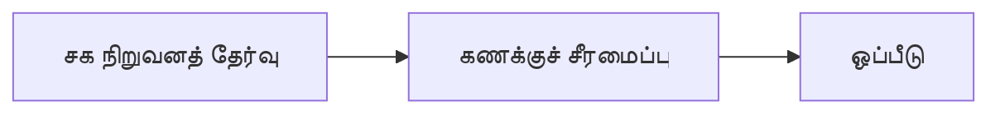

# 05 · போட்டியாளர் பகுப்பாய்வு

[← அடிப்படைப் பகுப்பாய்வு](../README.md) · [English](../../../01-Fundamental-Analysis/05-Competitors/README.md) · [தமிழ்](README.md) · [සිංහල](../../../si/01-Fundamental-Analysis/05-Competitors/README.md)

> **SCAP.N0000 · Softlogic Capital PLC**  
> **நிலை:** இது ஆய்வு செய்வதற்கான வழிகாட்டி மட்டுமே; SCAP பற்றிய இறுதி முடிவு இன்னும் உறுதி செய்யப்படவில்லை. **Reference: 2026-09-30**.

## 🎯 முக்கிய ஆய்வுக் கேள்வி

அதே தொழிலும் கணக்கியல் அடிப்படையும் கொண்ட நிறுவனங்களுடன் ஒப்பிடும்போது SCAP துணை நிறுவனங்கள் எவ்வாறு செயல்படுகின்றன?

## 🔍 சேகரிக்க வேண்டிய ஆதாரங்கள்

- [ ] காப்பீட்டுக்குக் காப்பீட்டாளர்கள், கடன் சேவைக்கு நிதி நிறுவனங்கள், தரகுக்குத் தரகர்கள் எனச் சரியான சக நிறுவனங்களைத் தேர்வு செய்து காரணம் எழுதவும்.
- [ ] கணக்கியல் காலம், குழும/தனி அறிக்கை, மூலதனம், உரிமைப் பங்கு, மதிப்பீட்டு denominator ஆகியவற்றைச் சரிசெய்யவும்.
- [ ] காப்பீட்டிற்கு persistency/solvency, நிதிக்கு NPL/funding, தரகுக்கு commission/turnover ஆகியவற்றை ஒப்பிடவும்.

## 🧭 ஆய்வுப் பாதை

## ⚠️ தவறாகப் புரிந்துகொள்ளக்கூடிய விடயம்

ஒரு holding company P/E-யை தனிக் காப்பீட்டு நிறுவன P/E-யுடன் நேரடியாக ஒப்பிடுவது minority interests மற்றும் அபாய வேறுபாட்டை மறைக்கலாம்.

## 🛠️ SCAP-க்கான அடுத்த ஆய்வு

ஒரே தரவரிசைக்கு பதிலாக நான்கு தொழில் பிரிவுகளுக்கும் தனித்தனி போட்டியாளர் அட்டவணை அமைக்கவும்; ஆதாரம்/தேதி பதிவு செய்யவும்.

## 📝 ஆதாரப் பதிவு (அசல் ஆவணத்தைப் பார்த்த பின்னர் நிரப்பவும்)

| அளவுகோல் / தகவல் | காலம் / கணக்குப் பிரிவு | அசல் ஆதாரம் + பக்கம் | உறுதி செய்த முடிவு |
|---|---|---|---|
| __________ | __________ | __________ | __________ |
| __________ | __________ | __________ | __________ |

**முந்தைய ஆய்வு:** [SCAP முந்தைய ஆய்வு](../../../ta/03-competition.md) · [ஆதாரப் பட்டியல்](../../../ta/SOURCES.md) · [CSE](https://www.cse.lk/).

**முறை:** ஒவ்வொரு எண்ணுக்கும் தேதி, கணக்குப் பிரிவு, அலகு மற்றும் அசல் ஆவணத்தின் பக்கத்தைப் பதிவு செய்யவும். ஒரு விகிதம் அல்லது வரைபடம் வாங்க/விற்க பரிந்துரை அல்ல.
