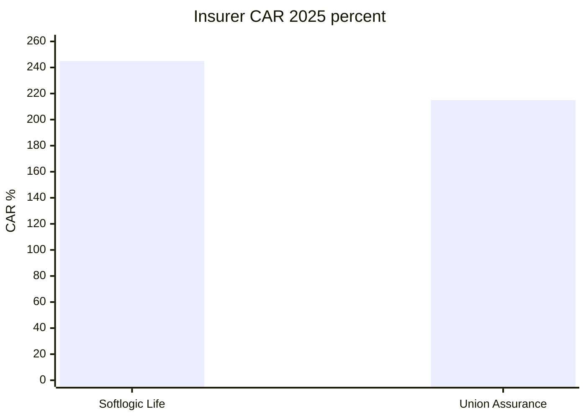

# 05 · தேதியுள்ள காப்பீடு மற்றும் Finance போட்டியாளர் ஒப்பீடு

[← Fundamental analysis](../README.md) · [English](../../../01-Fundamental-Analysis/05-Competitors/README.md) · [தமிழ்](README.md) · [සිංහල](../../../si/01-Fundamental-Analysis/05-Competitors/README.md)

> **SCAP.N0000 · அசல் ஆதார ஆய்வு · 30-09-2026 · தனியாகக் குறிப்பிட்டவை தவிர LKR மில்லியன்.** **OPEN: இறுதி SCAP FY2025/26 audited மற்றும் ஜூன் 2026 அசல் அறிக்கைகள் இன்னும் ஒப்பிடப்படவில்லை. FY2025 எண்களை தற்போதைய உறுதிப்படுத்தப்பட்ட நிலையாகக் கருத வேண்டாம்.**

## 🎯 ஆய்வுக் கேள்வி

ஒரே காலம், ஒரே தொழில் மற்றும் ஒரே கணக்கியல் வரையறையில் எந்த peer எண்களை ஒப்பிடலாம்?

**SCAP குழுமத்தை நேரடியாக insurance peer எனக் கருத முடியாது.** Insurer CAR ≠ Finance CAR; காப்பீட்டு GWP ≠ SCAP Group revenue. கீழே ஒரே துறை/கால அளவீடு மட்டும் ஒப்பிடப்படுகிறது. [SLIFE-AR-2025](../../../sources/records/SLIFE-AR-2025.md) · [UA-AR-2025-CAR](../../../sources/records/UA-AR-2025-CAR.md) · [CBSL-FC-Q1-2026](../../../sources/records/CBSL-FC-Q1-2026.md).

## 🔎 தேதியுள்ள ஆதாரங்கள்

| நிறுவனம் / அளவுகோல் | எண் | காலம் / ஆதாரம் | ஒப்பீட்டு வரம்பு |
|---|---|---|
| Softlogic Life risk-based CAR | 245% | 31-12-2025 issuer annual | Insurance RBC |
| Union Assurance risk-based CAR | 215% | 31-12-2025 issuer annual | Insurance peer RBC |
| காப்பீட்டு குறைந்தபட்ச CAR | 120% | 2025 annual reports | Regulatory minimum |
| Softlogic Life customer retention | 89% | Calendar 2025 issuer dashboard | 13-month persistency என்று உறுதி இல்லை |
| Union Assurance matching retention | OPEN | ஒரே வரையறை பெறவில்லை | ஊகம் செய்ய வேண்டாம் |
| Softlogic Finance total CAR | ~61% | 31-03-2026 management update | CBSL Finance CAR |
| CBSL finance sector CAR | 18.4% | 31-03-2026 regulator release | Sector measure |
| Softlogic Finance gross NPL | 37.6% provisional | 2026 secondary publication | அசல் NPL line OPEN |
| FC sector same-definition gross NPL | OPEN | ஒரே denominator தேவை | Bank Stage 3 கலக்க வேண்டாம் |

### Life CAR மற்றும் persistency வேறுபாடு

Softlogic Life-ன் calendar **2025 issuer அறிக்கையில் CAR 245%**, **customer retention 89%**. Union Assurance-ன் அதே **31-12-2025 annual CAR 215%**. இரண்டும் **insurance** prudential CAR; SCAP parent cash அல்ல. Union-ன் ஒரே denominator/customer cohort அடிப்படையிலான persistency உறுதி செய்யப்படவில்லை; அதனால் customer retention ஒப்பீடு OPEN. [SLIFE-AR-2025](../../../sources/records/SLIFE-AR-2025.md) · [UA-AR-2025-CAR](../../../sources/records/UA-AR-2025-CAR.md).

### Finance CAR மற்றும் gross NPL

Softlogic Finance-ன் **28-07-2026 issuer செய்தியில் CAR ~61%** எனக் கூறுகிறது. CBSL **finance company sector**-க்கு **31-03-2026 CAR 18.4%**. முதல் எண் issuer commentary; இரண்டாம் regulator statistic. Finance **gross NPL 37.6%** என்பது இன்னும் secondary செய்தியில் இருந்து கிடைத்த தற்காலிக எண்; audited original gross-NPL row OPEN. Bank Stage3 அல்லது net NPL உடன் நேரடியாக ஒப்பிடக் கூடாது. [SFIN-UPDATE-JUL2026](../../../sources/records/SFIN-UPDATE-JUL2026.md) · [CBSL-FC-Q1-2026](../../../sources/records/CBSL-FC-Q1-2026.md).

### Funding மற்றும் கடன் தர ஒப்பீட்டு வரம்பு

Finance issuer FY26 வரையறையில் assets **~7.3bn**, loans **~6.5bn**, deposits **>3.7bn**. துறையில் உள்ள ஒத்த finance நிறுவனங்களுடன் வைப்புகளின் tenor, cost, liquidity, recoveries ஆகியவற்றை ஒப்பிட அசல் audited KPI அறிக்கை தேவை. Life customer retention என்பது policy persistency என்ற ஒரே குறியீடு அல்ல. [SFIN-UPDATE-JUL2026](../../../sources/records/SFIN-UPDATE-JUL2026.md).

## ஆதாரக் காட்சி

## ⚠️ மீதமுள்ள சரிபார்ப்புகள்

- [ ] அதே calendar ஆண்டு மற்றும் customer cohort அடிப்படையிலான insurer persistency இரண்டிற்கும் பெறவும்.
- [ ] Finance FY26 original gross NPL, Stage3 coverage, வைப்புக் காலவரை உறுதி செய்யவும்.
- [ ] CBSL அதே வரையறையுள்ள FC gross NPL sector data பெறவும்.
- [ ] Stockbroker, asset manager களுக்கான issuer/SEC peer metrics சேகரிக்கவும்.

**ஆதார எண்கள்:** [SLIFE-AR-2025](../../../sources/records/SLIFE-AR-2025.md) · [UA-AR-2025-CAR](../../../sources/records/UA-AR-2025-CAR.md) · [SFIN-UPDATE-JUL2026](../../../sources/records/SFIN-UPDATE-JUL2026.md) · [CBSL-FC-Q1-2026](../../../sources/records/CBSL-FC-Q1-2026.md).

[Life 2025 original PDF](https://softlogiclife.lk/wp-content/uploads/sites/3/2026/03/Softlogic-Life-Integrated-Annual-Report-2025.pdf) · [Union 2025 original PDF](https://unionassurance.com/DigitalAnnualReport2025/Union-Assurance-AR-2025.pdf) · [CBSL FC sector Q1 2026](https://www.cbsl.gov.lk/en/node/20440) · [Finance issuer update](https://softlogicfinance.lk/news/building-a-stronger-more-resilient-softlogic-finance/).

[மூல அறிக்கைகள்](../../../sources/SOURCE-REGISTER.md) · [ஆய்வு முன்னேற்றம்](../../../ta/RESEARCH-QUEUE.md)

இது நிதித் தகவல் ஆய்வு; பங்குகளை வாங்க/விற்க பரிந்துரை அல்ல.