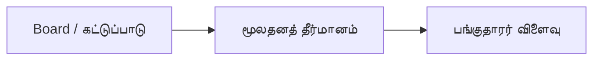

# 07 · நிர்வாகம் மற்றும் நல்லாட்சிப் பகுப்பாய்வு

[← அடிப்படைப் பகுப்பாய்வு](../README.md) · [English](../../../01-Fundamental-Analysis/07-Management-Governance/README.md) · [தமிழ்](README.md) · [සිංහල](../../../si/01-Fundamental-Analysis/07-Management-Governance/README.md)

> **SCAP.N0000 · Softlogic Capital PLC**  
> **நிலை:** இது ஆய்வு செய்வதற்கான வழிகாட்டி மட்டுமே; SCAP பற்றிய இறுதி முடிவு இன்னும் உறுதி செய்யப்படவில்லை. **Reference: 2026-09-30**.

## 🎯 முக்கிய ஆய்வுக் கேள்வி

இயக்குநர் குழு, மூலதன ஒதுக்கீடு மற்றும் தொடர்புடைய தரப்புகள் சிறுபான்மை பங்குதாரர்களை எவ்வாறு பாதிக்கின்றன?

## 🔍 சேகரிக்க வேண்டிய ஆதாரங்கள்

- [ ] தேதியுள்ள அறிக்கைகளில் board உறுப்பினர்கள், சுயாதீனம், audit committee, தணிக்கையாளர் கருத்து ஆகியவற்றைப் பதிவு செய்யவும்.
- [ ] Related-party பரிவர்த்தனை, உத்தரவாதம், ஊதியம், புதிய பங்குகள், கடந்தகால மூலதன பயன்பாடு ஆகியவற்றை ஆராயவும்.
- [ ] நிர்வாகம் கூறிய திட்டங்களையும் பதிவான விளைவுகளையும் ஒப்பிடவும்; நோக்கத்தை ஆதாரமின்றி ஊகிக்க வேண்டாம்.

## 🧭 ஆய்வுப் பாதை

## ⚠️ தவறாகப் புரிந்துகொள்ளக்கூடிய விடயம்

நிறுவனர் பெயர், குழுமப் புகழ் அல்லது ஒரு ஆண்டு நல்ல இலாபம் மட்டுமே நல்லாட்சிக்குச் சான்றல்ல.

## 🛠️ SCAP-க்கான அடுத்த ஆய்வு

SCAP சமீபத்திய ஆண்டு அறிக்கையின் governance, related-party, contingent-liability குறிப்புகளைப் பக்க எண்ணுடன் பதிவு செய்யவும்.

## 📝 ஆதாரப் பதிவு (அசல் ஆவணத்தைப் பார்த்த பின்னர் நிரப்பவும்)

| அளவுகோல் / தகவல் | காலம் / கணக்குப் பிரிவு | அசல் ஆதாரம் + பக்கம் | உறுதி செய்த முடிவு |
|---|---|---|---|
| __________ | __________ | __________ | __________ |
| __________ | __________ | __________ | __________ |

**முந்தைய ஆய்வு:** [SCAP முந்தைய ஆய்வு](../../../ta/01-business-and-ownership.md) · [ஆதாரப் பட்டியல்](../../../ta/SOURCES.md) · [CSE](https://www.cse.lk/).

**முறை:** ஒவ்வொரு எண்ணுக்கும் தேதி, கணக்குப் பிரிவு, அலகு மற்றும் அசல் ஆவணத்தின் பக்கத்தைப் பதிவு செய்யவும். ஒரு விகிதம் அல்லது வரைபடம் வாங்க/விற்க பரிந்துரை அல்ல.
