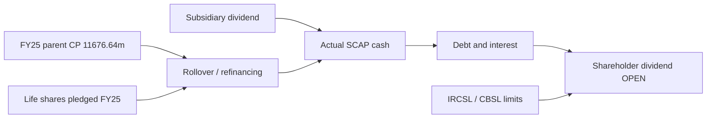

# 08 · தாய் நிறுவன நிதி, அடமானம், ஒழுங்குமுறை மற்றும் கடன் இடர்கள்

[← Fundamental analysis](../README.md) · [English](../../../01-Fundamental-Analysis/08-Risk/README.md) · [தமிழ்](README.md) · [සිංහල](../../../si/01-Fundamental-Analysis/08-Risk/README.md)

> **SCAP.N0000 · அசல் ஆதார ஆய்வு · 30-09-2026 · தனியாகக் குறிப்பிட்டவை தவிர LKR மில்லியன்.** **OPEN: இறுதி SCAP FY2025/26 audited மற்றும் ஜூன் 2026 அசல் அறிக்கைகள் இன்னும் ஒப்பிடப்படவில்லை. FY2025 எண்களை தற்போதைய உறுதிப்படுத்தப்பட்ட நிலையாகக் கருத வேண்டாம்.**

## 🎯 ஆய்வுக் கேள்வி

SCAP தாய் நிறுவனக் கணக்கில் வரலாற்றாகப் பதிவான கடன் மற்றும் security எவ்வளவு? எவை இன்னும் உறுதி செய்யப்படவில்லை?

**கணக்குப் பிரிவு முக்கியம்:** 31-03-2025 SCAP **தனி நிறுவன வட்டியுள்ள கடன் 14,797.33m**, ஆனால் குழுமம் **19,467.97m** (audited note 39, PDF ப.148). இவை ஒன்றல்ல. **31-03-2026 இடைக்கால** parent debt **17,324.26m**, cash **32.07m** — இறுதி audited மூலம் இன்னும் சரிபார்க்க வேண்டும். [SCAP-AR-2025](../../../sources/records/SCAP-AR-2025.md) · [SCAP-FY2026-YE-INTERIM](../../../sources/records/SCAP-FY2026-YE-INTERIM.md).

## 🔎 தேதியுள்ள ஆதாரங்கள்

| FY2025 audited parent அளவுகோல் | LKR mn | ஆதாரம் / எச்சரிக்கை |
|---|---|---|
| Bank loans | 1,950.22 | Note 39 ப.148; 426.02 ஒரு வருடத்திற்குள், 1,524.20 பின்னர் (ப.149) |
| Commercial paper | 11,676.64 | Note 39; ஒவ்வொரு tranche maturity OPEN |
| Securitisation | 1,154.54 | Note 39; தனி கடன் உறுதி செய்ய வேண்டும் |
| Lease creditors | 15.93 | ~3.07 ஒரு வருடத்திற்குள், ~12.86 பின்னர் |
| Debentures / subordinated parent | 0.00 | 31-03-2025 மட்டும் |
| மொத்த parent interest-bearing debt | 14,797.33 | Parent-only கூட்டுத்தொகை |
| Parent guarantee | 75.00 | Note 44 ப.161; Stockbrokers note 47.4 ப.168 |
| Life அடமானப் பங்குகள் | NDB 48,559,000 / DFCC 32,490,704 shares | Note 39.1.2 ப.149; **இவை share எண்ணிக்கை** |
| Parent operating CFO | −4,605.10 | Audited ப.70 |
| பெற்ற dividend / செலுத்திய வட்டி | +3,273.55 / −2,549.88 | Cash movement ப.70 |

### Commercial paper மற்றும் collateral

FY2025 directors note 2.1.2 (ப.71): வட்டி செலுத்த subsidiary dividend, புதிய commercial paper மீது எதிர்பார்ப்பு; முந்தைய **CP renewal அனுபவம் சுமார் 82%** என நிர்வாகம் கூறியது. அது இன்றைய கடன் rollover உத்தரவாதம் அல்ல. NDB/DFCC-க்கு Life shares pledged என்ற குறிப்பு FY2025-க்குரியது; தற்போதைய release OPEN. [SCAP-AR-2025](../../../sources/records/SCAP-AR-2025.md).

### காப்பீடு மற்றும் Finance மூலதனம்

Life-ன் **2025 CAR 245%** அதன் சொந்த insurance solvency; SCAP parent cash அல்ல. FY2025 note 41.7 (ப.157) **798.004m restricted surplus** விநியோகத்திற்கு IRCSL கட்டுப்பாடு. Finance-ன் **ஜூலை 2026 issuer update** சுமார் **61% finance CAR** மற்றும் 3.7bn-க்கும் அதிகமான deposits எனக் கூறுகிறது; இது CBSL finance நிறுவனம்; Life-ன் 245%-உடன் கூட்ட வேண்டாம். [SLIFE-AR-2025](../../../sources/records/SLIFE-AR-2025.md) · [SFIN-UPDATE-JUL2026](../../../sources/records/SFIN-UPDATE-JUL2026.md).

### Guarantee மற்றும் dividend இடைவெளி

SCAP note 44 (ப.161) **75m parent guarantees**, related-party note 47.4 (ப.168) Stockbrokers என்று குறிப்பிடுகிறது. அதே தொடர்புடைய நிறுவனப் பதிவில் Life-இலிருந்து **3,273.546m dividend income**. SCAP பங்குதாரருக்கு வழங்கக்கூடிய தொகை வட்டி, covenant, solvency மற்றும் board முடிவைப் பொறுத்தது; 2026 Life அறிவிப்பு cash receipt ஆக உறுதி செய்யப்படவில்லை. [SLIFE-JUN2026-DIVIDEND](../../../sources/records/SLIFE-JUN2026-DIVIDEND.md).

## ஆதாரக் காட்சி

## ⚠️ மீதமுள்ள சரிபார்ப்புகள்

- [ ] FY26 audited CP tranches/maturities/covenants மற்றும் SCAP June அசல் தகவலைப் பெறவும்.
- [ ] 2026 bank security/guarantees மற்றும் Life pledge release உறுதி செய்யவும்.
- [ ] FY26 standalone CFO, Finance deposit maturities, Life distributable reserve ஆகியவற்றைத் தனியாகச் சரிபார்க்கவும்.
- [ ] Group debt maturity-ஐ parent debt maturity என்று தவறாகப் பயன்படுத்தாதீர்கள்.

**ஆதார எண்கள்:** [SCAP-AR-2025](../../../sources/records/SCAP-AR-2025.md) · [SCAP-FY2026-YE-INTERIM](../../../sources/records/SCAP-FY2026-YE-INTERIM.md) · [SLIFE-AR-2025](../../../sources/records/SLIFE-AR-2025.md) · [SFIN-UPDATE-JUL2026](../../../sources/records/SFIN-UPDATE-JUL2026.md) · [SLIFE-JUN2026-DIVIDEND](../../../sources/records/SLIFE-JUN2026-DIVIDEND.md) · [SCAP-AR-2026-CATALOGUE](../../../sources/records/SCAP-AR-2026-CATALOGUE.md) · [SCAP-JUN2026-CATALOGUE](../../../sources/records/SCAP-JUN2026-CATALOGUE.md).

[SCAP FY2025 audited original](https://cdn.cse.lk/cmt/upload_report_file/1100_1764673838964.03.2025%20-%20Annual%20Report.pdf) · [SCAP FY2026 interim](https://cdn.cse.lk/cmt/upload_report_file/1100_1779968696398.pdf) · [Finance issuer](https://softlogicfinance.lk/news/building-a-stronger-more-resilient-softlogic-finance/).

[மூல அறிக்கைகள்](../../../sources/SOURCE-REGISTER.md) · [ஆய்வு முன்னேற்றம்](../../../ta/RESEARCH-QUEUE.md)

இது நிதித் தகவல் ஆய்வு; பங்குகளை வாங்க/விற்க பரிந்துரை அல்ல.