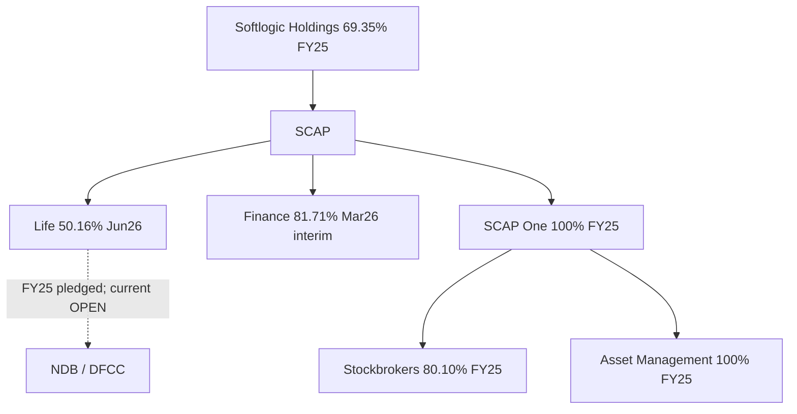

# 10 · பங்குரிமை, துணை நிறுவனங்கள், அடமானப் பங்குகள்

[← அடிப்படைப் பகுப்பாய்வு](../README.md) · [English](../../../01-Fundamental-Analysis/10-Shareholding/README.md) · [தமிழ்](README.md) · [සිංහල](../../../si/01-Fundamental-Analysis/10-Shareholding/README.md)

> **SCAP.N0000 · Softlogic Capital PLC · ஆதார நிலை · 30-09-2026.** FY2025 தணிக்கை செய்யப்பட்ட வரலாற்று ஆதாரம்; FY2026 ஆண்டு முடிவு இடைக்காலம் — தணிக்கைக்கு உட்பட்டது. **OPEN — இறுதி FY2026 SCAP audited அறிக்கையும் 2026 ஜூன் SCAP அசல் காலாண்டும் இன்னும் ஒப்பிடப்படவில்லை.**

## 🎯 ஆய்வுக் கேள்வி

SCAP-ன் நேரடி உரிமை எது? SCAP One வழியாக வரும் உரிமை எது? Life பங்குகளில் எவை கடனுக்கான security?

## ஆய்வு வழி

### தேதியுள்ள குழும உரிமை

**31-03-2025 SCAP audited அறிக்கை PDF ப.4**-இல் Softlogic Holdings → SCAP **69.35%**; SCAP → SCAP One **100%**; SCAP → SR One **100%**; SCAP One → Softlogic Stockbrokers **80.10%** மற்றும் Softlogic Asset Management **100%**. இவை **FY2025** தரவுகள்; 2026 broker/asset-manager stake உறுதி அல்ல. [SCAP-AR-2025](../../../sources/records/SCAP-AR-2025.md).

### புதிய Life மற்றும் Finance பதிவுகள்

Softlogic Life-ன் **30-06-2026 இடைக்கால** பங்குதாரர் அட்டவணை (குறிப்பு 19, ப.19/20): SCAP-க்கு **158,714,972 பங்குகள் / 50.16%**. 31-12-2025 Life பதிவிலும் இதே பங்கு எண்ணிக்கை. SCAP-ன் **31-03-2026 இடைக்கால** பதிவில் Life **50.16%**, Finance **81.71%**, SCAP One/SR One **100%** என முன்னர் பதிவு செய்யப்பட்டது; audited இறுதி நிலை தனியாக உறுதி செய்ய வேண்டும். [SLIFE-Q2-2026-REGISTER](../../../sources/records/SLIFE-Q2-2026-REGISTER.md) · [SCAP-FY2026-YE-INTERIM](../../../sources/records/SCAP-FY2026-YE-INTERIM.md).

### அடமானப் பங்கு ≠ சுதந்திரமான பங்கு

FY2025 audited SCAP கடன் குறிப்பு **39.1.2, PDF ப.149**: NDB கடனுக்காக **48,559,000 Life பங்குகள்**, DFCC கடனுக்காக **32,490,704 Life பங்குகள்** pledged எனக் குறிப்பிட்டுள்ளது. இவை **31-03-2025** நிலை; 2026-இல் தொடர்கிறதா, விடுவிக்கப்பட்டதா என்பது **OPEN**. Life பங்குதாரர் பதிவு pledge இருப்பை நிரூபிக்காது. [SCAP-AR-2025](../../../sources/records/SCAP-AR-2025.md).

## தேதியுள்ள ஆதார அட்டவணை

| நிறுவன உரிமை / pledge | பங்கு / அளவு | தேதி / உறுதி | அசல் ஆதாரம் |
|---|---|---|---|
| Holdings → SCAP | 69.35% | 31-03-2025 audited | SCAP ப.4 |
| SCAP → SCAP One → Stockbrokers | 100% → 80.10% | 31-03-2025 audited | SCAP ப.4 |
| SCAP → SCAP One → Asset Management | 100% → 100% | 31-03-2025 audited | SCAP ப.4 |
| SCAP → Life | 158,714,972 / 50.16% | 30-06-2026 Life interim | Life ப.19 |
| SCAP → Finance | 81.71% | 31-03-2026 SCAP interim | SCAP ப.19; முந்தைய பதிவு |
| NDB Life-share pledge | 48,559,000 | 31-03-2025 audited | SCAP குறிப்பு 39.1.2 |
| DFCC Life-share pledge | 32,490,704 | 31-03-2025 audited | SCAP குறிப்பு 39.1.2 |

## ஆதாரம் மற்றும் நிதிப் பாதை

**ஆதாரப் பதிவுகள்:** [SCAP-AR-2025](../../../sources/records/SCAP-AR-2025.md) · [SCAP-FY2026-YE-INTERIM](../../../sources/records/SCAP-FY2026-YE-INTERIM.md) · [SLIFE-Q2-2026-REGISTER](../../../sources/records/SLIFE-Q2-2026-REGISTER.md) · [SCAP-AR-2026-CATALOGUE](../../../sources/records/SCAP-AR-2026-CATALOGUE.md).

[Original SCAP 2025 audited group structure p.4](https://cdn.cse.lk/cmt/upload_report_file/1100_1764673838964.03.2025%20-%20Annual%20Report.pdf) · [SCAP 2025 collateral note p.149](https://cdn.cse.lk/cmt/upload_report_file/1100_1764673838964.03.2025%20-%20Annual%20Report.pdf) · [Life 30 Jun 2026 shareholder note p.19]([object Object]) · [SCAP 2026 interim](https://cdn.cse.lk/cmt/upload_report_file/1100_1779968696398.pdf).

## ⚠️ இன்னும் சரிபார்க்க வேண்டியது

- [ ] FY2025/26 இறுதி SCAP audited துணை நிறுவன உரிமைப் பட்டியல் பெறவும்.
- [ ] 30-06-2026 SCAP அசல் அறிக்கை, broker/manager புதிய shareholder records பெறவும்.
- [ ] NDB/DFCC pledge விடுவிப்பு, புதிய அடமானம், custodian உரிமை ஆகியவற்றை உறுதி செய்யவும்.

[மத்திய ஆதாரப் பட்டியல்](../../../sources/SOURCE-REGISTER.md) · [ஆய்வு வரிசை](../../../ta/RESEARCH-QUEUE.md)

**Scope:** Research documents distinct dated entities and accounting sources, not an investment recommendation.