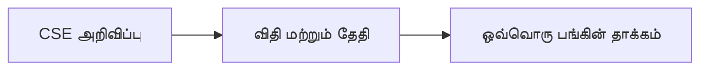

# 11 · நிறுவன நடவடிக்கைப் பகுப்பாய்வு

[← அடிப்படைப் பகுப்பாய்வு](../README.md) · [English](../../../01-Fundamental-Analysis/11-Corporate-Actions/README.md) · [தமிழ்](README.md) · [සිංහල](../../../si/01-Fundamental-Analysis/11-Corporate-Actions/README.md)

> **SCAP.N0000 · Softlogic Capital PLC** · **நிலை:** இது ஆய்வு வழிகாட்டி; SCAP-இன் தற்போதைய முடிவாகக் கருத வேண்டாம். **Reference date: 2026-09-30**.

## 🎯 ஆய்வுக் கேள்வி

புதிய பங்கு, dividend, rights issue, இணைப்பு அல்லது சொத்து விற்பனை பங்கு எண்ணிக்கை/உரிமை/மதிப்பை மாற்றுமா?

## 🔎 சரிபார்க்க வேண்டியவை

- [ ] Dividend, rights issue, share split, warrant, merger, சொத்து விற்பனை மற்றும் மறுமூலதனமயமாக்கல் அறிவிப்புகளைத் தேதியுடன் பதிவு செய்யவும்.
- [ ] உரிமை விகிதம், effective date, புதிய share count ஆகிய அசல் விதிகளைக் கொண்டு dilution மற்றும் per-share தாக்கம் கணக்கிடவும்.
- [ ] ஒவ்வொரு நடவடிக்கையும் முன்மொழிவு, அனுமதி, நடைமுறை, முடிவு அல்லது ரத்து ஆகிய எந்த நிலையில் உள்ளது என்று பிரிக்கவும்.

## 🧭 ஆய்வு வரைபடம்

## ⚠️ ஊகிக்கக்கூடாத விடயம்

Rights issue-வின் தலைப்புச் சலுகை விலை மட்டும் முழு விளைவை விளக்காது; entitlement, முதலீட்டுத் தேவை ஆகியவை தேவை.

## 🛠️ SCAP-க்கான ஆய்வு

SCAP அறிவிப்பு, ex-date, record date, effective date மற்றும் பங்கு விளைவு அடங்கிய காலவரிசைத் தயாரிக்கவும்.

## 📝 ஆதாரப் பதிவு

| அளவுகோல் / நிகழ்வு | காலம் / கணக்குப் பிரிவு | அசல் ஆதாரம் | கண்டறிந்தது |
|---|---|---|---|
| ______ | ______ | ______ | ______ |
| ______ | ______ | ______ | ______ |

[முந்தைய SCAP குறிப்பு](../../../ta/RESEARCH-LOG.md) · [ஆதாரங்கள்](../../../ta/SOURCES.md) · [CSE](https://www.cse.lk/)

**முறை:** வெளியீட்டுத் தேதி, கணக்கியல் scope, அலகு, அசல் பக்கத்தைப் பதிவு செய்யவும். இது பங்கு விலையோ வாங்க/விற்க பரிந்துரையோ அல்ல.
