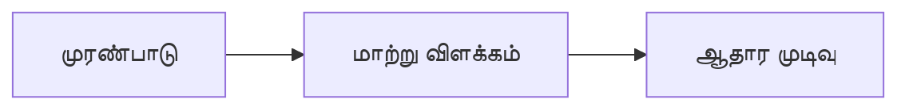

# 12 · கணக்கியல் தடயப் பகுப்பாய்வு

[← அடிப்படைப் பகுப்பாய்வு](../README.md) · [English](../../../01-Fundamental-Analysis/12-Forensic-Accounting/README.md) · [தமிழ்](README.md) · [සිංහල](../../../si/01-Fundamental-Analysis/12-Forensic-Accounting/README.md)

> **SCAP.N0000 · Softlogic Capital PLC** · **நிலை:** இது ஆய்வு வழிகாட்டி; SCAP-இன் தற்போதைய முடிவாகக் கருத வேண்டாம். **Reference date: 2026-09-30**.

## 🎯 ஆய்வுக் கேள்வி

அறிக்கைகளில் விசாரிக்க வேண்டிய முரண்பாடுகள் உள்ளனவா? இருப்பினும் ஆதாரமின்றி தவறு நடந்தது என்று சொல்லலாமா?

## 🔎 சரிபார்க்க வேண்டியவை

- [ ] இலாபம்-பணப்புழக்கம், segment reconciliation, கடன் இழப்பு ஒதுக்கீடு, ஒருமுறை வருமானம் ஆகியவற்றை ஒப்பிடவும்.
- [ ] Restatement, audit qualification, related-party balances, பெறவேண்டிய நிலுவைகள், accounting policy மாற்றங்களை ஆராயவும்.
- [ ] பல ஆண்டுத் தரவுகளைச் சோதித்து, முரண்பாட்டுக்கு தவறல்லாத மாற்று விளக்கங்களையும் பதிவு செய்யவும்.

## 🧭 ஆய்வு வரைபடம்

## ⚠️ ஊகிக்கக்கூடாத விடயம்

முரண்பாடு விசாரணை தொடங்குவதற்கான காரணம்; அதுவே மோசடி அல்லது தவறான செயல் நடந்ததற்குச் சான்றல்ல.

## 🛠️ SCAP-க்கான ஆய்வு

Aggregator-இன் எண்களுக்கும் அசல் SCAP அறிக்கைக்கும் இடையேயான வேறுபாட்டை கணக்கு வரி, காலம், scope அடிப்படையில் கண்டறியவும்.

## 📝 ஆதாரப் பதிவு

| அளவுகோல் / நிகழ்வு | காலம் / கணக்குப் பிரிவு | அசல் ஆதாரம் | கண்டறிந்தது |
|---|---|---|---|
| ______ | ______ | ______ | ______ |
| ______ | ______ | ______ | ______ |

[முந்தைய SCAP குறிப்பு](../../../ta/06-financial-snapshot.md) · [ஆதாரங்கள்](../../../ta/SOURCES.md) · [CSE](https://www.cse.lk/)

**முறை:** வெளியீட்டுத் தேதி, கணக்கியல் scope, அலகு, அசல் பக்கத்தைப் பதிவு செய்யவும். இது பங்கு விலையோ வாங்க/விற்க பரிந்துரையோ அல்ல.
