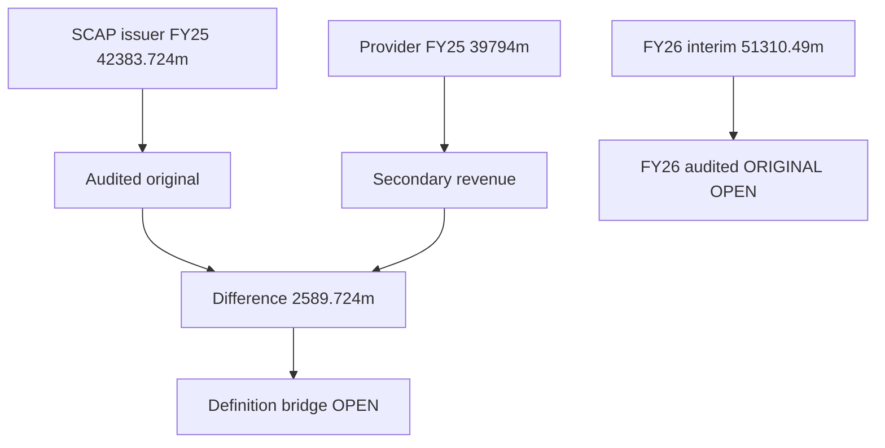

# 12 · கணக்கியல் தடய ஆய்வு: FY2025 வருமானத் தரவு சமரசம்

[← Fundamental analysis](../README.md) · [English](../../../01-Fundamental-Analysis/12-Forensic-Accounting/README.md) · [தமிழ்](README.md) · [සිංහල](../../../si/01-Fundamental-Analysis/12-Forensic-Accounting/README.md)

> **SCAP.N0000 · அசல் ஆதார ஆய்வு · 30-09-2026 · தனியாகக் குறிப்பிட்டவை தவிர LKR மில்லியன்.** **OPEN: இறுதி SCAP FY2025/26 audited மற்றும் ஜூன் 2026 அசல் அறிக்கைகள் இன்னும் ஒப்பிடப்படவில்லை. FY2025 எண்களை தற்போதைய உறுதிப்படுத்தப்பட்ட நிலையாகக் கருத வேண்டாம்.**

## 🎯 ஆய்வுக் கேள்வி

SCAP அசல் audited income statement-இன் வருமானமும் provider ‘revenue’ எண்ணும் ஏன் வேறுபடுகின்றன?

SCAP அசல் FY2025 audited **குழும total operating income LKR 42,383.724m** (PDF ப.63), FY2024 ஒப்பீடு **36,729.682m**. இது தாய் நிறுவன FY2025 operating income **4,093.984m** அல்ல. StockAnalysis என்ற **secondary provider** FY2025 revenue **39,794m**, FY2024 **35,927m** எனக் காட்டுகிறது. சரியான line-definition bridge இல்லாமல் provider எண்ணை audited group line என்று கருத முடியாது. [SCAP-AR-2025](../../../sources/records/SCAP-AR-2025.md) · [SCAP-STOCKANALYSIS](../../../sources/records/SCAP-STOCKANALYSIS.md).

## 🔎 தேதியுள்ள ஆதாரங்கள்

| ஆதார வரி | FY2024 LKR mn | FY2025 LKR mn | நிலை |
|---|---|---|---|
| SCAP அசல் GROUP total operating income | 36,729.682 | 42,383.724 | Audited ப.63 |
| Provider normalized revenue | 35,927 | 39,794 | Secondary StockAnalysis |
| Original − provider வேறுபாடு | 802.682 | 2,589.724 | கணக்கு மட்டும்; காரணம் OPEN |
| SCAP தனி COMPANY income | 1,933.064 | 4,093.984 | Audited ப.63; group அல்ல |
| FY2026 GROUP interim | — | 51,310.49 (FY26) | 27-05-2026, தணிக்கைக்கு உட்பட்டது |

### அசல் audited வரி

SCAP FY2025 PDF ப.63-இன் **'Total operating income'**: **LKR 42,383,724,027**, FY2024 **36,729,682,098**. FY2025 net earned insurance premium **30,842.349m** உள்ளிட்ட interest/fees/gains வரிகள் இதில் அடங்கும்; காப்பீடு GWP-ஐ இதே வரியாகக் கருதக் கூடாது. Parent income-உடன் group income சேர்க்கக் கூடாது. [SCAP-AR-2025](../../../sources/records/SCAP-AR-2025.md).

### மூன்றாம் தரப்பு வேறுபாடு இன்னும் OPEN

StockAnalysis [அட்டவணை](https://stockanalysis.com/quote/cose/SCAP.N0000/financials/) FY2025 **39,794m**, FY2024 **35,927m**; original−provider வேறுபாடு **2,589.724m** மற்றும் **802.682m**. அந்த provider எதைக் கழித்தது/சேர்த்தது என்ற அசல் adjustment table கிடைக்கவில்லை; **கற்பனை reconciling item உருவாக்கக்கூடாது**. Repo-வின் `reports/financial-pulse.md`, பழைய snapshot மற்றும் மூன்று மொழி chart-கள் இப்போது FY25 original **42,383.72m** பயன்படுத்துகின்றன; 39,794 திருத்தக் குறிப்பில் மட்டுமே உள்ளது. [SCAP-STOCKANALYSIS](../../../sources/records/SCAP-STOCKANALYSIS.md).

### 2026 audited மற்றும் ஜூன் SCAP காலாண்டு

Secondary catalogue SCAP **31-03-2026 final annual** மற்றும் **30-06-2026 interim** இருப்பதாகச் சொல்கிறது. ஆனால் **அசல் signed audited PDF**, பிந்தைய திருத்தங்கள், SCAP June அசல் காலாண்டு இங்கே உறுதி செய்யப்படவில்லை. முந்தைய 27-05-2026 year-end interim group income **51,310.49m** இன்னும் **subject to audit**. [SCAP-AR-2026-CATALOGUE](../../../sources/records/SCAP-AR-2026-CATALOGUE.md) · [SCAP-JUN2026-CATALOGUE](../../../sources/records/SCAP-JUN2026-CATALOGUE.md).

## ஆதாரக் காட்சி

## ⚠️ மீதமுள்ள சரிபார்ப்புகள்

- [ ] FY2025/26 SCAP signed audit மற்றும் மாற்றப்பட்ட எண்களைப் பெறவும்.
- [ ] 30 ஜூன் SCAP அசல் report-ஐப் பெற்று restatement/related party/owner PAT சோதிக்கவும்.
- [ ] Provider 39,794 / 35,927 வருமான மாற்றப் பட்டியலை அசல் வரிகளுடன் ஒப்பிடவும்.
- [ ] தணிக்கை மாறினால் எல்லா மொழி charts-ஐயும் ஒரே நேரத்தில் புதுப்பிக்கவும்.

**ஆதார எண்கள்:** [SCAP-AR-2025](../../../sources/records/SCAP-AR-2025.md) · [SCAP-STOCKANALYSIS](../../../sources/records/SCAP-STOCKANALYSIS.md) · [SCAP-FY2026-YE-INTERIM](../../../sources/records/SCAP-FY2026-YE-INTERIM.md) · [SCAP-AR-2026-CATALOGUE](../../../sources/records/SCAP-AR-2026-CATALOGUE.md) · [SCAP-JUN2026-CATALOGUE](../../../sources/records/SCAP-JUN2026-CATALOGUE.md).

[SCAP FY2025 original p.63](https://cdn.cse.lk/cmt/upload_report_file/1100_1764673838964.03.2025%20-%20Annual%20Report.pdf) · [StockAnalysis normalized revenue](https://stockanalysis.com/quote/cose/SCAP.N0000/financials/) · [SCAP FY2026 interim](https://cdn.cse.lk/cmt/upload_report_file/1100_1779968696398.pdf).

[மூல அறிக்கைகள்](../../../sources/SOURCE-REGISTER.md) · [ஆய்வு முன்னேற்றம்](../../../ta/RESEARCH-QUEUE.md)

இது நிதித் தகவல் ஆய்வு; பங்குகளை வாங்க/விற்க பரிந்துரை அல்ல.