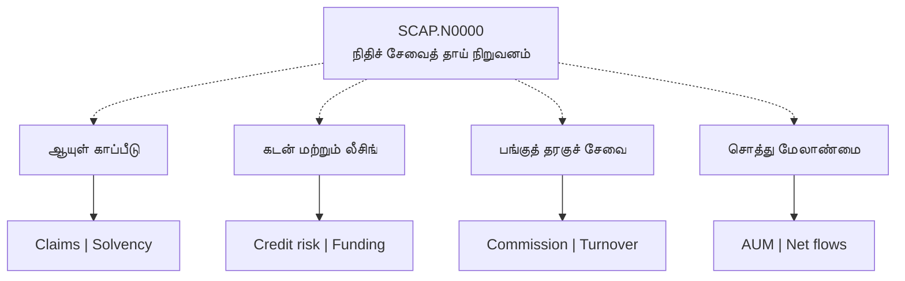
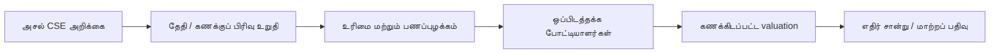

# 📊 SCAP.N0000 — தமிழ் காட்சி முதலீட்டு ஆய்வு

[← முதன்மை](../../README.md) · [தமிழ்](README.md) · [සිංහල](../../si/reports/README.md) · [English](../../reports/README.md)

> **Softlogic Capital PLC · CSE: SCAP.N0000**
>
> **சான்று நிலை: ஆரம்பம்.** வருமானம், தாய் நிறுவனப் பங்குதாரருக்குரிய இலாபம், தற்போதைய உரிமைப் பங்கு மற்றும் பங்குவிலை ஆகியவை அசல் CSE அறிக்கைகளுடன் இன்னும் முழுமையாக ஒப்பிடப்படவில்லை.

## 📌 முதன்மை காட்சி ஆய்வறிக்கை

| ஆய்வு கோணம் | தற்போதைய ஆவண நிலை | இன்னும் தேவை |
|---|---|---|
| 🏢 நிறுவன அமைப்பு | நிறுவனம் கூறும் நான்கு வணிகப் பிரிவுகள் | தற்போதைய துணை நிறுவன உரிமைப் பங்கு |
| 💵 நிதித் தரவு | FY25/FY26 இரண்டாம் நிலை எண்கள் | அதிகாரப்பூர்வ அறிக்கையுடன் ஒப்பிடுதல் |
| ⚖️ மதிப்பீடு | கணக்கிடப்படவில்லை | SCAP-க்குரிய இலாபம், share count, தேதியுள்ள விலை |
| 🛡️ இடர் | காரணிகளின் தரமான வரைபடம் | அசல் நிதி/ஒழுங்குமுறை ஆவணங்கள் |

## 🧩 வணிக மாதிரி

**கோடுகளின் அர்த்தம்:** புள்ளிக் கோடு நிறுவனம் கூறும் தொழில் தொடர்பைக் காட்டுகிறது; இன்றைய நேரடி உரிமைப் பங்கு சதவீதத்தைச் சுட்டிக்காட்டாது. பெட்டியின் நிறம்/அளவு வருமானம், ஆபத்து அல்லது சந்தைப் பங்கை அளவிடவில்லை.

## 📑 ද / Reports

| காட்சி அறிக்கை | என்ன பார்க்கலாம்? |
|---|---|
| [🏢 வணிக வரைபடம்](business-model.md) | வணிகப் பிரிவுகள், வருமானம் SCAP உரிமையாளரிடம் வருவது எப்படி? |
| [📈 நிதி வரைபடம்](financial-pulse.md) | FY25/FY26 ஆரம்ப எண்களுக்கான தனித்தனி charts |
| [🛡️ இடர் வரைபடம்](risk-map.md) | பல்வேறு இடர்களின் காரணிகள் மற்றும் சான்றுத் தேவை |
| [🔬 ஆய்வுத் திட்டம்](research-roadmap.md) | அசல் ஆவணம் முதல் மதிப்பீடு வரையிலான முறை |

## 🔎 Evidence gate / ஆதாரச் சோதனை / සාක්ෂි පරීක්ෂාව

**[CSE](https://www.cse.lk/)** · [தமிழ் sources](../SOURCES.md) · [தமிழ் log](../RESEARCH-LOG.md)

**ஆய்வு நிலை: ஆரம்பம் · குறிப்புத் தேதி: 2026-09-30.** இந்த ஆவணம் பங்குகளை வாங்க/விற்க பரிந்துரை அல்ல. பழைய அல்லது மூன்றாம் தரப்புத் தகவலை இன்றைய உறுதிப்படுத்தப்பட்ட தரவாகக் கருத வேண்டாம்.
