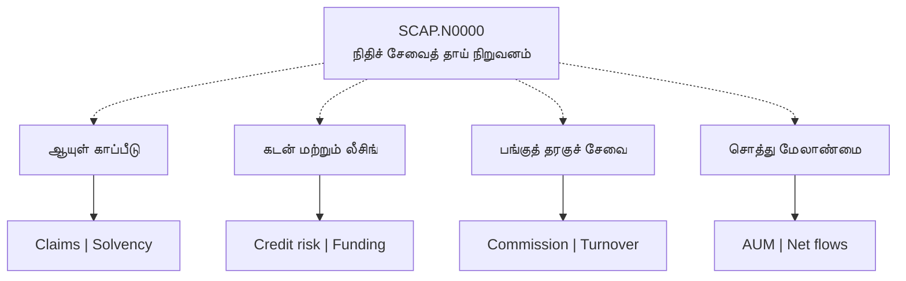
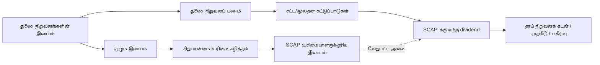

# 🏢 SCAP.N0000 — வணிக அமைப்பு வரைபடம்

[← முதன்மை](../../README.md) · [தமிழ்](README.md) · [සිංහල](../../si/reports/README.md) · [English](../../reports/README.md) · [முதன்மை காட்சி ஆய்வறிக்கை](README.md)

> **இது தற்போதைய முழுமையான பங்குரிமை விளக்கப்படம் அல்ல.** துணை நிறுவனத் தொடர்புகள் நிறுவனம் கூறும் விவரத்தின் அடிப்படையில் காட்டப்பட்டுள்ளன; ஒவ்வொரு தற்போதைய உரிமைப் பங்கும் தனியாக உறுதி செய்யப்பட வேண்டும்.

## 🗺️ Group and exposures

## 💸 Revenue engines

| பிரிவு | வருமானம் வரக்கூடிய வழி | முக்கிய ஆய்வு |
|---|---|---|
| ☂️ ஆயுள் காப்பீடு | பாலிசி வருமானம் மற்றும் முதலீட்டு முடிவுகள் | Claims, persistency, SLFRS 17, solvency |
| 🏦 நிதிச் சேவை | கடன் வட்டி மற்றும் கட்டணங்கள் | NPL, நிதி திரட்டும் செலவு, capital |
| 📊 தரகுச் சேவை | பரிவர்த்தனைக் கமிஷன் மற்றும் பிற சேவைகள் | CSE turnover, வாடிக்கையாளர் நிலைத்தன்மை |
| 🌱 சொத்து மேலாண்மை | AUM அடிப்படையிலான நிர்வாகக் கட்டணங்கள் | AUM, net flows, fee rates |

## 🔁 Profits and cash are not identical

**முக்கிய வேறுபாடு:** குழுமத்தின் இலாபம், SCAP பங்குதாரருக்குரிய இலாபம், SCAP தாய் நிறுவனத்துக்கு உண்மையாக வந்த பணம் ஆகியவை ஒரே அளவல்ல.

**தேதியிட்ட உரிமைச் சான்று:** [Softlogic Life-ன் 2025 ஆண்டு அறிக்கை](https://softlogiclife.lk/wp-content/uploads/sites/3/2026/03/Softlogic-Life-Integrated-Annual-Report-2025.pdf) படி **2025-12-31** அன்று SCAP-ன் பங்கு **50.16%**. இது தற்போதைய பங்குரிமைக்கான உறுதி அல்ல.

[விரிவான தமிழ் நிறுவன ஆய்வு](../01-business-and-ownership.md) · [வருமான மாதிரி](../02-how-it-makes-money.md) · [போட்டியாளர்கள்](../03-competition.md)

**[SCAP issuer overview](https://softlogiccapital.lk/about-us-overview/)** · **[Subsidiary directory](https://softlogiccapital.lk/subsidiaries/)**

**ஆய்வு நிலை: ஆரம்பம் · குறிப்புத் தேதி: 2026-09-30.** இந்த ஆவணம் பங்குகளை வாங்க/விற்க பரிந்துரை அல்ல. பழைய அல்லது மூன்றாம் தரப்புத் தகவலை இன்றைய உறுதிப்படுத்தப்பட்ட தரவாகக் கருத வேண்டாம்.
