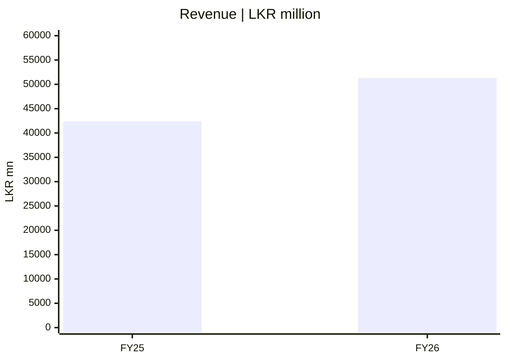
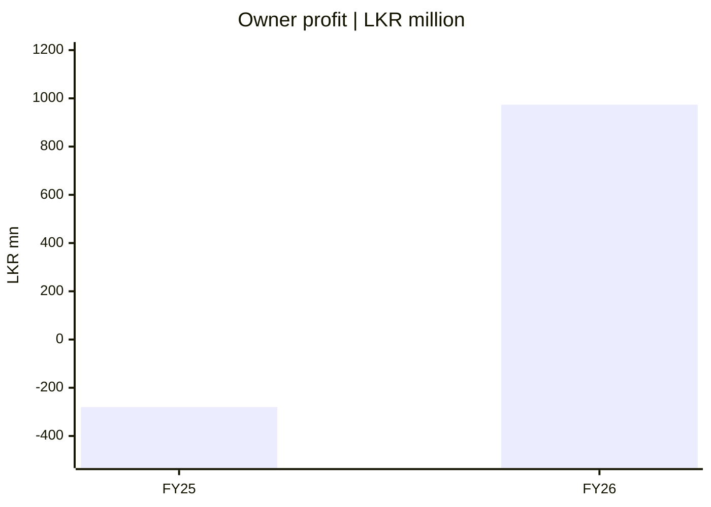
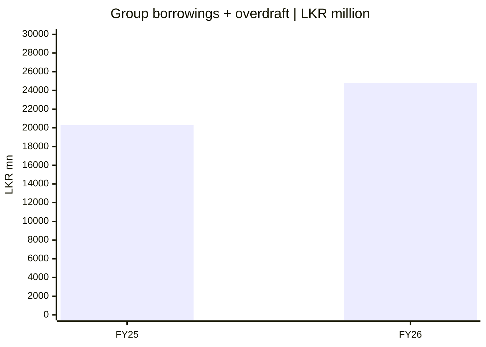

# 📈 நிதிக் காட்சி — CSE அசல் மூலம்

[← முதன்மை](../README.md) · [தமிழ் டாஷ்போர்டு](README.md) · [English](../../reports/financial-pulse.md) · [සිංහල](../../si/reports/financial-pulse.md)

> **ஆதாரம்:** [SCAP 27 மே 2026 CSE இடைக்கால அறிக்கை](https://cdn.cse.lk/cmt/upload_report_file/1100_1779968696398.pdf). அனைத்துத் தொகையும் **LKR மில்லியன்**. FY2025 ஒப்பீடு **Audited**, FY2026 **தணிக்கைக்கு உட்பட்டது**. பழைய FY2025 revenue **39,794** என்பதற்குப் பதிலாக அசல் CSE **42,383.72** பயன்படுத்தப்பட்டுள்ளது; பின்னைய திருத்தங்களும் நடப்பு பங்குவிலையும் இதில் இல்லை.

FY2025 audited ஒப்பீடு / FY2026 இடைக்காலம். **Four independently scaled charts: bar heights between charts cannot be compared.**

## 1 · குழும மொத்த வருமானம்

*குழும வருமானக் கணக்கு PDF ப. 2.*

## 2 · SCAP உரிமையாளருக்குரிய குழும இலாபம்/இழப்பு

*குழும இலாபத்தில் SCAP உரிமையாளருக்குரிய தொகை PDF ப. 2; **மொத்தக் குழும PAT அல்ல**.*

## 3 · குழும இயக்கப் பணப்புழக்கம்

*குழும இயக்கப் பணப்புழக்கம் PDF ப. 9; **தாய் நிறுவனத்துக்குக் கிடைக்கும் ரொக்கம் அல்ல**.*

## 4 · குழும வட்டியுள்ள கடன் + overdraft

*குழும வட்டியுள்ள கடன் + overdraft PDF ப. 6; **தனி நிறுவனக் கடன் அல்ல**.*

## அசல் தரவுச் சுருக்கம்

| அளவுகோல் | FY2025 Audited ஒப்பீடு | FY2026 இடைக்காலம் | ஆதாரம் |
|---|---:|---:|---|
| குழும மொத்த வருமானம் | 42,383.72 | 51,310.49 | குழும வருமானக் கணக்கு, PDF ப. 2 |
| SCAP உரிமையாளருக்குரிய குழும இலாபம்/இழப்பு | −280.42 | 973.77 | குழும PAT-இல் தாய் உரிமையாளருக்குரிய பங்கு, ப. 2 |
| குழும இயக்கப் பணப்புழக்கம் | 427.54 | −851.24 | குழும பணப்புழக்கம், ப. 9 |
| குழும வட்டியுள்ள கடன் + overdraft | 20,285.82 | 24,781.48 | குழும இருப்புநிலை, ப. 6; வைப்புகள்/காப்பீட்டு பொறுப்புகள் சேர்க்கப்படவில்லை |

## குழுமம் ≠ உரிமையாளர்கள் ≠ தாய் நிறுவனம்

FY2026 குழும PAT **LKR 3,371.26mn**; SCAP உரிமையாளர்களுக்குரியது **973.77mn**, சிறுபான்மை உரிமைக்குரியது **2,397.49mn**. SCAP தனி நிறுவனம் FY2026 **722.49mn இழப்பு** பதிவு செய்தது. 31 மார்ச் 2026 அன்று அதன் cash **32.07mn**, வட்டியுள்ள கடன் **17,324.26mn**. [வணிகப் பகுப்பாய்வு](../../ta/01-Fundamental-Analysis/01-Business-Analysis/README.md) மற்றும் [அசல் CSE அறிக்கை](https://cdn.cse.lk/cmt/upload_report_file/1100_1779968696398.pdf) பார்க்கவும்.

**பழைய எண்ணின் திருத்தம்:** மூன்றாம் தரப்பு chart FY2025 revenue **LKR 39,794mn** எனக் காட்டியது. SCAP அசல் CSE அறிக்கையின் **FY2025 Audited ஒப்பீடு LKR 42,383.72mn**. வேறுபாட்டின் provider வரையறை முழுமையாக விளக்கப்படவில்லை. இனி இந்த அட்டவணை அசல் CSE எண்ணைப் பயன்படுத்துகிறது. இறுதி FY2026 தணிக்கை அறிக்கையும் 2026 ஜூன் காலாண்டு அசல் அறிக்கையும் பின்னர் ஒப்பிடப்பட வேண்டும்.

[நிதித் தகவல் அட்டவணை](../06-financial-snapshot.md) · [ஆதாரங்கள்](../SOURCES.md) · [CSE](https://www.cse.lk/)

காப்பீடு/நிதி நிறுவனப் பணப்புழக்கம் பொதுவான உற்பத்தி நிறுவனங்களைப் போலப் பொருள் கொள்ளக்கூடாது. இது பங்குவிலை இலக்கோ பரிந்துரையோ அல்ல.
