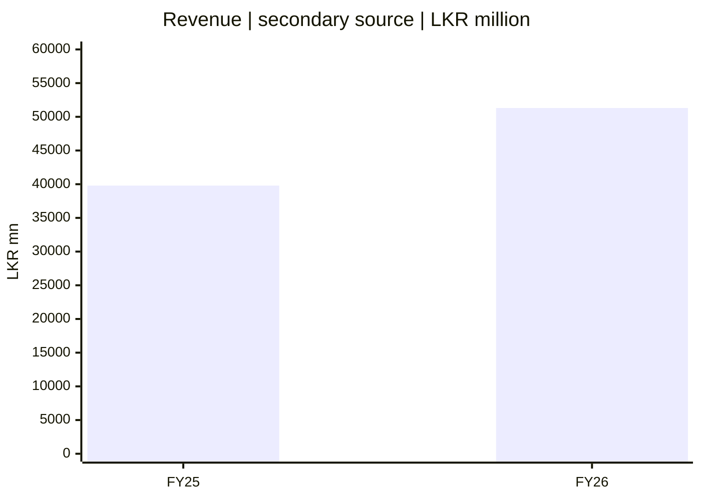
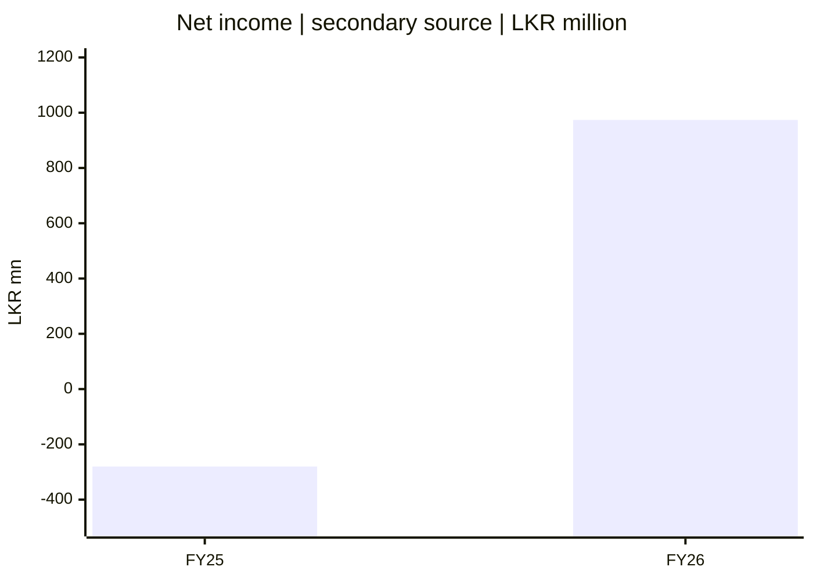
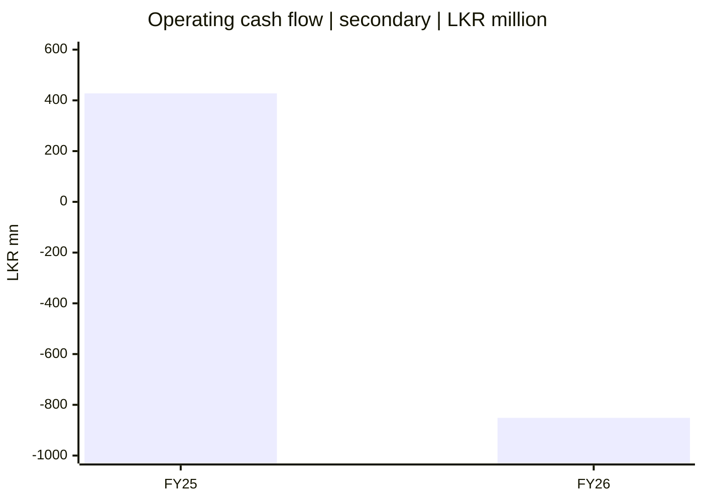
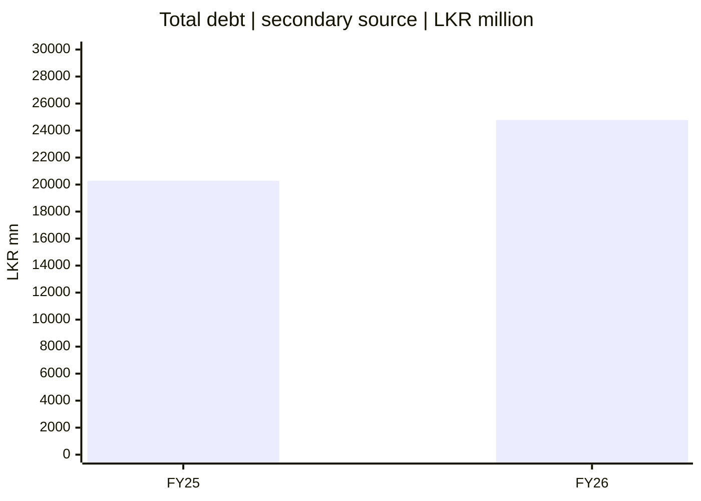

# 📈 SCAP.N0000 — ஆரம்ப நிதிக் காட்சிகள்

[← முதன்மை](../../README.md) · [தமிழ்](README.md) · [සිංහල](../../si/reports/README.md) · [English](../../reports/README.md) · [முதன்மை காட்சி ஆய்வறிக்கை](README.md)

⚠️ **கீழே உள்ள எண்கள் இரண்டாம் நிலைத் தரவிலிருந்து முன்பு பதிவு செய்யப்பட்டவை; அசல் SCAP/CSE தணிக்கை அறிக்கையுடன் ஒப்பிடப்படவில்லை.** [முந்தைய தமிழ் நிதி அட்டவணை](../06-financial-snapshot.md), [StockAnalysis](https://stockanalysis.com/quote/cose/SCAP.N0000/financials/) ஆகியவற்றுடன் இணைக்கப்பட்டுள்ளன. பங்கு மதிப்பீட்டிற்கு இவை உறுதிப்படுத்தப்பட்ட உள்ளீடுகள் அல்ல.

**அலகு: LKR மில்லியன்; எல்லா வரைபடங்களும் தனித்தனி அளவைக் கொண்டவை.** ஒரு வரைபடத்தின் பட்டையின் உயரத்தை மற்றொன்றுடன் நேரடியாக ஒப்பிட வேண்டாம். இங்கு நடப்பு பங்குவிலை, intrinsic value, EPS அல்லது வாங்க/விற்கச் சைகை இல்லை.

## 01 / வருமானம் — Revenue

*கணக்கியல் காலம்: 2025-03-31 மற்றும் 2026-03-31 முடிந்த ஆண்டுகள்.*

## 02 / நிகர இலாபம் — Net income

*Net income என்பது SCAP பங்குதாரருக்குரிய இலாபமா என்பதைக் கண்டறிய வேண்டும்.*

## 03 / இயக்கப் பணப்புழக்கம் — Operating cash flow

*நிதி/காப்பீட்டு நிறுவனப் பணப்புழக்கத்தைத் தனியாகப் புரிந்துகொள்ள வேண்டும்.*

## 04 / மொத்தக் கடன் — Total debt

*குழுமத்தின் மொத்தக் கடனும் SCAP தாய் நிறுவனத்தின் தனிக் கடனும் வேறு.*

## 📋 Data table / தரவு அட்டவணை / දත්ත වගුව

| அளவு | FY25 | FY26 | நிலை |
|---|---:|---:|---|
| Revenue | 39,794 | 51,310 | இரண்டாம் நிலை |
| Net income | -280.42 | 973.77 | உரிமைக்குரிய அளவு உறுதி செய்யவில்லை |
| Operating cash flow | 427.54 | -851.24 | துறை கணக்கியல் வேறுபாடு |
| Total debt | 20,286 | 24,781 | group vs parent திறந்தது |

**[CSE](https://www.cse.lk/)** · [Original financial note](../06-financial-snapshot.md) · [Source register](../SOURCES.md)

**ஆய்வு நிலை: ஆரம்பம் · குறிப்புத் தேதி: 2026-09-30.** இந்த ஆவணம் பங்குகளை வாங்க/விற்க பரிந்துரை அல்ல. பழைய அல்லது மூன்றாம் தரப்புத் தகவலை இன்றைய உறுதிப்படுத்தப்பட்ட தரவாகக் கருத வேண்டாம்.
