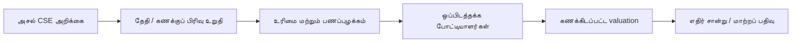
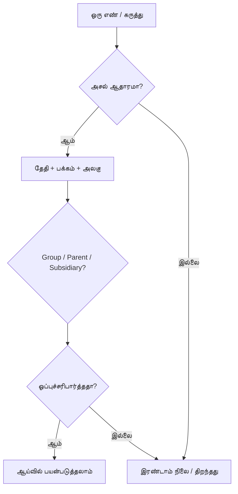

# 🔬 SCAP.N0000 — சான்று அடிப்படையிலான ஆய்வுத் திட்டம்

[← முதன்மை](../../README.md) · [தமிழ்](README.md) · [සිංහල](../../si/reports/README.md) · [English](../../reports/README.md) · [முதன்மை காட்சி ஆய்வறிக்கை](README.md)

**இந்த வரைபடம் வேலை முறையைக் காட்டுகிறது; எல்லா பணிகளும் முடிந்துவிட்டன என்று அர்த்தமில்லை.**

## 🧭 ஆய்வுத் திட்டம்

## 🗂️ Research status — not a share rating

| நிலை | இதுவரை உள்ளவை | இன்னும் செய்ய வேண்டியது |
|---|---|---|
| 🟡 வணிகம் | நிறுவனம் கூறும் செயல்பாடுகள் | உரிமைப் பங்குகள் மற்றும் segment வருமானம் |
| 🟡 போட்டியாளர் ஆய்வு | ஒப்பீட்டு முறை | ஒரே காலம்/வரையறையுள்ள போட்டியாளர் எண்கள் |
| 🔴 நிதி | இரண்டாம் நிலை FY25/FY26 அட்டவணை | அசல் தணிக்கை மற்றும் காலாண்டு ஒப்புச்சரிபார்ப்பு |
| 🔴 மதிப்பீடு | கேள்விகள்/வார்ப்புருக்கள் | சரியான EPS, share count, தேதியுள்ள விலை |
| 🟡 இடர் | தரமான இடர் வரைபடம் | தற்போதைய ஆவணங்களுடன் உறுதி |
| 🔴 தொழில்நுட்ப chart | எதிர்காலத் திட்டம் | தேதியுள்ள உண்மையான price/volume data |

🟡 = ஆய்வு வடிவம் உள்ளது / පර්යේෂණ රාමුව ඇත · 🔴 = அசல் சான்று தேவை / මුල් සාක්ෂි අවශ්‍යයි. **இவை நிறுவனத்திற்கு வழங்கிய மதிப்பெண்கள் அல்ல / මේවා සමාගම් ලකුණු නොවේ.**

## ✅ Checklist

- [ ] அசல் FY2025/26 SCAP அறிக்கையைப் பெறுதல்.
- [ ] 2026 ஜூன் காலாண்டு மற்றும் பின்னைய அறிவிப்புகளைப் பெறுதல்.
- [ ] Parent vs group vs subsidiary எண்களைப் பிரித்தல்.
- [ ] சிறுபான்மை உரிமை, தாய் நிறுவனக் கடன், பணப்பங்கீடு உறுதி செய்தல்.
- [ ] சரியான சக நிறுவனங்களுடன் ஒப்பிட்டு valuation சூழல்கள் உருவாக்குதல்.
- [ ] புதிய சான்றுகள் வந்ததும் ஆய்வுப் பதிவைப் புதுப்பித்தல்.

## 📖 Claim validation

[Research log](../RESEARCH-LOG.md) · [Original checklist](../07-reading-checklist.md)

இந்த மாற்றத்தில் GitHub Actions அல்லது தானியங்கி workflow சேர்க்கப்படவில்லை.

**ஆய்வு நிலை: ஆரம்பம் · குறிப்புத் தேதி: 2026-09-30.** இந்த ஆவணம் பங்குகளை வாங்க/விற்க பரிந்துரை அல்ல. பழைய அல்லது மூன்றாம் தரப்புத் தகவலை இன்றைய உறுதிப்படுத்தப்பட்ட தரவாகக் கருத வேண்டாம்.
