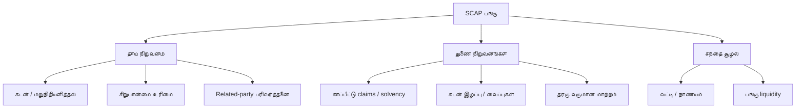

# 🛡️ SCAP.N0000 — இடர் மற்றும் சான்று வரைபடம்

[← முதன்மை](../../README.md) · [தமிழ்](README.md) · [සිංහල](../../si/reports/README.md) · [English](../../reports/README.md) · [முதன்மை காட்சி ஆய்வறிக்கை](README.md)

> **தரமான (qualitative) ஆய்வு மட்டுமே:** அம்புகள் சாத்தியமான அபாயப் பாதையைக் குறிக்கின்றன; உறுதிப்படுத்தப்பட்ட சம்பவம், நிகழ்தகவு அல்லது இடர் மதிப்பெண் அல்ல.

## 🌿 இடர் வரைபடம்

## 🔎 Evidence needed

| காரணம் | பாதிக்கக்கூடியது | எங்கே உறுதி செய்ய வேண்டும்? |
|---|---|---|
| தாய் நிறுவனக் கடன் | பகிரக்கூடிய பணம் | SCAP தனிக் கணக்கு மற்றும் debt notes |
| சிறுபான்மை பங்கு | உரிமையாளருக்குரிய இலாபம் | Ownership / NCI notes |
| காப்பீடு | Claims மற்றும் solvency | Insurer அறிக்கை |
| கடன்/வைப்பு | Credit loss, liquidity | Finance subsidiary + regulator |
| Related parties | உத்தரவாதம், பணப்பாதை | Related-party disclosures |
| சந்தை liquidity | விற்பனைச் செலவு/வசதி | தேதியுள்ள CSE trading data |

**வரலாறு மட்டும்:** [2025 செய்தி](https://economynext.com/sri-lankas-softlogic-finance-to-resume-business-after-central-bank-lifts-restrictions-241534/) படி Softlogic Finance கட்டுப்பாடுகள் 2025-09-19 முதல் நீக்கப்பட்டதாக அறிக்கையிடப்பட்டது. அது இன்றைய ஒழுங்குமுறை நிலையை நிரூபிக்காது.

[Detailed risk chapter](../05-risks-and-questions.md) · [Source register](../SOURCES.md) · [CSE](https://www.cse.lk/)

**ஆய்வு நிலை: ஆரம்பம் · குறிப்புத் தேதி: 2026-09-30.** இந்த ஆவணம் பங்குகளை வாங்க/விற்க பரிந்துரை அல்ல. பழைய அல்லது மூன்றாம் தரப்புத் தகவலை இன்றைய உறுதிப்படுத்தப்பட்ட தரவாகக் கருத வேண்டாம்.
